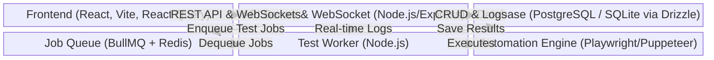
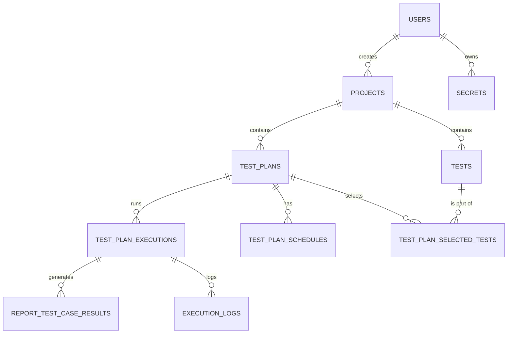
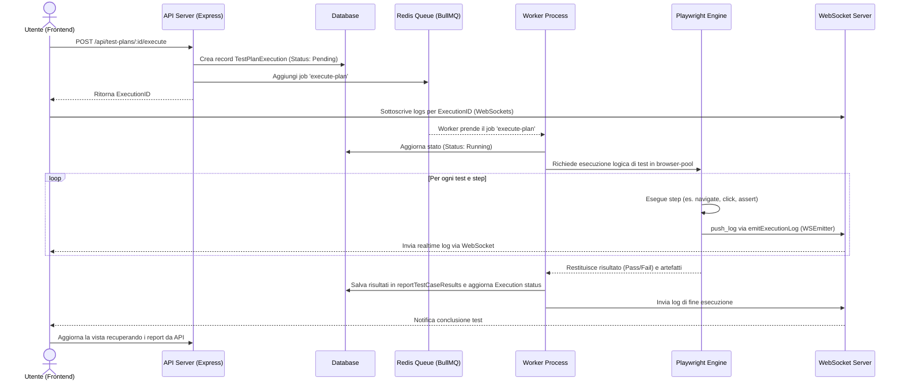

# System Architecture & Codebase Document: WebFlowMaster

## 1. EXECUTIVE SUMMARY & TECH STACK

**WebFlowMaster** è la piattaforma enterprise per il test automation end-to-end. Combina un Visual Builder intuitivo con un potente motore di esecuzione basato su Playwright e Puppeteer per garantire la massima affidabilità delle applicazioni web. La piattaforma permette ai team QA di creare test complessi (No-Code Visual Builder), registrarli, eseguirli e monitorarli attraverso dashboard analitiche avanzate, agevolando l'integrazione nel ciclo CI/CD.

### Tech Stack
*   **Frontend**: React (v18), TypeScript, Vite, TailwindCSS, Shadcn/UI (Radix UI), Wouter (routing), React Query (@tanstack/react-query), Zustand (potenziale, o React Context), Framer Motion, Monaco Editor.
*   **Backend**: Node.js, Express, Passport.js (Local Strategy), BullMQ (Task Queue).
*   **Database**: PostgreSQL (tramite Neon serverless o db locale) o SQLite (Better-sqlite3/PGlite per sviluppo), gestito tramite **Drizzle ORM**.
*   **Automation Engine**: Playwright (@playwright/test) e Puppeteer.
*   **Queue & Background Jobs**: BullMQ con Redis, Node-cron per la schedulazione.
*   **Logging**: Winston (con winston-daily-rotate-file e winston-loki per l'esportazione).
*   **Real-time Communication**: WebSockets (`ws` package).
*   **Auth**: Passport.js con strategy locale e gestione sessioni tramite express-session memorizzate in memoria o Redis (tramite connect-redis / memorystore).

---

## 2. ARCHITETTURA DI SISTEMA

L'architettura segue un approccio client-server monolitico modulare.
Il client è una Single Page Application (SPA) in React che comunica via REST API e WebSockets con il server Express Node.js.
Il backend gestisce l'autenticazione, la logica CRUD e l'orchestrazione dei test.
L'esecuzione dei test è delegata in background: un servizio di esecuzione test inserisce job (tramite BullMQ) in una coda basata su Redis, i quali vengono prelevati ed elaborati da un Worker asincrono. Questo permette di eseguire i test E2E tramite Playwright senza bloccare l'event loop del server principale.
I risultati e i log dei test vengono salvati nel Database e comunicati in tempo reale al frontend tramite WebSockets.



---

## 3. MAPPA DEL CODEBASE (Directory Structure)

```text
/ WebFlowMaster
├── package.json               # Configurazione dipendenze e workspace (client/server monorepo).
├── /client                    # Frontend React SPA
│   ├── package.json           # Dipendenze Frontend
│   └── /src
│       ├── App.tsx            # Entry point e Routing dell'app frontend (Wouter).
│       ├── /components        # Componenti UI riutilizzabili (Shadcn UI e custom components).
│       ├── /hooks             # Hook custom (es. use-auth, useTestRunner, useExcelMappings).
│       ├── /lib               # Utility frontend, configurazione API client e React Query (queryClient.ts).
│       ├── /pages             # View components/Pagine (Dashboard, Auth, Test Reports).
│       └── /locales           # Traduzioni i18n per la piattaforma.
├── /server                    # Backend Node.js
│   ├── index.ts               # API Gateway, configurazione Express, WebSockets middleware.
│   ├── worker.ts              # Entry point del Worker background per processare la coda test (BullMQ).
│   ├── routes.ts              # Definizione delle route REST API.
│   ├── db.ts                  # Configurazione connessione Database e Drizzle ORM.
│   ├── auth.ts                # Configurazione Passport.js per l'autenticazione.
│   ├── queue.ts               # Setup della coda BullMQ e connessione Redis.
│   ├── websocket.ts           # Gestione delle connessioni real-time WebSocket.
│   ├── logger.ts              # Configurazione logging strutturato Winston.
│   ├── test-execution-service.ts # Core logic per la preparazione e avvio dei test.
│   ├── playwright-service.ts  # Servizio di astrazione per comandare Playwright.
│   ├── scheduler-service.ts   # Gestione dei test schedulati (node-cron).
│   ├── reporting-service.ts   # Generazione di report (es. JUnit, HTML) e salvataggio DB.
│   └── /middleware            # Middleware Express (es. correlationId per tracing logs).
└── /shared
    └── schema.ts              # Schemi Drizzle ORM per il Database e tipi condivisi tra FE e BE.
```

---

## 4. CORE MODULES & LOGICA DI BUSINESS

### Motore di esecuzione dei test
Il motore di esecuzione si basa su un'architettura asincrona.
1. **Avvio**: Quando un utente o lo scheduler avvia un test (da `test-execution-service.ts`), il backend crea un record di esecuzione nel DB e aggiunge un Job alla coda `TEST_EXECUTION_QUEUE_NAME` via `queue.ts` (BullMQ).
2. **Elaborazione Worker**: Il modulo `worker.ts` rileva il job ed esegue `processTestPlanJob`.
3. **Automazione**: Il worker delega le operazioni a `playwright-service.ts`, che istanzia e gestisce un pool di browser (configurato in `browser-pool.ts`). La logica di test è convertita in istruzioni Playwright (navigate, click, type, assert). Viene supportato l'inserimento automatico dei Secrets tramite interpolazione.
4. **Refertazione e Chiusura**: Terminati gli step, `reporting-service.ts` salva i risultati nel DB e `test-execution-service.ts` aggiorna lo stato finale, mentre i browser vengono rilasciati nel pool.

### Sistema di Logging
Il sistema di logging, situato in `server/logger.ts`, usa **Winston**.
- Il log è "Strutturato", formattato in JSON per una facile ingestione da sistemi come Loki (tramite `winston-loki`).
- Include la propagazione di un `correlationId` (tramite `AsyncLocalStorage` nel modulo middleware `correlation.ts`), per unire tutti i log generati da una singola richiesta HTTP o esecuzione test.
- Prevede meccanismi di **redactSensitiveData** per oscurare informazioni PII o password (secrets).
- I log dell'esecuzione dei test (`ExecutionLogEntry`) vengono inviati in tempo reale al frontend via WebSocket tramite l'emitter fornito da `websocket.ts` e salvati su database nella tabella `execution_logs`.

### Autenticazione e gestione degli utenti
La gestione dell'identità avviene tramite `server/auth.ts`, utilizzando **Passport.js**.
- Sfrutta `passport-local` per username/password con hashing tramite funzione nativa Node.js `scrypt`.
- Le sessioni sono mantenute via `express-session`, tipicamente salvate in `memorystore` per sviluppo o Redis.
- I cookie di sessione proteggono le API backend, le quali espongono i dati solo agli utenti autenticati (`req.user` tipizzato su schema).
- Sul frontend, l'hook `use-auth.tsx` ed il context `AuthProvider` mantengono lo stato di autenticazione, bloccando le route non autorizzate con il componente `protected-route.tsx`.

---

## 5. MODELLO DEI DATI (Database Schema)

Il database è gestito tramite **Drizzle ORM** con definizione dello schema in `@shared/schema.ts`.

### Entità Principali
*   **users**: Utenti del sistema.
*   **projects**: Contenitori per raggruppare i test.
*   **tests**: Le definizioni e configurazioni dei test automatici.
*   **testPlans**: Piani di esecuzione che aggregano multipli test (`testPlanSelectedTests`).
*   **testPlanExecutions**: Istanza di un test plan eseguito.
*   **reportTestCaseResults**: I risultati dettagliati degli esecuzioni dei singoli step e test.
*   **executionLogs**: Log dettagliati relativi ad una singola esecuzione, utilizzati anche per riproduzione e debug.
*   **secrets**: Credenziali oscurate crittograficamente da iniettare nei test runtime.
*   **testPlanSchedules**: Dati relativi all'esecuzione ricorrente basati su cron.

### Diagramma Entità-Relazione (ER)



---

## 6. DATA FLOW: IL CICLO DI VITA DI UN TEST

Flusso end-to-end che parte dal click dell'utente fino alla visualizzazione del risultato:



---

## 7. GESTIONE DELLO STATO E UI (Frontend)

### Stato Globale e Data Fetching
- Il frontend utilizza pesantemente **React Query (`@tanstack/react-query`)** come layer primario di gestione stato lato server. La libreria gestisce il caching, il refetching, l'invalidazione dei query-key per i dati asincroni (es. recupero test in esecuzione, dashboard analytics, dati utente con hook custom).
- La gestione del contesto utente e dello stato di login è gestita nativamente in React tramite `Context API` all'interno di `AuthProvider` (in `hooks/use-auth.tsx`).
- Lo stato UI effimero e il form-handling sfruttano state locali (`useState`), hook specializzati (come `react-hook-form` con schema validation via `zod` e `drizzle-zod`).

### Dati Real-Time
- Per visualizzare l'esecuzione in diretta senza oberare l'API con il polling, l'app stabilisce una connessione **WebSocket**.
- I dati inviati al client tramite WebSocket contengono `ExecutionLogEntry`. Questi dati vengono intercettati dal frontend e inseriti nello state locale per visualizzare i logs e far progredire visivamente le barre di avanzamento dei test step by step all'utente in tempo reale.
