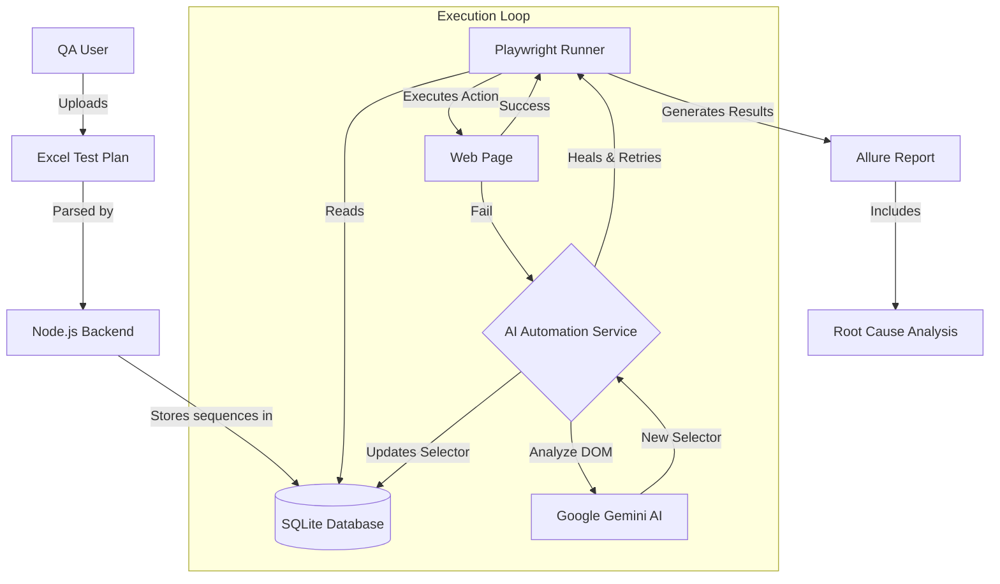

# Technical Architecture Guide 🏗️

This document outlines the architectural design of WebFlowMaster, focusing on data flow, database schema, and the AI Self-Healing mechanism.

## 🔄 Data Flow Overview

The system operates as a unified flow from Requirement (Excel) to Execution (Playwright) and Reporting (Allure), with an AI loop for resilience.



---

## 🗄️ Database Schema (SQLite)

The core testing logic revolves around the `tests` table, managed via Drizzle ORM.

### Key Table: `tests`

| Column     | Type         | Description                                                    |
| :--------- | :----------- | :------------------------------------------------------------- |
| `id`       | Integer (PK) | Unique Test ID.                                                |
| `name`     | Text         | Human-readable test name.                                      |
| `sequence` | JSON         | Array of test steps (`click`, `fill`, etc.) defining the flow. |
| `elements` | **JSON**     | **Dynamic Repository of Detected Elements.**                   |

### The `elements` Column Strategy

Instead of hardcoding selectors into every step, we store them in a centralized `elements` JSON array within the test record.

**Structure:**

```json
[
  {
    "id": "elem-input-1",
    "type": "input",
    "tag": "input",
    "selector": "#username",  <-- Updates dynamically upon Self-Healing
    "attributes": { "name": "user", "class": "form-control" }
  },
  ...
]
```

When **Self-Healing** occurs, the system updates **both**:

1.  The specific step in the `sequence` JSON.
2.  The corresponding definition in the `elements` JSON.

---

## 🧠 AI Self-Healing Architecture

The `AIAutomationService` acts as a middleware between Playwright failures and the Database.

### Process Flow

1.  **Detection**: `PlaywrightReporter` catches specific errors (Timeout, Element Not Found).
2.  **Snapshot**: The system captures the current HTML DOM snapshot (truncated to ~30k chars context).
3.  **Inference**:
    - **Input**: Old Selector + Current DOM + Error Message.
    - **Model**: Gemini Pro.
    - **Prompt**: "Find the element in this new DOM that corresponds to the old selector X."
4.  **Verification**: The Runner retries the action with the _proposed_ selector.
5.  **Persistence**:
    - If the retry succeeds, the new selector is committed to SQLite via `UPDATE tests SET ...`.
6.  **Reporting**: The step is marked as `[HEALED]` in Allure.

### Failure Analysis (RCA)

If healing fails (or for non-selector errors):

1.  Backend gathers Stack Trace + Logs.
2.  AI generates a natural language explanation (RCA).
3.  RCA is saved as a text attachment in Allure.

---

## 🛠 Backend Structure

- **`server/routes.ts`**: API Entry points (Express).
- **`server/playwright-service.ts`**: Core Execution Engine.
- **`server/playwright-reporter.ts`**: Custom Reporter wrapping Playwright actions with interception logic.
- **`server/ai-automation-service.ts`**: Service class handling Gemini API communication and DB updates.
