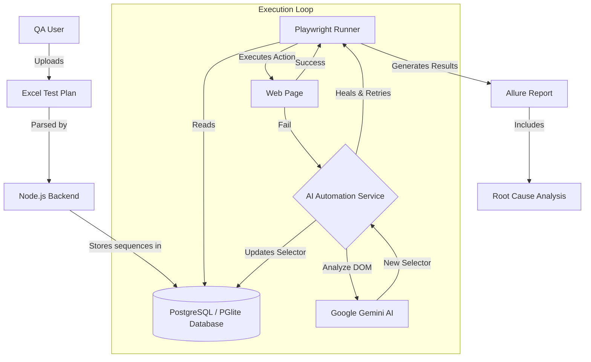

# Technical Architecture Guide 🏗️

This document outlines the architectural design of WebFlowMaster, focusing on data flow, database schema, and the AI Self-Healing mechanism.

## 🔄 Data Flow Overview

The system operates as a unified flow from Requirement (Excel) to Execution (Playwright) and Reporting (Allure), with an AI loop for resilience.


```mermaid
graph TD
    User[QA User] -->|Uploads| Excel[Excel Test Plan]
    Excel -->|Parsed by| Backend[Node.js Backend]
    Backend -->|Stores sequences in| DB[(PostgreSQL / PGlite Database)]

    subgraph Execution Loop
        Runner[Playwright Runner] -->|Reads| DB
        Runner -->|Executes Action| Page[Web Page]
        Page -- Success --> Runner
        Page -- Fail --> AI_Service{AI Automation Service}

        AI_Service -- "Analyze DOM" --> Gemini[Google Gemini AI]
        Gemini -- "New Selector" --> AI_Service
        AI_Service -->|Heals & Retries| Runner
        AI_Service -->|Updates Selector| DB
    end

    Runner -->|Generates Results| Allure[Allure Report]
    Allure -->|Includes| RCA[Root Cause Analysis]
```

---

## 🗄️ Database Schema (PostgreSQL / PGlite)

> **Note:** The persistence layer uses PostgreSQL in production (via Drizzle ORM `node-postgres`) and [PGlite](https://github.com/electric-sql/pglite) for local development. A `DATABASE_URL` starting with `postgres://` selects PostgreSQL; otherwise it is treated as a local PGlite data directory. (Earlier versions of the project used SQLite.)

The core testing logic revolves around the `tests` table, managed via Drizzle ORM.

### Key Table: `tests`

| Column     | Type         | Description                                                    |
| :--------- | :----------- | :------------------------------------------------------------- |
| `id`       | Integer (PK) | Unique Test ID.                                                |
| `name`     | Text         | Human-readable test name.                                      |
| `sequence` | JSON         | Array of test steps (`click`, `fill`, etc.) defining the flow. |
| `elements` | **JSON**     | **Dynamic Repository of Detected Elements.**                   |

### The `elements` Column Strategy

Instead of hardcoding selectors into every step, we store them in a centralized `elements` JSON array within the test record.

**Structure:**

```json
[
  {
    "id": "elem-input-1",
    "type": "input",
    "tag": "input",
    "selector": "#username",  <-- Updates dynamically upon Self-Healing
    "attributes": { "name": "user", "class": "form-control" }
  },
  ...
]
```

When **Self-Healing** occurs, the system updates **both**:

1.  The specific step in the `sequence` JSON.
2.  The corresponding definition in the `elements` JSON.

---

## 🧠 AI Self-Healing Architecture

The `AIAutomationService` acts as a middleware between Playwright failures and the Database.

### Process Flow

1.  **Detection**: `PlaywrightReporter` catches specific errors (Timeout, Element Not Found).
2.  **Snapshot**: The system captures the current HTML DOM snapshot (truncated to ~30k chars context).
3.  **Inference**:
    - **Input**: Old Selector + Current DOM + Error Message.
    - **Model**: Gemini Pro.
    - **Prompt**: "Find the element in this new DOM that corresponds to the old selector X."
4.  **Verification**: The Runner retries the action with the _proposed_ selector.
5.  **Persistence**:
    - If the retry succeeds, the new selector is committed to the database via `UPDATE tests SET ...`.
6.  **Reporting**: The step is marked as `[HEALED]` in Allure.

### Failure Analysis (RCA)

If healing fails (or for non-selector errors):

1.  Backend gathers Stack Trace + Logs.
2.  AI generates a natural language explanation (RCA).
3.  RCA is saved as a text attachment in Allure.

---

## 🛠 Backend Structure

- **`server/routes.ts`**: API Entry points (Express).
- **`server/playwright-service.ts`**: Core Execution Engine.
- **`server/playwright-reporter.ts`**: Custom Reporter wrapping Playwright actions with interception logic.
- **`server/ai-automation-service.ts`**: Service class handling Gemini API communication and DB updates.

## Observability and incidents

Two outputs from one pipeline, both development-only.

### Logs

`logs/app-YYYY-MM-DD.log` carries server *and* browser lines in one stream. Client lines
are prefixed `[client]` and carry `sessionId`; their browser-supplied metadata is nested
under `clientMeta`, where it cannot collide with a field the server set.

Every line has a `correlationId`, generated by the browser and adopted by the server, so

    grep c-9f3a logs/app-*.log

returns the whole chain from click to failure, across both sides.

Levels are two separate system settings: `logLevel` (server) and `clientLogLevel`
(browser). They are separate on purpose — turning the server up to `debug` while chasing a
backend problem should not also flood the ingest endpoint with browser traffic. For a
single browser tab, `localStorage.setItem('wfm:logLevel', 'debug')` overrides it without
touching the database.

### Incidents

Every unhandled failure writes `.observability/incidents/inc_XXXXXX.json` (gitignored)
containing:

- the stack resolved to a source file, line and the surrounding code, so the failing line
  is in the artifact and nothing has to be looked up;
- the request, job data or component stack that caused it, with secrets redacted;
- the git commit it happened on — a line number means nothing without it;
- the last 50 events before it.

`.observability/index.json` lists them all with title, count, status and reproduction
path, so triage starts from one file rather than by opening every artifact.

Recurrences of the same bug merge into one file by fingerprint, so a storm produces a
count rather than a thousand files. The fingerprint normalises ids, timings and paths out
of the message, but keeps different URLs apart — two endpoints failing are two bugs.

Four layers report: unhandled Express errors, client runtime errors (React error boundary,
`window.onerror`, unhandled rejections), failed BullMQ jobs, and *infrastructure* failures
of the test runner. A UI test that fails its assertions deliberately produces nothing —
that is a normal product outcome, and recording it would bury the real defects.

### Reproductions

Each incident writes a `*.repro.ts` next to the suite that will own it — `server/__repro__/`
or `client/src/__repro__/`. Neither vitest config collects that extension, so pending
reproductions never redden the main suites. Run them with:

    npx vitest run --include '**/*.repro.ts'

Once a bug is fixed and its reproduction passes, rename it to `.test.ts` to keep it as a
permanent regression test.

Confidence is declared in the artifact, not assumed. `server-api` and `job` reproductions
replay the captured input directly. `runner` ones may need a real browser. `client-runtime`
ones are best-effort scaffolds: a React render crash depends on props, state and hook
history that cannot be fully captured, so the file carries the component stack and
breadcrumbs and leaves an `it.todo` rather than pretending to reproduce it.

### What this is not

It does not replace `execution_logs` or the WebSocket console — those narrate the
product's own test runs, a different audience. There is no source-map resolution and no
production ingest: in development `tsx` and Vite serve real sources, so stacks already
point at TypeScript lines.
