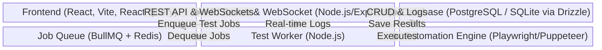
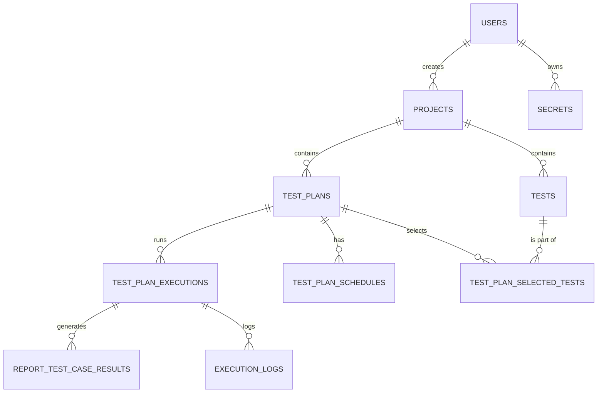
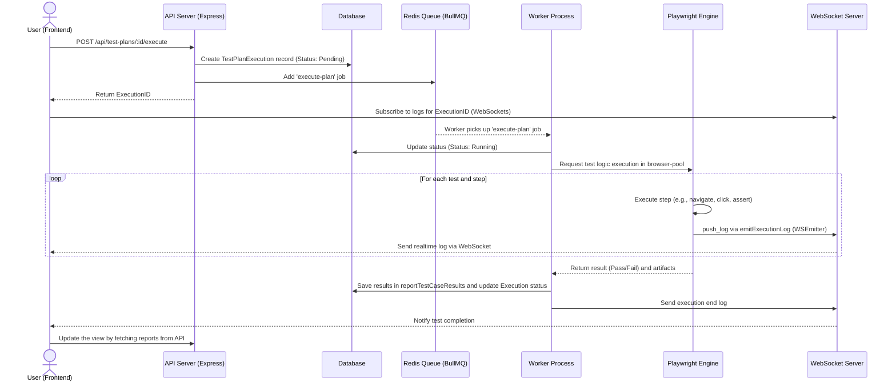

# System Architecture & Codebase Document: WebFlowMaster

## 1. EXECUTIVE SUMMARY & TECH STACK

**WebFlowMaster** is an enterprise platform for end-to-end test automation. It combines an intuitive Visual Builder with a powerful execution engine based on Playwright and Puppeteer to ensure maximum reliability of web applications. The platform allows QA teams to create complex tests (No-Code Visual Builder), record, execute, and monitor them through advanced analytical dashboards, facilitating integration into the CI/CD cycle.

### Tech Stack
*   **Frontend**: React (v18), TypeScript, Vite, TailwindCSS, Shadcn/UI (Radix UI), Wouter (routing), React Query (@tanstack/react-query), Zustand (potential, or React Context), Framer Motion, Monaco Editor.
*   **Backend**: Node.js, Express, Passport.js (Local Strategy), BullMQ (Task Queue).
*   **Database**: PostgreSQL (via serverless Neon or local db) or SQLite (Better-sqlite3/PGlite for development), managed via **Drizzle ORM**.
*   **Automation Engine**: Playwright (@playwright/test) and Puppeteer.
*   **Queue & Background Jobs**: BullMQ with Redis, Node-cron for scheduling.
*   **Logging**: Winston (with winston-daily-rotate-file and winston-loki for export).
*   **Real-time Communication**: WebSockets (`ws` package).
*   **Auth**: Passport.js with local strategy and session management via express-session stored in memory or Redis (via connect-redis / memorystore).

---

## 2. SYSTEM ARCHITECTURE

The architecture follows a modular monolithic client-server approach.
The client is a Single Page Application (SPA) in React that communicates via REST APIs and WebSockets with the Node.js Express server.
The backend handles authentication, CRUD logic, and test orchestration.
Test execution is delegated to the background: a test execution service pushes jobs (via BullMQ) into a Redis-based queue, which are then picked up and processed by an asynchronous Worker. This allows E2E tests via Playwright to run without blocking the main server's event loop.
Test results and logs are saved in the Database and communicated in real-time to the frontend via WebSockets.



---

## 3. CODEBASE MAP (Directory Structure)

```text
/ WebFlowMaster
├── package.json               # Dependencies configuration and workspace (client/server monorepo).
├── /client                    # Frontend React SPA
│   ├── package.json           # Frontend Dependencies
│   └── /src
│       ├── App.tsx            # Entry point and routing of the frontend app (Wouter).
│       ├── /components        # Reusable UI components (Shadcn UI and custom components).
│       ├── /hooks             # Custom hooks (e.g., use-auth, useTestRunner, useExcelMappings).
│       ├── /lib               # Frontend utilities, API client configuration, and React Query (queryClient.ts).
│       ├── /pages             # View components/Pages (Dashboard, Auth, Test Reports).
│       └── /locales           # i18n translations for the platform.
├── /server                    # Backend Node.js
│   ├── index.ts               # API Gateway, Express configuration, WebSockets middleware.
│   ├── worker.ts              # Entry point of the background Worker to process the test queue (BullMQ).
│   ├── routes.ts              # REST API route definitions.
│   ├── db.ts                  # Database connection configuration and Drizzle ORM.
│   ├── auth.ts                # Passport.js authentication configuration.
│   ├── queue.ts               # BullMQ queue setup and Redis connection.
│   ├── websocket.ts           # Real-time WebSocket connections management.
│   ├── logger.ts              # Winston structured logging configuration.
│   ├── test-execution-service.ts # Core logic for preparing and starting tests.
│   ├── playwright-service.ts  # Abstraction service to command Playwright.
│   ├── scheduler-service.ts   # Management of scheduled tests (node-cron).
│   ├── reporting-service.ts   # Report generation (e.g., JUnit, HTML) and DB saving.
│   └── /middleware            # Express middlewares (e.g., correlationId for tracing logs).
└── /shared
    └── schema.ts              # Drizzle ORM schemas for the Database and types shared between FE and BE.
```

---

## 4. CORE MODULES & BUSINESS LOGIC

### Test Execution Engine
The execution engine is based on an asynchronous architecture.
1. **Start**: When a user or the scheduler starts a test (from `test-execution-service.ts`), the backend creates an execution record in the DB and adds a Job to the `TEST_EXECUTION_QUEUE_NAME` queue via `queue.ts` (BullMQ).
2. **Worker Processing**: The `worker.ts` module detects the job and executes `processTestPlanJob`.
3. **Automation**: The worker delegates operations to `playwright-service.ts`, which instantiates and manages a browser pool (configured in `browser-pool.ts`). The test logic is converted into Playwright instructions (navigate, click, type, assert). Automatic injection of Secrets via interpolation is supported.
4. **Reporting and Closure**: Once steps are completed, `reporting-service.ts` saves the results in the DB and `test-execution-service.ts` updates the final status, while the browsers are released back to the pool.

### Logging System
The logging system, located in `server/logger.ts`, uses **Winston**.
- The log is "Structured", formatted in JSON for easy ingestion by systems like Loki (via `winston-loki`).
- It includes the propagation of a `correlationId` (via `AsyncLocalStorage` in the `correlation.ts` middleware module), to merge all logs generated by a single HTTP request or test execution.
- It provides mechanisms for **redactSensitiveData** to obscure PII information or passwords (secrets).
- Test execution logs (`ExecutionLogEntry`) are sent in real-time to the frontend via WebSocket through the emitter provided by `websocket.ts` and saved to the database in the `execution_logs` table.

### Authentication and User Management
Identity management takes place via `server/auth.ts`, using **Passport.js**.
- It uses `passport-local` for username/password with hashing via the native Node.js `scrypt` function.
- Sessions are maintained via `express-session`, typically stored in `memorystore` for development or Redis.
- Session cookies protect the backend APIs, which expose data only to authenticated users (`req.user` typed on schema).
- On the frontend, the `use-auth.tsx` hook and the `AuthProvider` context maintain the authentication state, blocking unauthorized routes with the `protected-route.tsx` component.

---

## 5. DATA MODEL (Database Schema)

The database is managed via **Drizzle ORM** with the schema definition in `@shared/schema.ts`.

### Main Entities
*   **users**: System users.
*   **projects**: Containers to group tests.
*   **tests**: Definitions and configurations of automated tests.
*   **testPlans**: Execution plans that aggregate multiple tests (`testPlanSelectedTests`).
*   **testPlanExecutions**: Instance of an executed test plan.
*   **reportTestCaseResults**: Detailed results of individual step and test executions.
*   **executionLogs**: Detailed logs related to a single execution, also used for playback and debugging.
*   **secrets**: Cryptographically obscured credentials to be injected into tests at runtime.
*   **testPlanSchedules**: Data related to recurring execution based on cron.

### Entity-Relationship Diagram (ER)



---

## 6. DATA FLOW: THE TEST LIFECYCLE

End-to-end flow from the user's click to the display of the result:



---

## 7. STATE MANAGEMENT AND UI (Frontend)

### Global State and Data Fetching
- The frontend heavily utilizes **React Query (`@tanstack/react-query`)** as the primary layer for server state management. The library handles caching, refetching, query-key invalidation for asynchronous data (e.g., fetching running tests, dashboard analytics, user data with custom hooks).
- User context management and login state is natively handled in React via `Context API` within `AuthProvider` (in `hooks/use-auth.tsx`).
- Ephemeral UI state and form-handling utilize local states (`useState`), specialized hooks (like `react-hook-form` with schema validation via `zod` and `drizzle-zod`).

### Real-Time Data
- To view execution live without overwhelming the API with polling, the app establishes a **WebSocket** connection.
- Data sent to the client via WebSocket contains `ExecutionLogEntry`. This data is intercepted by the frontend and inserted into the local state to display logs and visually advance the test progress bars step-by-step to the user in real-time.
