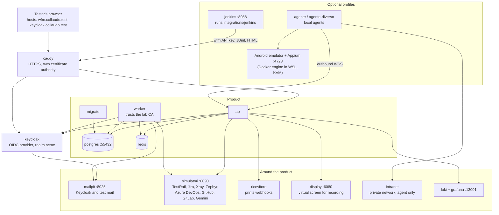

# Test lab (acceptance environment)

The repository contains a complete environment for **manually accepting the product**: WebFlowMaster as
`docker-compose.yml` starts it, in production mode behind HTTPS, with everything the acceptance cases need
around it — an identity provider, a mail inbox, simulated external tools, Jenkins, a log stack and an
Android emulator. It lives in `collaudo/` ("collaudo" is Italian for acceptance test).

The step-by-step procedure (commands, accounts, values for each case) is in
[`collaudo/README.md`](https://github.com/Markg981/WebFlowMaster/blob/main/collaudo/README.md), in Italian,
because the acceptance protocol itself is. This page explains what the lab is made of and how it works.

## What it is for

Run `npm run dev:collaudo` from the repository root and open `http://localhost:4322`
for the local acceptance page. It reproduces the original artifact presentation and
provides search, filters, progress, outcome buttons, automatic note saving and JSON
backup import/export. `npm run dev:docs` remains the documentation command.
The catalogue is versioned in `collaudo/casi.json`; cycles and results are stored in
`collaudo/.local/state.json`, excluded from Git. The page itself needs neither Claude
nor Docker. Use the lab below to execute the product acceptance cases.

Each cycle freezes its catalogue, including instructions and presentation, under a SHA-256
`catalogHash`; recorded results carry the corresponding `caseHash`. Historical pages and CSV
exports use that frozen catalogue. Create a new cycle to test updated definitions. Existing
cycles freeze the locally saved catalogue before repository updates are applied; definitions
already overwritten before this migration cannot be recovered automatically.
Before each save or migration, a restorable JSON backup is written to
`collaudo/.local/backups/auto-*.json`. The last 30 automatic backups are retained; manual files
are untouched. A failed backup prevents the save. Import accepts files up to 50 MiB and merges
history without overwriting conflicting results. For rollback, stop the server, copy `.local`
somewhere safe, rename `state.json`, restart and import the selected backup. Keep an off-machine
copy too: local backups do not protect against disk failure.

The automated tests prove the code; the lab proves the *product as a person meets it*: the real images,
TLS, cookies, single sign-on, e-mail, agents in another network, a real emulator. The protocol is a
list of numbered cases (areas ACC, MFA, SSO, MEM, ENV, WEB, API, LIB, PLN, SCH, REP, INT, AGT, ADM, SEC,
OPS, UX, TMG, TRC, MOB) kept locally in `collaudo/casi.json`; each recorded result is keyed by
the case id, so ids are never renamed.

## Topology

| Service | Purpose | Cases |
|---|---|---|
| `caddy` | HTTPS with a private certificate authority; the product and the worker already trust it, the tester's browser imports it once | all |
| `keycloak` | Identity provider for SSO, OAuth 2.0 client credentials, TOTP users, reset-password mail | SSO, API-04, WEB-45…49 |
| `mailpit` | Inbox for Keycloak and for "Wait for email" steps | WEB-45…47 |
| `simulatori` | One Node server answering like TestRail, Jira (and Xray Server), Xray Cloud, Zephyr Scale, Azure DevOps, GitHub, GitLab and Gemini, with the data the cases expect; an admin page shows what it received | TMG, TRC, INT-07, REP-15…22, WEB-16 |
| `intranet` | A site on a private network that only the agent can reach | AGT |
| `ricevitore` | Prints notification webhooks | PLN-13 |
| `display` | A virtual screen (noVNC) where the recording window opens | WEB-11, ENV-04 |
| `loki`, `grafana` | The application's logs | OPS-09 |
| `agente`, `agente-diverso` | Local agents; the second runs another Playwright version to test the mismatch message | AGT |
| `jenkins` | Jenkins configured by code that runs the shared library of `integrations/jenkins` against the lab | INT-08 |
| Android emulator | A real emulator with Appium (`budtmo/docker-android`), reached through an agent and a *Local Appium* grid | MOB |

## Commands

All are `npm run` scripts at the repository root; they use the project name `wfm-collaudo`, so the lab's
database and volumes never mix with a development stack.

| Command | Does |
|---|---|
| `collaudo:up` | Builds the image from the current code and starts every service, waiting until healthy. |
| `collaudo:prepare` | Creates people, one signed-in session per role, the *Staging* environment, a login test and a plan already run once, and a restricted project. Repeatable. |
| `collaudo:check` | Prints "Ready" or, for each problem, what to do. Public sites used by cases are warnings: if they are down, the case is *Blocked*, not *Failed*. |
| `collaudo:simulatori` | Creates the "Simulated · …" connections and verifies each through the product. |
| `collaudo:jenkins` | Creates an API key, starts Jenkins and runs job INT-08. |
| `collaudo:mobile` | Starts the emulator and Appium, downloads the sample app. |
| `collaudo:sicurezza-mobile` | Runs the SEC-25…30 isolation steps of mobile tests through the API. |
| `collaudo:reset` | Removes the stack and its volumes. |

## Design decisions worth knowing

- **The lab is the real product.** It is the production images with environment overrides, not a
  special build; anything the lab needs that the product lacked was added to the product (for example
  the worker trusting an extra CA, `collaudo/worker/trust-ca.sh`).
- **Every external service is simulated, deterministically.** The cases can then be repeated without
  accounts, and the simulator's admin page shows exactly what the product sent (REP-17 reads the prompt
  sent to the AI there).
- **Settings a case changes are variables**, applied by recreating the service and removed by recreating
  it again (`INSTALLATION_ADMINS`, `ORG_MAX_CONCURRENT_RUNS`, `RUN_MAX_DURATION_MS`, `API_RATE_LIMIT`,
  `AUTH_RATE_LIMIT`, `REGISTRATION`, `GEMINI_API_KEY`, `DEBUG_IDLE_TIMEOUT_MS`).
- **Credentials are lab-only** (`Collaudo.2026!`, fixed secrets). They are never to be reused.
- **A failing case after "Ready" fails for the application, not for the environment.**

## What the lab does not cover

Real Jira, Azure DevOps, GitHub and CI systems are external; the corresponding cases use the simulators or
need their own project, repository and tokens. The GitHub case INT-06 needs the installation to be reachable
from GitHub (a self-hosted runner or a tunnel). iOS cases need a Mac.
