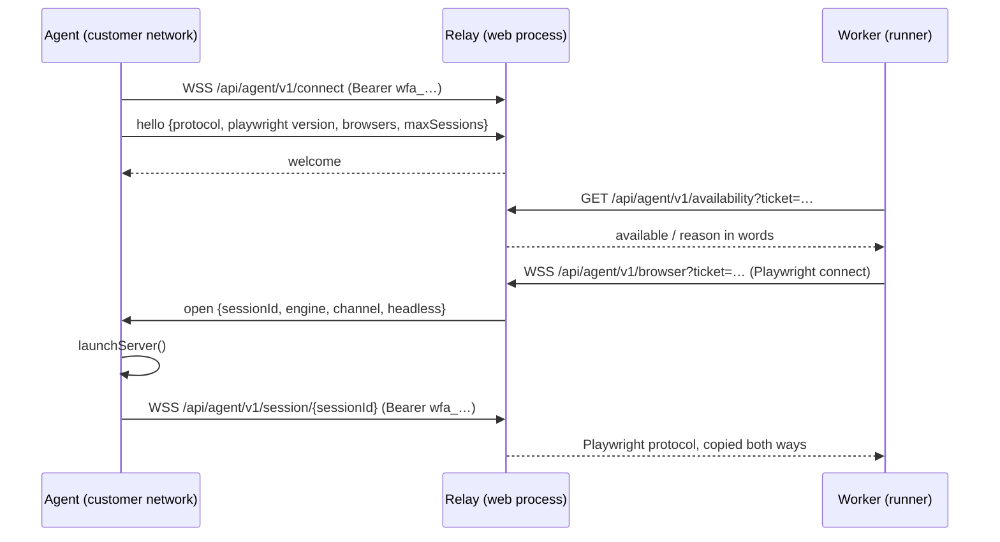

# Local agents (internals)

A local agent lends browsers that run inside a customer's network to runs that execute on the
server's workers. This page explains how it works inside. How to install and operate one is in the
[Local agents guide](../LOCAL_AGENT).

## The idea: lend the browser, keep the runner

The runner stays exactly where it is. What moves is the browser: instead of `chromium.launch()`, a
pass of a plan set to an agent pool calls `chromium.connect()` to a browser that an agent started
with Playwright's `launchServer`. Everything that drives a browser — steps, healing, screenshots,
video, trace, HAR, visual comparison, accessibility — works unchanged, and the pages open from the
agent's machine, so they reach what that machine reaches.

Nothing dials an agent. The agent opens every connection, outward, so it needs no inbound port and
no VPN.

## Components

| Piece | File | Role |
|---|---|---|
| Protocol types | `shared/agents.ts` | Paths, protocol version, message shapes, pool name rule, Playwright compatibility. |
| Credentials | `server/agents/agent-credentials.ts` | Agent tokens (`wfa_…`, stored as SHA-256), relay tickets (HMAC, 60 s). |
| Token lookup | `server/agents/agent-auth.ts` | Which agent a token belongs to (privileged: the token names the organization). |
| Relay | `server/agents/relay.ts` | Accepts agents, runners and sessions; chooses an agent; pipes the protocol. |
| Directory | `server/agents/relay-directory.ts` | What each relay instance holds, when there are several web servers. |
| Runner side | `server/agents/agent-browser.ts` | Signs a ticket, asks availability, connects. |
| API requests | `server/agents/agent-fetch.ts` | `fetch` executed through a borrowed browser's request API. |
| Setup | `server/agents/setup.ts` | Starts the relay in the web process, cluster mode from `AGENT_RELAY_ADVERTISE_URL`. |
| Agent program | `scripts/wfm-agent.ts` | Control connection, `launchServer`, session pipes, reconnect, drain. |
| Routes | `server/routes/agents.routes.ts` | List, create (token shown once), revoke; availability. |

## Credentials

- The **agent token** says "I am this agent of this organization". Shown once, stored as a hash.
  Revoking sets `revoked_at` and disconnects the agent.
- The **ticket** says "this runner may borrow a browser of this organization's pool, now". The
  relay's browser endpoint is on the public address the agents dial, so without a ticket anyone could
  borrow a customer's browser. A ticket is signed with `AGENT_RELAY_SECRET` (defaulting to
  `SESSION_SECRET`), names organization, pool, engine, channel, headless and the runner's Playwright
  version, and expires after 60 seconds.

## Choosing an agent

For a ticket, the relay considers the agents of the same organization and pool, then filters:

1. the Playwright **major.minor** must match the runner's (the protocol changes between minors);
2. the agent must have the requested **engine** installed;
3. it must not be **draining** and must be under its `maxSessions`.

It picks the least busy. When none qualifies, it answers with the first reason that applies, in words
("No agent of pool "onprem" is connected", "…run Playwright 1.58, and this server 1.61: they must
match", "…has firefox installed", "Every agent … is busy or draining"). The runner asks
`/api/agent/v1/availability` before connecting so that reason, not a WebSocket error code, reaches the
run's log.

## Sessions

When chosen, the relay registers a pending session, holds the runner's first messages in a buffer,
and sends `open` to the agent. The agent starts a browser server and connects
`/api/agent/v1/session/{id}` with its token. Only the agent that was asked may answer for that session.
The buffered messages are flushed, and from then on messages are copied both ways, unread. If the
agent reports `open_failed` or does not answer within 30 seconds, the runner's connection is closed
with the reason.

The agent reconnects its control connection with backoff (up to 30 s). A `401` or a `refused`
message (revoked token, unsupported protocol) is fatal: the agent exits with code 2. `SIGTERM`
announces `draining` and lets current sessions finish.

## API requests from the agent

For a plan on an agent pool, API tests, API preconditions and OAuth token requests must also leave
from the customer's network. `AgentHttp` borrows one browser per run on the first request and uses
`context.request.fetch()`, which Playwright executes where the browser lives. Each request gets a new
browser context (a context keeps cookies; `fetch` does not), repeated headers survive, the
self-signed-certificate allowlist applies as on the server, and an abort is honoured immediately. No
agent change was needed: any agent that can lend a browser can send requests.

## Several web servers

Each web server runs its own relay instance, and an agent is connected to whichever instance the load
balancer gave it. With `AGENT_RELAY_ADVERTISE_URL` set, instances publish the agents they hold to
Redis every 5 seconds (entries live at least 15 seconds) and read what the others hold.

- A **runner** whose request lands on an instance without a suitable agent is forwarded to the
  instance that has the least busy one, as one more WebSocket copied both ways.
- The agent's **session connection** may also land anywhere. Session ids carry the id of the instance
  holding the runner (`instance~uuid`), so the connection is forwarded there; if that instance is not
  in the cached directory, the directory is read again first.
- A forwarded request carries the `x-wfm-relay-hop` header and is served or refused where it lands,
  never forwarded again. The far instance checks the ticket or the agent token itself, and its
  refusal (status and reason) is passed back unchanged; an unreachable instance is named, with the
  setting to check.
- **Revocation** reaches every instance: each re-authenticates the tokens of its agents on every
  heartbeat (20 s).

## Limits

- Agent and server Playwright must share major.minor. The Docker image is tagged with the server's
  version, and Settings flags a mismatch.
- API requests through an agent need Chromium on the agent.
- The API tester page and ad hoc runs from the builder send requests from the server: they belong to
  no plan and so to no pool.
