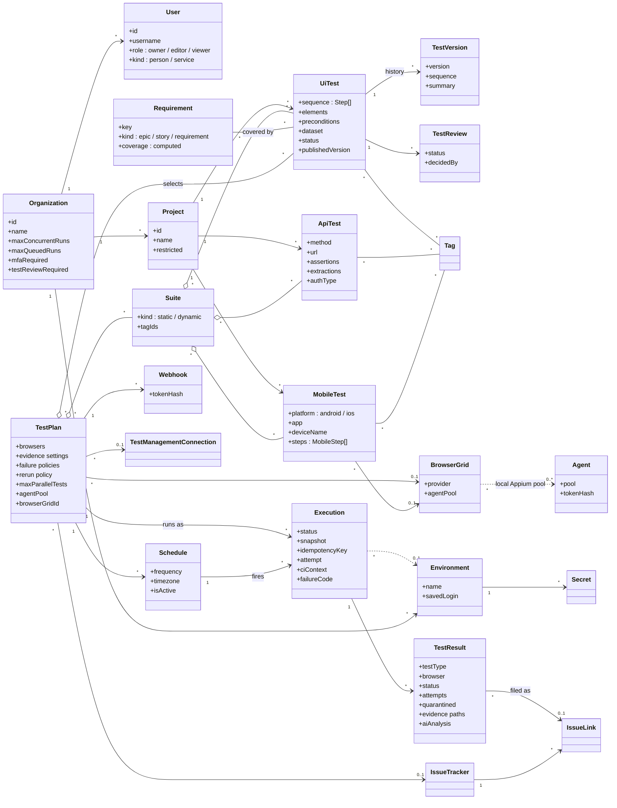
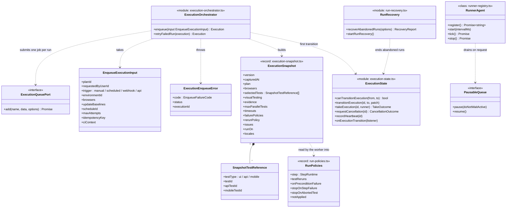
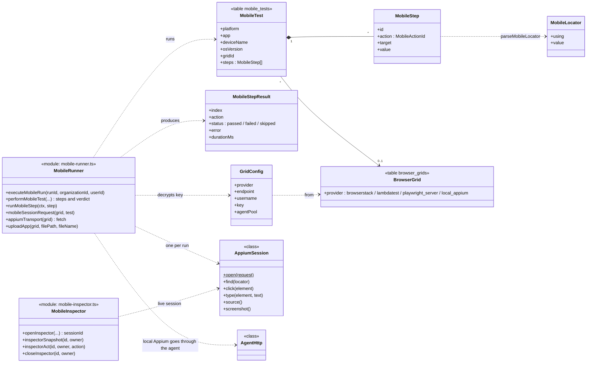
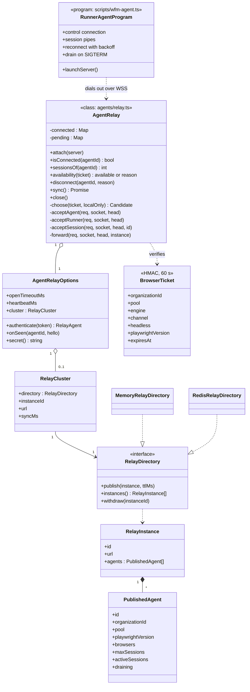
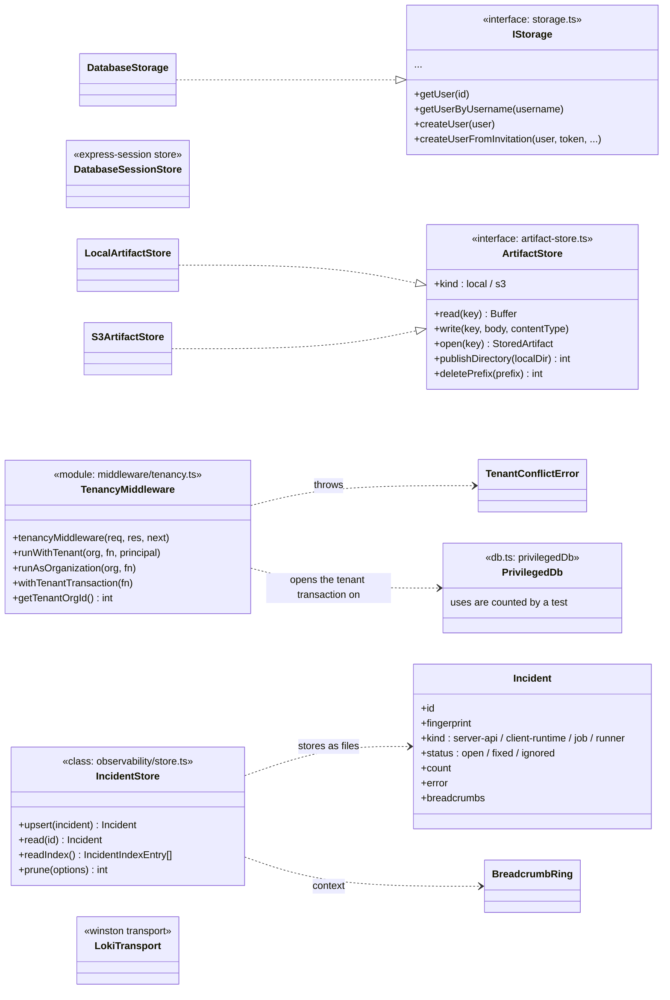

# Class diagrams

WebFlowMaster is written mostly as modules of functions: decisions are pure functions in their own
files, effects are in the modules that perform them. The product therefore has few classes, and the
ones it has sit exactly where *state with a lifetime* is needed — a WebSocket relay, a browser pool, a
device session, a debugger. This page draws them, and draws next to them the **domain model**: the
types that the whole system passes around, which are interfaces and records rather than classes.

All diagrams are taken from the code. Signatures are abbreviated to what matters; the file is named
on each diagram so the full definition is one search away. For the tables behind the domain types see
[Database schema](./database-schema).

## 1. The domain model

The business concepts and how they relate. Each box is a database table or a stored document; the
database column names are in [Database schema](./database-schema).

Three things the diagram cannot show:

- **A run is frozen when it is requested.** `Execution.snapshot` holds the plan's configuration and the
  *resolved list of tests*; editing the plan afterwards changes nothing about a run that exists.
- **Coverage is computed, never stored.** `Requirement.coverage` comes from the latest results of the
  tests that cover it (`shared/requirements.ts`).
- **A test result belongs to a test *and a browser*.** One test on three browsers is three
  `TestResult` rows, each with its own attempts, evidence and verdict.

## 2. Run creation and control

The orchestrator creates runs; `execution-state` is the only place a run's status changes; the
worker's `RunnerAgent` keeps the process visible. These are the types around them.

The run's status machine (`queued → running → completed | failed | error | timed_out`, with
`cancelling → cancelled`) is drawn in [Run lifecycle](./execution#_2-the-state-machine).

## 3. Execution of tests

```mermaid
classDiagram
  direction TB
  class PlaywrightService {
    <<class: playwright-service.ts>>
    +startRecordingSession(url, userId)
    +stopRecordingSession(id, userId)
    +getRecordedActions(id, userId)
    +detectElements(url, userId) DetectionResult
    +captureLoginState(sessionId, environment)
    +registerSession(id, session)
    +disposeAllRecordingSessions()
  }
  class BrowserPool {
    <<singleton: browser-pool.ts>>
    +getInstance()$ BrowserPool
    +acquire(browserType, headless) Browser
    +release(browser)
  }
  class FlowCursor {
    <<class: flow-cursor.ts>>
    +advance(outcome) string
    +iterationKey() string
  }
  class StepResult {
    <<record>>
    +name
    +type
    +status : passed / failed
    +screenshot
    +error
    +healed
    +visual
    +accessibility
  }
  class AgentHttp {
    <<class: agents/agent-fetch.ts>>
    +fetch : fetch through a borrowed browser
    +close() Promise
  }
  class AIAutomationService {
    <<class: ai-automation-service.ts>>
    +isAvailable() bool
    +proposeTestSteps(prompt)
    +proposeTestCases(prompt)
    +explainFailure(prompt, screenshot)
    +healSelector(selector, pageSource, error)
  }
  class DebugController {
    <<class: debug-session.ts>>
    +watch(vars)
    +record(record) Promise
    +finish(outcome) Promise
    +fail(message) Promise
  }
  class DebugHooks {
    <<interface>>
    +watch(vars)
    +beforeStep(context) DebugDecision
    +afterFailure(context) DebugDecision
    +record(record)
    +finish(outcome)
  }
  class DebugChannel {
    <<interface>>
    +open(id, meta)
    +publish(id, state)
    +read(id) DebugState
    +send(id, command)
    +drain(id) DebugCommand[]
    +next(id, ms) DebugCommand
  }
  class ExcelService {
    <<class: excel-service.ts>>
    +parseExcelFile(path) ExcelTestCase[]
    +detectColumns(path) string[]
  }
  class AppiumSession {
    <<class: appium-client.ts>>
    +open(request)$ AppiumSession
    +find(locator) string
    +click(element)
    +type(element, text)
    +drag(from, to, durationMs)
    +source() string
    +screenshot() string
    +close()
  }
  class WebDriverError

  PlaywrightService ..> BrowserPool : local browsers
  PlaywrightService ..> FlowCursor : conditions and loops
  PlaywrightService ..> StepResult : produces
  PlaywrightService ..> AIAutomationService : healing, optional
  PlaywrightService ..> DebugHooks : pauses when debugged
  DebugController ..|> DebugHooks
  DebugController ..> DebugChannel : state out, commands in
  AppiumSession ..> WebDriverError : throws
```

Notes:

- `PlaywrightService` is the largest class (recording, element detection, step execution helpers). A
  run does not use it as a bag of methods: `test-execution-service.ts` and `step-executor.ts` use its
  browser sessions and the pure helpers around it.
- `DebugChannel` has two implementations: `memoryDebugChannel` when browser tasks run inline in the web
  process, and `redisDebugChannel` when a worker runs them, which is what makes the step debugger
  work with the browser on a worker and the person on a web server.
- `AgentHttp` is described in [Local agents (internals)](./agents#api-requests-from-the-agent).

## 4. Mobile

The mobile subsystem is a vertical slice of its own; see [Mobile subsystem](./mobile) for the story.

## 5. Agents and the relay

## 6. Storage, tenancy and cross-cutting types

### The errors

Each area has its own `Error` subclass carrying a *code* the route turns into a status and a
sentence. None is caught by type outside its own area; a generic handler turns the rest into a `500`
and an incident.

| Class | File | Raised when |
|---|---|---|
| `ExecutionEnqueueError` | `execution-orchestrator.ts` | A run cannot be created: unknown plan, queue full, queue unreachable, invalid input. |
| `BrowserTaskError` | `browser-tasks.ts` | A task for a worker timed out, was refused or found no worker. |
| `TenantConflictError` | `middleware/tenancy.ts` | Code tries to run in two organizations at once. |
| `PublishingError`, `QuarantineError` | `test-publishing.ts`, `test-quarantine.ts` | A test cannot be published, reviewed or quarantined in its current state. |
| `SsoConfigError` | `sso.ts` | The provider's configuration is invalid or unreachable. |
| `ReportExportError` | `report-export.ts` | A report cannot be rendered. |
| `WebDriverError` | `appium-client.ts` | The Appium server answered with a W3C WebDriver error. |
| `InspectorError` | `mobile-inspector.ts` | An inspector session is gone, busy or refused. |

## 7. How to read the code with these diagrams

- Start from a **record** (`ExecutionSnapshot`, `StepResult`, `MobileStep`): they are the contracts
  between the web process, the worker, the client and the stored JSON. Most of them live in `shared/`
  so the client and the server cannot disagree.
- A **module** box (`<<module>>`) is a file of functions. Its pure part is tested directly; its
  effects are tested against PGlite or an HTTP fake.
- A **class** box is state with a lifetime: it owns a socket, a browser or a timer, so it has an
  explicit `close()` or `stop()` and a test that calls it.
