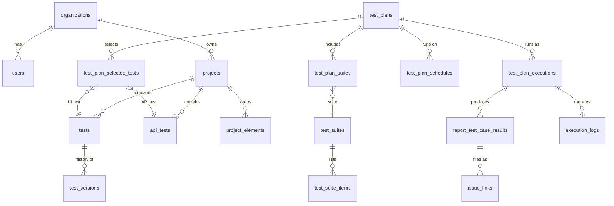

# Data model

The schema is declared once, with Drizzle, in `shared/schema.ts`, and created by the hand-written SQL
migrations in `migrations/` (see the [developer guide](./developer-guide#database-migrations)). This
page groups the tables by domain and explains what each one is for. Column-level detail is in
`shared/schema.ts`, where most columns carry a comment.

Unless noted, a table has an `organization_id` and is protected by row-level security
([Tenancy and access](./tenancy)).

## The core relationships

## Organizations, people and access

| Table | Purpose |
|---|---|
| `organizations` | The tenant. Also holds its quotas (`max_concurrent_runs`, `max_queued_runs`), its MFA policy and whether tests need review before publishing. Not RLS-scoped by `organization_id` (it *is* the organization). |
| `users` | People and service accounts. Carries the organization pointer and the role. No RLS: queries name the organization explicitly. |
| `user_mfa` | TOTP secret and recovery codes. No RLS and no grant to `app_user`: only the privileged MFA module reads it. |
| `user_settings` | Per-user preferences: theme, language, default test URL, default browser, headless, timeouts. |
| `invitations` | Pending invitations with a role and an expiry; single-use. Read before the user exists, so no RLS. |
| `projects` / `project_members` | Projects and, for restricted ones, who may see them and with which project role. |
| `api_keys` | Pipeline credentials: hash, prefix, scopes, expiry, last use, owning user or service account. |
| `audit_log` | Append-only trail of who did what; `app_user` may only select and insert. |
| `sessions` | The session store when PostgreSQL holds sessions (Redis does in production). Installation-wide. |

## Authoring tests

| Table | Purpose |
|---|---|
| `tests` | UI tests: the step sequence, detected elements, preconditions, dataset, published version pointer. |
| `detected_elements` | Elements found on a page for one test (the builder's palette). |
| `project_elements` | The element repository: one definition per element per project, which steps may reference; healing updates it once for every test. |
| `step_groups` | Named, reusable step sequences called from tests; expanded at run time. |
| `api_tests` | API tests: method, URL, headers, body, authentication, assertions, extractions. |
| `api_test_history` | Requests sent from the API tester, for the history panel. |
| `tags` / `test_tags` | An organization's own vocabulary, attached to tests; drives dynamic suites. |
| `test_versions` | Every saved state of a test. `app_user` cannot delete from it: the history cannot be rewritten. |
| `test_publications` | Which version was published or rolled back, when and by whom (select and insert only). |
| `test_reviews` | Review requests and decisions, when the organization requires review. |
| `test_quarantines` | Tests set aside as unreliable, with reason, evidence and release. |
| `excel_sequences_map` | Test Manager: rows of an imported spreadsheet mapped to saved sequences. |
| `test_runs` | Results of single test runs started from the builder (not plan runs). |

## Planning and running

| Table | Purpose |
|---|---|
| `test_plans` | A plan: browser machines, evidence settings, visual testing, timeouts, failure policies, re-run policy, parallelism, notification settings, issue tracker, agent pool. |
| `test_plan_selected_tests` | The tests a plan runs directly, in order. |
| `test_suites` / `test_suite_items` | Suites: static (listed tests) or dynamic (tests with given tags). |
| `test_plan_suites` | Suites a plan includes; expanded into tests when a run is created. |
| `test_plan_schedules` | When a plan runs: frequency or cron, time zone, browsers, environment, retry policy, notification override. |
| `test_plan_webhooks` | CI webhooks that start a plan; token stored as a hash. |
| `test_plan_executions` | Runs: status and lifecycle timestamps, heartbeat, runner, snapshot, idempotency key, attempts, CI context, aggregates, failure code and message. |
| `report_test_case_results` | One row per test per browser per run: status, steps (with screenshots, healing, visual and accessibility results), evidence paths, network summary, test version, quarantine flag, attempts. |
| `execution_logs` | The live log of a run, replayed by the report page. |
| `issue_trackers` / `issue_links` | Jira or Azure DevOps connections (token encrypted), and which failure was filed as which issue (unique per failure, so one failure is filed once). |
| `source_hosts` | GitHub or GitLab connections for commit statuses (token encrypted), with the last delivery outcome. |

## Environments and credentials for the system under test

| Table | Purpose |
|---|---|
| `environments` | Named targets (Staging, Production…), with an optional saved login state (the browser's cookies and storage, encrypted) so tests can start signed in. |
| `secrets` | The environment's values, encrypted, offered to tests as `{{name}}` variables; one named `baseUrl` overrides the installation's default. |

## Execution plane

| Table | Purpose |
|---|---|
| `runners` | Worker processes that registered, their heartbeat, capacity, installed browsers and desired state (draining). Installation-wide, no RLS. |
| `agents` | Local agents: pool, token hash, what they reported (host, versions, browsers), revocation. |
| `system_settings` | Installation-wide settings (log levels and similar). No RLS. |

## Conventions

- **Primary keys**: serial integers for the older, high-volume tables (tests, projects, users); UUID
  text for the newer ones and for anything whose id appears in a URL or a job (runs, plans,
  schedules).
- **Timestamps** are `timestamp` without time zone, always written and read as UTC: every database
  session sets `TIME ZONE 'UTC'` when it connects (`server/db.ts`).
- **jsonb** holds structured, schema-versioned documents (steps, snapshots, CI context, summaries).
  Readers accept both parsed and text forms, because some older rows were written as strings.
- **Deleting** is rare on purpose: tests keep their versions, runs keep their results after
  retention removes their files, agents are revoked rather than deleted. Where `app_user` has no
  `DELETE` grant, the application cannot delete.
- **Same-organization links** between organization tables are guarded, and checked by a drift test.
