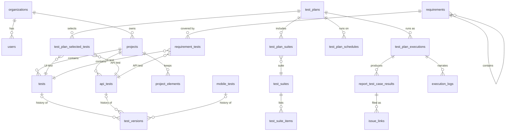

# Data model

The schema is declared once, with Drizzle, in `shared/schema.ts`, and created by the hand-written SQL
migrations in `migrations/` (see the [developer guide](./developer-guide#database-migrations)). This
page groups the tables by domain and explains what each one is for. Column-level detail is in
`shared/schema.ts`, where most columns carry a comment.

Unless noted, a table has an `organization_id` and is protected by row-level security
([Tenancy and access](./tenancy)).

## The core relationships

```mermaid
erDiagram
  organizations ||--o{ users : has
  organizations ||--o{ projects : owns
  projects ||--o{ tests : contains
  projects ||--o{ api_tests : contains
  projects ||--o{ project_elements : keeps
  tests |o--o{ test_versions : "history of"
  api_tests |o--o{ test_versions : "history of"
  mobile_tests |o--o{ test_versions : "history of"
  test_plans ||--o{ test_plan_selected_tests : selects
  test_plan_selected_tests }o--|| tests : "UI test"
  test_plan_selected_tests }o--|| api_tests : "API test"
  test_plans ||--o{ test_plan_suites : includes
  test_plan_suites }o--|| test_suites : suite
  test_suites ||--o{ test_suite_items : lists
  requirements ||--o{ requirements : contains
  requirements ||--o{ requirement_tests : "covered by"
  requirement_tests }o--|| tests : "UI test"
  requirement_tests }o--|| api_tests : "API test"
  test_plans ||--o{ test_plan_schedules : "runs on"
  test_plans ||--o{ test_plan_executions : "runs as"
  test_plan_executions ||--o{ report_test_case_results : produces
  test_plan_executions ||--o{ execution_logs : narrates
  report_test_case_results ||--o{ issue_links : "filed as"
```

## Organizations, people and access

| Table                          | Purpose                                                                                                                                                                                                       |
| ------------------------------ | ------------------------------------------------------------------------------------------------------------------------------------------------------------------------------------------------------------- |
| `organizations`                | The tenant. Also holds its quotas (`max_concurrent_runs`, `max_queued_runs`), its MFA policy and whether tests need review before publishing. Not RLS-scoped by `organization_id` (it _is_ the organization). |
| `users`                        | People and service accounts. Carries the organization pointer and the role. No RLS: queries name the organization explicitly.                                                                                 |
| `user_mfa`                     | TOTP secret and recovery codes. No RLS and no grant to `app_user`: only the privileged MFA module reads it.                                                                                                   |
| `user_settings`                | Per-user preferences: theme, language, default test URL, default browser, headless, timeouts.                                                                                                                 |
| `invitations`                  | Pending invitations with a role and an expiry; single-use. Read before the user exists, so no RLS.                                                                                                            |
| `projects` / `project_members` | Projects and, for restricted ones, who may see them and with which project role.                                                                                                                              |
| `api_keys`                     | Pipeline credentials: hash, prefix, scopes, expiry, last use, owning user or service account.                                                                                                                 |
| `audit_log`                    | Append-only trail of who did what; `app_user` may only select and insert.                                                                                                                                     |
| `quota_execution_sessions`     | Tenant-scoped occupancy sessions independent of report retention; overlaps measured per UTC month.                                                                                                            |
| `quota_artifacts`              | Tenant-scoped committed and reserved retained bytes, including baseline objects and inline mobile screenshots.                                                                                                |
| `quota_installation_defaults`  | Private installation mode/test/storage defaults used by quota triggers; unavailable to `app_user`.                                                                                                            |

Organization quota overrides include mode, saved tests, artifact bytes and monthly execution minutes,
with optimistic revision and artifact inventory timestamp. See [quota administration](../admin/administration#quotas).
| `password_resets` | Single-use, expiring password-reset links created by an owner or by the `password-reset-link` script; only the hash of the token is stored. |
| `organization_sso` | One identity provider per organization, OpenID Connect or SAML 2.0 (`protocol`): the issuer (entity ID for SAML), then client id and client secret (encrypted) for OpenID Connect or sign-on URL and signing certificate for SAML, plus default role, whether it is enabled and whether it is required, and the roles taken from the provider's groups (`group_attribute`, `role_mappings` as `[{group, role}]`, `require_group`) and the SCIM token (its hash and prefix, when it was issued and last used). No RLS and no grant to `app_user`: the provider is found before anyone is signed in. |
| `sso_saml_requests` | SAML AuthnRequests waiting for their answer: id and organization, kept ten minutes. The answer must match one, which is deleted as it is used, so a response cannot be replayed. Kept in the database, not the session, because the provider posts back cross-site. No RLS and no grant to `app_user`. |
| `sso_domains` | E-mail domains that route a sign-in to an organization's provider. A domain belongs to one organization; `verification_token` is the value of its DNS TXT record and `verified_at` says when it was proven. |
| `sso_identities` | The link between a person at the provider (`issuer` + `subject`) and a `users` row, with the last sign-in. |
| `scim_users` | The accounts the identity provider manages through SCIM, with the `external_id` it knows them by and whether its groups deactivated them (`disabled_by_groups`). The account is the `users` row; its SCIM id is the user id. No RLS and no grant to `app_user`. |
| `scim_groups` / `scim_group_members` | The provider's groups as it pushes them through SCIM, and who is in them. Role mappings match a group's `display_name` or `external_id`. No RLS and no grant to `app_user`. |
| `sso_saml_replay` | Atomic signed assertion/logout identifiers consumed once until their validation window expires. Privileged pre-authentication access only; no grant to `app_user`. |
| `sso_saml_sessions` | Session ids linked to SAML issuer, NameID and SessionIndex for provider-initiated logout. Revocation is authoritative even if the session store fails. Personal rows cascade with the user. Privileged access only. |
| `mail_deliveries` / `mail_delivery_events` | SMTP acceptance and signed delivery/bounce events: recipient, purpose, state and timestamps without content or tokens. Owner reads use RLS; signed callbacks use opaque privileged correlation. Null-organization system records are never visible through tenant APIs. |
| `sessions` | The session store when PostgreSQL holds sessions (Redis does in production). Installation-wide. |

Migration 0073 adds optional IdP-initiated login, required encrypted assertions, the SP public
certificate and encrypted private key, and provider logout URL to `organization_sso`.
`sso_saml_requests` distinguishes authentication and logout correlation by `purpose`.
Migration 0074 adds the mail tracking tables with forced RLS and SELECT-only application grants.

The complete column-level diagrams of all tables are in [Database schema](./database-schema).

## Authoring tests

| Table                                | Purpose                                                                                                                                                                                                                                                                                                                                                                                          |
| ------------------------------------ | ------------------------------------------------------------------------------------------------------------------------------------------------------------------------------------------------------------------------------------------------------------------------------------------------------------------------------------------------------------------------------------------------ |
| `tests`                              | UI tests: the step sequence, detected elements, preconditions, cleanup calls (`cleanups`, run after the test), dataset, published version pointer.                                                                                                                                                                                                                                               |
| `detected_elements`                  | Elements found on a page for one test (the builder's palette).                                                                                                                                                                                                                                                                                                                                   |
| `project_elements`                   | The element repository: one definition per element per project, which steps may reference; healing updates it once for every test.                                                                                                                                                                                                                                                               |
| `step_groups`                        | Named, reusable step sequences called from tests; expanded at run time.                                                                                                                                                                                                                                                                                                                          |
| `api_tests`                          | API tests: method, URL, headers, body, authentication, assertions, extractions, and the optional performance check (repetitions and response-time thresholds), plus the published-version pointer.                                                                                                                                                                                               |
| `api_test_history`                   | Requests sent from the API tester, for the history panel.                                                                                                                                                                                                                                                                                                                                        |
| `tags` / `test_tags`                 | An organization's own vocabulary, attached to tests; drives dynamic suites.                                                                                                                                                                                                                                                                                                                      |
| `test_versions`                      | Immutable executable revisions of web, API and mobile tests; typed references identify the test and `snapshot` holds the API/mobile configuration. `app_user` cannot delete from it: the history cannot be rewritten.                                                                                                                                                                            |
| `test_publications`                  | Which version was published or rolled back, when and by whom (select and insert only).                                                                                                                                                                                                                                                                                                           |
| `test_reviews`                       | Review requests and decisions, when the organization requires review.                                                                                                                                                                                                                                                                                                                            |
| `test_quarantines`                   | Tests set aside as unreliable, with reason, evidence and release.                                                                                                                                                                                                                                                                                                                                |
| `custom_actions`                     | An organization's own steps: a name, typed parameters and a script that runs in the browser page; a test uses one like any built-in action.                                                                                                                                                                                                                                                      |
| `test_data_sets`                     | Shared test data: a name, columns and rows. Each column of the first row is `{{data.<name>.<column>}}` in every test; a UI test runs over the rows when its `dataset` holds the marker `[{"$sharedSet": "<id>"}]`, expanded just before it runs (`server/test-data.ts`).                                                                                                                         |
| `excel_sequences_map`                | Test Manager: rows of an imported spreadsheet mapped to saved sequences.                                                                                                                                                                                                                                                                                                                         |
| `test_runs`                          | Results of single test runs started from the builder (not plan runs).                                                                                                                                                                                                                                                                                                                            |
| `mobile_tests` / `mobile_test_runs`  | Tests of native Android and iOS apps — platform, app on the grid (`bs://`, `lt://`), device, steps with native locators — and their runs on a grid's device. Tests have a published-version pointer; debug runs retain `test_version` and `test_snapshot` from request creation, with step results, the final screenshot and the session's page (`shared/mobile.ts`, `server/mobile-runner.ts`). |
| `requirements` / `requirement_tests` | Epics, user stories and requirements (typed in or imported from an issue tracker, with their parent) and the tests that cover them. Coverage is never stored: it is worked out from the tests' latest results (`shared/requirements.ts`).                                                                                                                                                        |

API/mobile plan results use `report_test_case_results.test_version` for the selected revision.
Direct mobile debug requests retain their saved working copy in `mobile_test_runs.test_snapshot`
and its revision in `test_version`, before background execution starts.

### BDD definitions and execution profiles

UI tests and their versions preserve Gherkin source, dialect, filename, scenario/example selection,
mode and exact profile binding. `bdd_execution_profiles` stores owner-authorized organization/project
bindings to an agent pool, operator profile and revision; it is RLS-protected. Support code stays on
the operator-provisioned agent. See [BDD tests](../guide/bdd-tests) and [suite handbook](./suite-handbook).

## Planning and running

| Table                                                                              | Purpose                                                                                                                                                                                                                                                                            |
| ---------------------------------------------------------------------------------- | ---------------------------------------------------------------------------------------------------------------------------------------------------------------------------------------------------------------------------------------------------------------------------------- |
| `test_plans`                                                                       | A plan: browser machines, evidence settings, visual testing, timeouts, failure policies, re-run policy, parallelism, notification settings, issue tracker, test management connection, agent pool.                                                                                 |
| `test_plan_selected_tests`                                                         | The tests a plan runs directly, in order.                                                                                                                                                                                                                                          |
| `test_suites` / `test_suite_items`                                                 | Suites: static (listed tests) or dynamic (tests with given tags).                                                                                                                                                                                                                  |
| `test_plan_suites`                                                                 | Suites a plan includes; expanded into tests when a run is created.                                                                                                                                                                                                                 |
| `test_plan_schedules`                                                              | When a plan runs: frequency or cron, time zone, browsers, environment, retry policy, notification override.                                                                                                                                                                        |
| `test_plan_webhooks`                                                               | CI webhooks that start a plan; token stored as a hash.                                                                                                                                                                                                                             |
| `test_plan_executions`                                                             | Runs: status and lifecycle timestamps, heartbeat, runner, snapshot, idempotency key, attempts, CI context, aggregates, failure code and message.                                                                                                                                   |
| `report_test_case_results`                                                         | One row per test per browser per run: status, steps (with screenshots, healing, visual and accessibility results), evidence paths, network summary, test version, quarantine flag, attempts.                                                                                       |
| `execution_logs`                                                                   | The live log of a run, replayed by the report page.                                                                                                                                                                                                                                |
| `test_management_connections` / `test_case_links` / `test_management_publications` | TestRail, Xray or Zephyr Scale connections (token encrypted), the case each test is in each of them (a test whose name carries `[KEY]` needs none), and each publication of a run: where, with what outcome, the key and link of what it made there (`server/test-management.ts`). |
| `issue_trackers` / `issue_links`                                                   | Jira or Azure DevOps connections (token encrypted), and which failure was filed as which issue (unique per failure, so one failure is filed once).                                                                                                                                 |
| `source_hosts`                                                                     | GitHub or GitLab connections for commit statuses (token encrypted), with the last delivery outcome.                                                                                                                                                                                |

## Environments and credentials for the system under test

| Table          | Purpose                                                                                                                                               |
| -------------- | ----------------------------------------------------------------------------------------------------------------------------------------------------- |
| `environments` | Named targets (Staging, Production…), with an optional saved login state (the browser's cookies and storage, encrypted) so tests can start signed in. |
| `secrets`      | The environment's values, encrypted, offered to tests as `{{name}}` variables; one named `baseUrl` overrides the installation's default.              |

## Execution plane

| Table             | Purpose                                                                                                                                                                                                                                                                                                                                         |
| ----------------- | ----------------------------------------------------------------------------------------------------------------------------------------------------------------------------------------------------------------------------------------------------------------------------------------------------------------------------------------------- |
| `runners`         | Worker processes that registered, their heartbeat, capacity, installed browsers and desired state (draining). Installation-wide, no RLS.                                                                                                                                                                                                        |
| `agents`          | Local agents: pool, token hash, what they reported (host, versions, browsers), revocation.                                                                                                                                                                                                                                                      |
| `browser_grids`   | Where browsers or devices come from when the runners do not have them: BrowserStack, LambdaTest, a Playwright server of one's own, or a **local Appium** reached through an agent pool. The key is encrypted. Plans point at a grid for browsers; mobile tests point at one for devices (`shared/browser-grids.ts`, `server/browser-grids.ts`). |
| `system_settings` | Installation-wide settings (log levels and similar). No RLS.                                                                                                                                                                                                                                                                                    |

## Conventions

- **Primary keys**: serial integers for the older, high-volume tables (tests, projects, users); UUID
  text for the newer ones and for anything whose id appears in a URL or a job (runs, plans,
  schedules).
- **Timestamps** are `timestamp` without time zone, always written and read as UTC: every database
  session sets `TIME ZONE 'UTC'` when it connects (`server/db.ts`).
- **jsonb** holds structured, schema-versioned documents (steps, snapshots, CI context, summaries).
  Readers accept both parsed and text forms, because some older rows were written as strings.
- **Deleting** is rare on purpose: tests keep their versions, runs keep their results after
  retention removes their files, agents are revoked rather than deleted. Where `app_user` has no
  `DELETE` grant, the application cannot delete.
- **Same-organization links** between organization tables are guarded, and checked by a drift test.
