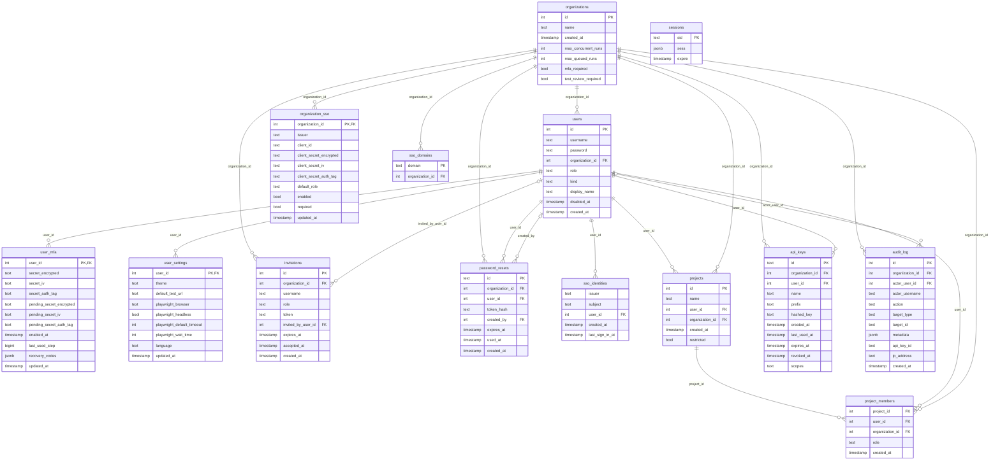
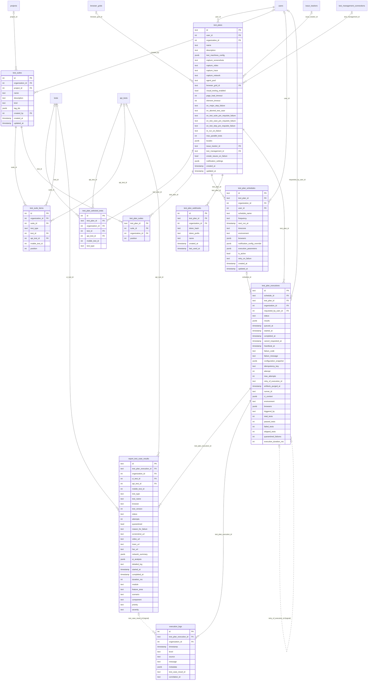
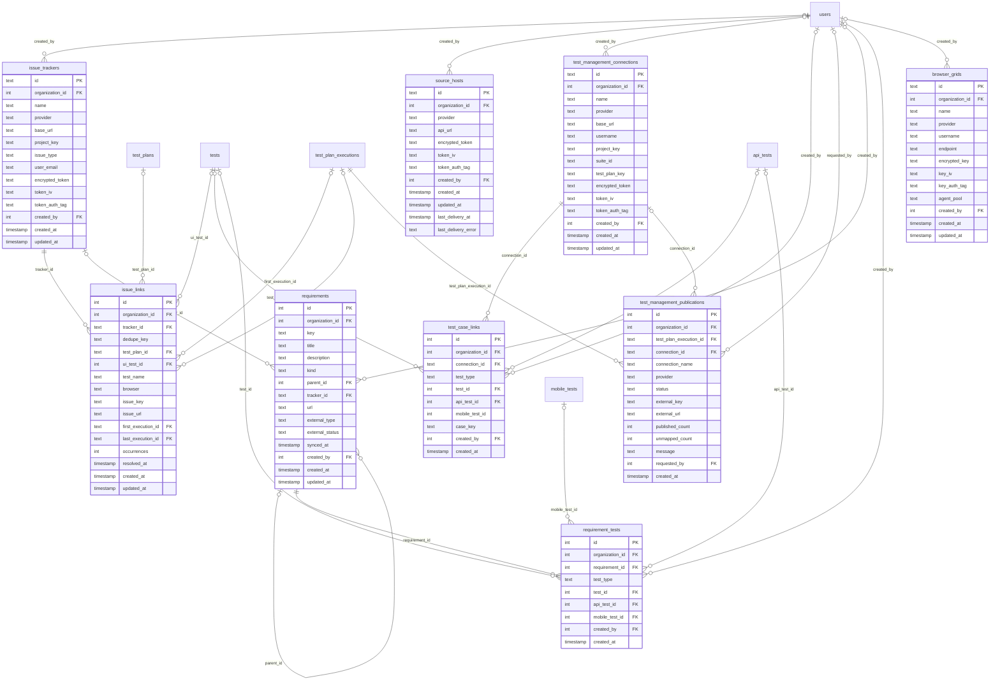
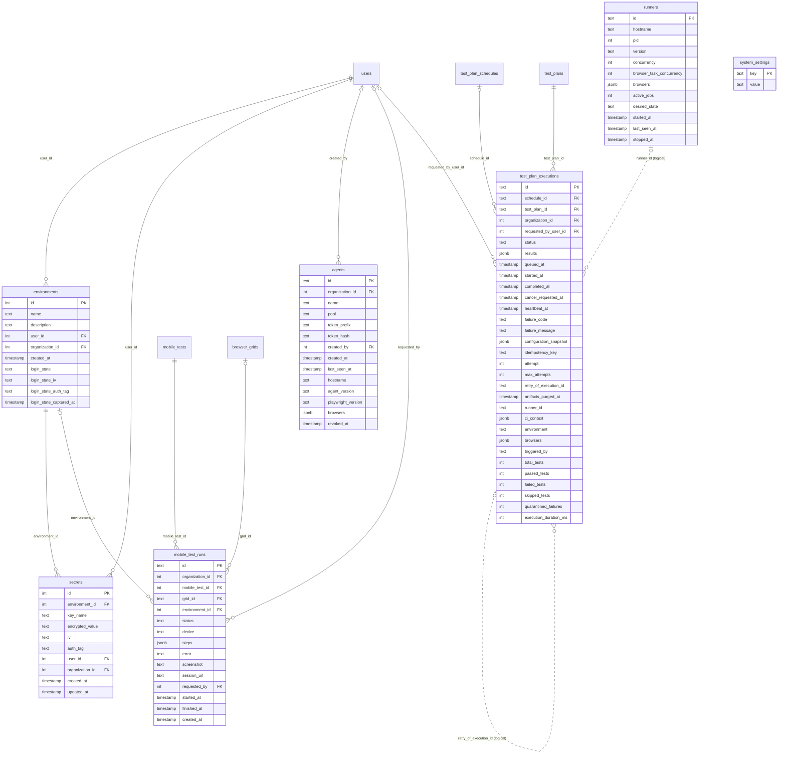

# Database schema

This page is the reference for the database: every table, every column and every relationship, drawn from
`shared/schema.ts` (the single declaration of the schema) by a script, so it cannot drift from the code. For the
purpose of each table, in words, read [Data model](./data-model); for how rows are kept apart between organizations,
read [Tenancy and access](./tenancy).

**55 tables**, of which 44 carry an `organization_id` and are protected by row-level security. The other 11 are
installation-wide or are read before an organization is known: `organizations`, `users`, `user_mfa`,
`user_settings`, `invitations`, `organization_sso`, `sso_domains`, `sso_identities`, `sessions`, `runners`
and `system_settings`.

## How to read the diagrams

- **PK** primary key, **FK** foreign key. Types are the logical ones: `int` (serial or integer), `text`, `bool`,
  `timestamp` (UTC, without time zone), `jsonb`, `bigint`.
- A solid line is a real foreign key. A line with `||` on the parent side means the column is `NOT NULL`; `|o` means it
  may be empty. A **dotted line** marked *(logical)* is a link the application keeps without a database constraint — for
  example a UI test, an API test or a mobile test appearing in the same column pair (`test_type` tells which).
- Inside a domain diagram the link of every table to `organizations` is left out: it is on every one of them, and drawn it
  would hide the rest. The first diagram, the overview, leaves out the columns for the same reason.
- Several tables hold *polymorphic* test references: `ui_test_id` / `test_id`, `api_test_id` and `mobile_test_id`,
  with `test_type` (`ui`, `api` or `mobile`) naming the one that is set. Only the first two are foreign keys; mobile
  tests were added later and are checked by the application.

## Overview

All the tables and the relationships between them, without columns and without the links to the organization and to the person who created a row.

```mermaid
erDiagram
  projects ||--o{ project_members : "project_id"
  projects |o--o{ tests : "project_id"
  tests ||--o{ test_runs : "test_id"
  tests ||--o{ detected_elements : "test_id"
  projects |o--o{ api_tests : "project_id"
  browser_grids |o--o{ test_plans : "browser_grid_id"
  issue_trackers |o--o{ test_plans : "issue_tracker_id"
  test_management_connections |o--o{ test_plans : "test_management_id"
  test_plans ||--o{ test_plan_schedules : "test_plan_id"
  test_plan_schedules |o--o{ test_plan_executions : "schedule_id"
  test_plans ||--o{ test_plan_executions : "test_plan_id"
  test_plan_executions ||--o{ report_test_case_results : "test_plan_execution_id"
  tests |o--o{ report_test_case_results : "ui_test_id"
  api_tests |o--o{ report_test_case_results : "api_test_id"
  test_plan_executions ||--o{ execution_logs : "test_plan_execution_id"
  environments ||--o{ secrets : "environment_id"
  test_plans ||--o{ test_plan_webhooks : "test_plan_id"
  test_plans ||--o{ test_plan_selected_tests : "test_plan_id"
  tests |o--o{ test_plan_selected_tests : "test_id"
  api_tests |o--o{ test_plan_selected_tests : "api_test_id"
  tests ||--o{ excel_sequences_map : "test_id"
  projects |o--o{ step_groups : "project_id"
  projects ||--o{ project_elements : "project_id"
  tags ||--o{ test_tags : "tag_id"
  tests |o--o{ test_tags : "test_id"
  api_tests |o--o{ test_tags : "api_test_id"
  tests ||--o{ test_versions : "test_id"
  tests ||--o{ test_publications : "test_id"
  tests ||--o{ test_reviews : "test_id"
  projects |o--o{ test_suites : "project_id"
  test_suites ||--o{ test_suite_items : "suite_id"
  tests |o--o{ test_suite_items : "test_id"
  api_tests |o--o{ test_suite_items : "api_test_id"
  test_plans ||--o{ test_plan_suites : "test_plan_id"
  test_suites ||--o{ test_plan_suites : "suite_id"
  tests |o--o{ test_quarantines : "test_id"
  api_tests |o--o{ test_quarantines : "api_test_id"
  requirements |o--o{ requirements : "parent_id"
  issue_trackers |o--o{ requirements : "tracker_id"
  test_management_connections ||--o{ test_case_links : "connection_id"
  tests |o--o{ test_case_links : "test_id"
  api_tests |o--o{ test_case_links : "api_test_id"
  test_plan_executions ||--o{ test_management_publications : "test_plan_execution_id"
  test_management_connections |o--o{ test_management_publications : "connection_id"
  projects |o--o{ mobile_tests : "project_id"
  browser_grids |o--o{ mobile_tests : "grid_id"
  mobile_tests ||--o{ mobile_test_runs : "mobile_test_id"
  browser_grids |o--o{ mobile_test_runs : "grid_id"
  environments |o--o{ mobile_test_runs : "environment_id"
  requirements ||--o{ requirement_tests : "requirement_id"
  tests |o--o{ requirement_tests : "test_id"
  api_tests |o--o{ requirement_tests : "api_test_id"
  mobile_tests |o--o{ requirement_tests : "mobile_test_id"
  issue_trackers ||--o{ issue_links : "tracker_id"
  test_plans |o--o{ issue_links : "test_plan_id"
  tests |o--o{ issue_links : "ui_test_id"
  test_plan_executions |o--o{ issue_links : "first_execution_id"
  test_plan_executions |o--o{ issue_links : "last_execution_id"
  organizations ||--o{ users : "organization_id"
  organizations ||--o{ projects : "organization_id"
```

## Identity, tenancy and access

Organizations, people, sign-in (password, second factor, single sign-on), invitations, projects and their members, API keys, and the audit trail.

## Authoring tests

UI, API and mobile tests, their versions, publication and review, the element repository, step groups, custom actions, tags and quarantine.

```mermaid
erDiagram
  users ||--o{ projects : "user_id"
  users ||--o{ tests : "user_id"
  projects |o--o{ tests : "project_id"
  tests ||--o{ test_versions : "test_id"
  users |o--o{ test_versions : "created_by"
  tests ||--o{ test_publications : "test_id"
  users |o--o{ test_publications : "published_by"
  tests ||--o{ test_reviews : "test_id"
  users |o--o{ test_reviews : "requested_by"
  users |o--o{ test_reviews : "decided_by"
  tests |o--o{ test_quarantines : "test_id"
  api_tests |o--o{ test_quarantines : "api_test_id"
  users |o--o{ test_quarantines : "quarantined_by"
  users |o--o{ test_quarantines : "released_by"
  tests ||--o{ detected_elements : "test_id"
  projects ||--o{ project_elements : "project_id"
  users ||--o{ step_groups : "user_id"
  projects |o--o{ step_groups : "project_id"
  users ||--o{ custom_actions : "user_id"
  users ||--o{ api_tests : "user_id"
  projects |o--o{ api_tests : "project_id"
  users ||--o{ api_test_history : "user_id"
  tags ||--o{ test_tags : "tag_id"
  tests |o--o{ test_tags : "test_id"
  api_tests |o--o{ test_tags : "api_test_id"
  tests ||--o{ excel_sequences_map : "test_id"
  tests ||--o{ test_runs : "test_id"
  projects |o--o{ mobile_tests : "project_id"
  browser_grids |o--o{ mobile_tests : "grid_id"
  users |o--o{ mobile_tests : "created_by"
  mobile_tests ||--o{ mobile_test_runs : "mobile_test_id"
  browser_grids |o--o{ mobile_test_runs : "grid_id"
  environments |o--o{ mobile_test_runs : "environment_id"
  users |o--o{ mobile_test_runs : "requested_by"
  mobile_tests |o..o{ test_tags : "mobile_test_id (logical)"
  mobile_tests |o..o{ test_quarantines : "mobile_test_id (logical)"
  test_reviews |o..o{ test_publications : "review_id (logical)"
  projects {
    int id PK
    text name
    int user_id FK
    int organization_id FK
    timestamp created_at
    bool restricted
  }
  tests {
    int id PK
    int user_id FK
    int organization_id FK
    int project_id FK
    text name
    text url
    jsonb sequence
    jsonb elements
    jsonb preconditions
    jsonb dataset
    text status
    int published_version
    timestamp created_at
    timestamp updated_at
    text module
    text feature_area
    text scenario
    text component
    text priority
    text severity
  }
  test_versions {
    int id PK
    int organization_id FK
    int test_id FK
    int version
    text name
    text url
    jsonb sequence
    jsonb elements
    jsonb preconditions
    jsonb dataset
    text summary
    int restored_from_version
    int created_by FK
    timestamp created_at
  }
  test_publications {
    int id PK
    int organization_id FK
    int test_id FK
    int version
    text kind
    int review_id
    int published_by FK
    timestamp published_at
  }
  test_reviews {
    int id PK
    int organization_id FK
    int test_id FK
    int version
    text status
    text note
    int requested_by FK
    timestamp requested_at
    int decided_by FK
    timestamp decided_at
    text decision_comment
  }
  test_quarantines {
    int id PK
    int organization_id FK
    text test_type
    int test_id FK
    int api_test_id FK
    int mobile_test_id
    text reason
    int quarantined_by FK
    timestamp quarantined_at
    int released_by FK
    timestamp released_at
    text release_note
  }
  detected_elements {
    int id PK
    int test_id FK
    int organization_id FK
    text element_id
    text selector
    text original_selector
    text type
    text text
    text tag
    jsonb attributes
    timestamp created_at
  }
  project_elements {
    text id PK
    int organization_id FK
    int project_id FK
    text name
    text selector
    text original_selector
    text frame_selector
    text tag
    text element_type
    text text
    jsonb attributes
    timestamp healed_at
    timestamp created_at
    timestamp updated_at
  }
  step_groups {
    text id PK
    int organization_id FK
    int user_id FK
    int project_id FK
    text name
    text description
    jsonb sequence
    timestamp created_at
    timestamp updated_at
  }
  custom_actions {
    text id PK
    int organization_id FK
    int user_id FK
    text name
    text description
    jsonb parameters
    text script
    timestamp created_at
    timestamp updated_at
  }
  api_tests {
    int id PK
    int user_id FK
    int organization_id FK
    int project_id FK
    text name
    text method
    text url
    jsonb query_params
    jsonb request_headers
    text request_body
    jsonb assertions
    jsonb extractions
    text auth_type
    jsonb auth_params
    text body_type
    text body_raw_content_type
    jsonb body_form_data
    jsonb body_url_encoded
    text body_graphql_query
    text body_graphql_variables
    timestamp created_at
    timestamp updated_at
    text module
    text feature_area
    text scenario
    text component
    text priority
    text severity
  }
  api_test_history {
    int id PK
    int user_id FK
    int organization_id FK
    text method
    text url
    jsonb query_params
    jsonb request_headers
    text request_body
    int response_status
    jsonb response_headers
    text response_body
    int duration_ms
    timestamp created_at
  }
  tags {
    text id PK
    int organization_id FK
    text name
    timestamp created_at
  }
  test_tags {
    int id PK
    int organization_id FK
    text tag_id FK
    int test_id FK
    int api_test_id FK
    int mobile_test_id
    text test_type
    timestamp created_at
  }
  excel_sequences_map {
    int id PK
    int test_id FK
    int organization_id FK
    text excel_test_case_id
    timestamp created_at
  }
  test_runs {
    int id PK
    int test_id FK
    int organization_id FK
    text status
    jsonb results
    timestamp started_at
    timestamp completed_at
  }
  mobile_tests {
    int id PK
    int organization_id FK
    int project_id FK
    text name
    text platform
    text app
    text device_name
    text os_version
    text grid_id FK
    jsonb steps
    int created_by FK
    timestamp created_at
    timestamp updated_at
  }
  mobile_test_runs {
    text id PK
    int organization_id FK
    int mobile_test_id FK
    text grid_id FK
    int environment_id FK
    text status
    text device
    jsonb steps
    text error
    text screenshot
    text session_url
    int requested_by FK
    timestamp started_at
    timestamp finished_at
    timestamp created_at
  }
```

## Planning and running

Plans, suites, schedules, webhooks, runs, per-test results and the live log. A run is one `test_plan_executions` row; each test on each browser is one `report_test_case_results` row.

## Integrations and traceability

Issue trackers, source hosts, test-management tools, requirements and their coverage, and the browser and device grids.

## Environments and the execution plane

Environments with their encrypted secrets and saved login, the runners that registered, the local agents, and installation-wide settings. The two run tables are repeated here only to show what points at them.

## Links the database does not enforce

These relationships exist in the application but have no foreign key. Most come from a polymorphic design (three kinds of test in one column set).

| Column | Points at | Note |
|---|---|---|
| `mobile_test_id` in `report_test_case_results`, `test_plan_selected_tests`, `test_suite_items`, `test_tags`, `test_quarantines`, `test_case_links` | `mobile_tests.id` | Added after the UI and API columns; `requirement_tests` is the exception and does reference it. |
| `execution_logs.test_case_result_id` | `report_test_case_results.id` | Optional: ties a log line to one test of the run. |
| `test_publications.review_id` | `test_reviews.id` | A publication may not come from a review (a direct publish or a rollback). |
| `excel_sequences_map.test_id` | `tests.id` | Test Manager: the saved sequence a spreadsheet row maps to. |
| `test_plan_executions.runner_id` | `runners.id` | A runner row may be pruned while the run keeps its record. |
| `test_plan_executions.retry_of_execution_id` | `test_plan_executions.id` | The run a re-run repeats. |

## Constraints worth knowing

- **Same-organization links.** Where one organization table points at another, a composite foreign key `(id, organization_id)` makes sure both
  rows belong to the same organization (migration 0034 and later); a drift test fails when a new link lacks one.
- **Append-only tables.** `audit_log`, `test_versions` and `test_publications` give `app_user` only `SELECT` and
  `INSERT`: the application cannot rewrite them.
- **Uniqueness.** Environment names are unique per organization (migration 0041); an invitation is unique per username
  while pending (0044); an issue link is unique per failure (`dedupe_key`), so one failure is filed once; a run's
  idempotency key is unique per organization, so a retried request returns the same run.
- **Migrations.** 59 numbered SQL files in `migrations/` (`0000` … `0058`), applied once by the migrator before the other
  processes start; the journal is `migrations/meta/_journal.json`.
