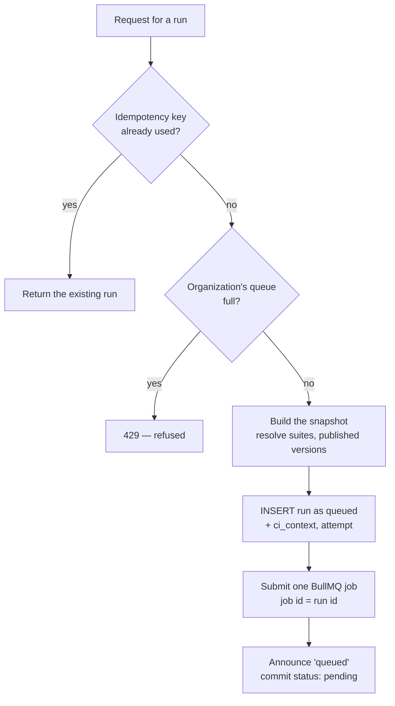
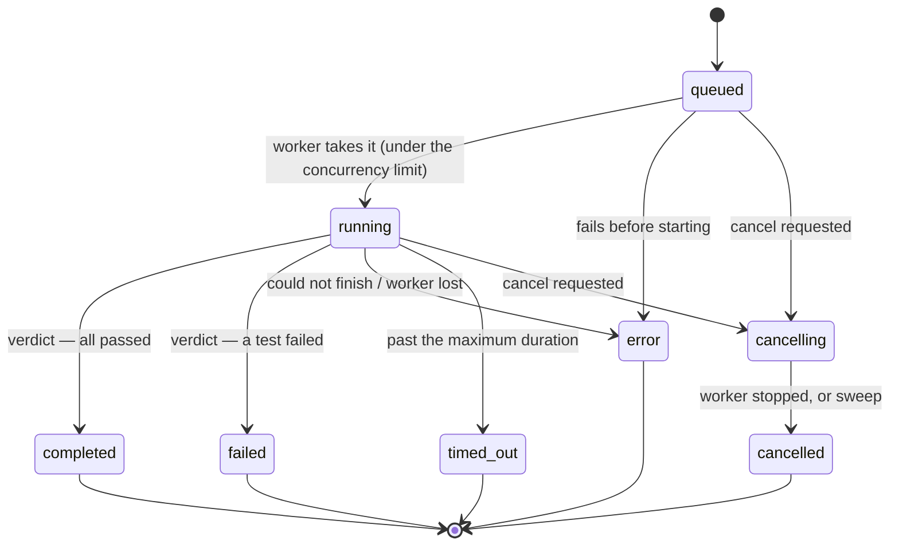

# Run lifecycle

A **run** (a row of `test_plan_executions`) is one execution of a test plan. This page follows a run
from the moment somebody asks for it to the commit status that reports it, and explains the
mechanisms that keep it correct when processes crash, requests repeat and workers race.

## Who asks for a run

| Trigger | Path | `triggered_by` |
|---|---|---|
| Run button in the application | `POST /api/test-plans/:id/run` | `manual` |
| Schedule | `server/scheduler-service.ts` (cron in the web process, or BullMQ job schedulers fired by a worker) | `scheduled` |
| Pipeline | `POST /api/v1/plans/:planId/runs` (the CLI uses it) | `api` |
| CI webhook | `POST /api/webhooks/execute` with a webhook token | `webhook` |
| Retry of a failed scheduled attempt | the worker, through the orchestrator | as the first attempt |

All of them go through one function: the **orchestrator** (`server/execution-orchestrator.ts`).

## 1. Creation: the orchestrator

1. **Idempotency.** A caller may send an idempotency key; asking twice with the same key returns the
   first run. A unique index per organization settles two requests arriving at the same instant.
2. **Queue limit.** Past the organization's `max_queued_runs` the request is refused with `429`
   rather than filling the queue for everybody ([limits](./tenancy#limits-per-organization)).
3. **Snapshot.** Everything the runner will read is written into `configuration_snapshot`
   (`server/execution-snapshot.ts`): the browser configuration, the selected tests (with suites
   already expanded into tests), visual testing, evidence capture, parallelism, timeouts, failure
   policies, re-run policy, notification settings, issue filing, and the agent pool. A plan edited
   while the run waits cannot change what the run does. A test added to the plan later is not in
   this run.
4. **One job.** Exactly one BullMQ job is submitted, and its id is the run's id: BullMQ refuses a
   second job with the same id, so even a duplicate that slipped past the key cannot run twice. If
   Redis refuses the submission, the run ends as `error` with `queue_submission_failed` and can be
   reclaimed by asking again.
5. **Priority.** The job's priority is fair across organizations: one with fewer runs in flight goes
   ahead of one that queued fifty.

## 2. The state machine

A run's `status` moves only through `server/execution-state.ts`. Every move is one conditional
`UPDATE … WHERE status IN (states it may follow)`: when two processes race, the database lets
exactly one through, and a terminal state has no way out.

The timestamps belong to the move, not to the caller: `running` stamps `started_at` and the first
heartbeat, a terminal state stamps `completed_at`, `cancelling` stamps `cancel_requested_at`. A
cancellation of a run still `queued` ends it immediately (`queued → cancelling → cancelled` in one
call), because no worker holds it.

After every recorded move, the state machine **announces** the new row to the listeners registered
in the process (`onExecutionTransition`); the commit status module is one of them.

## 3. The worker takes the run

`server/worker.ts` consumes the plan queue with `WORKER_CONCURRENCY` jobs at a time and calls
`processTestPlanJob` (`server/test-execution-service.ts`):

1. **Take.** `takeExecution` counts the organization's running runs under a lock and moves the run
   to `running` only if it is under `max_concurrent_runs`. Otherwise the job is delayed by
   `RUN_DEFERRAL_MS` (10 s) and the run stays `queued` — it waits, it does not fail. A run that is no
   longer `queued` (taken already, cancelled) is not taken, which is what makes a job delivered
   twice run once.
2. **Watch.** `watchRun` (`server/run-watch.ts`) starts a heartbeat every
   `RUN_HEARTBEAT_INTERVAL_MS` (15 s). Each beat also tells the worker whether somebody asked to
   cancel, whether the run ended elsewhere, and whether it passed `RUN_MAX_DURATION_MS` (3 h). The
   tests see it through an `AbortSignal` and stop at their next step.
3. **Read the snapshot.** Runs from before snapshots existed fall back to the plan as it is now.
4. **Resolve variables** once for the run: the installation defaults, the environment's values, and
   its decrypted secrets (`server/variables.ts`). The same resolution feeds preconditions, UI steps
   and API requests.

## 4. Running the plan

### Browser passes

`browsersForRun` (`server/browsers.ts`) turns what the plan or the schedule says ("chrome", "edge",
"safari", headed or headless) into Playwright engines and channels, and says out loud what it cannot
honour (an OS, a browser version, Safari itself). The schedule's browsers take precedence over the
plan's machines. With none configured, the run uses the requesting user's default browser.

If the plan is set to an **agent pool**, every pass borrows its browser from the pool's local agents
instead of launching one ([Local agents](./agents)), and the run's API requests go out from the agent
too.

Each browser is probed before the tests start; one that cannot start is reported as an
infrastructure failure of the run (it becomes `error`), not as failed tests. A headed browser that
cannot start on a machine without a display falls back to headless, and says so.

### Lanes and parallelism

Every test runs once per usable browser. A **lane** is one browser's pass over the plan, with its own
map of captured values. The plan's `max_parallel_tests` (capped by the installation's
`RUN_MAX_PARALLEL`) decides how many tests run at once:

- `1` — the historical order: one browser at a time, tests in sequence.
- `> 1` with **chained** API tests (an extraction feeds a later request) — browsers side by side,
  tests in order within each lane.
- `> 1` otherwise — any test of any lane, up to the limit.

### One test

`runTest` handles one test on one browser:

- **Which version.** Plans run a test's **published version** when it has one; with review required
  by the organization, an unpublished test is skipped rather than run unreviewed
  (`server/test-publishing.ts`).
- **Preconditions** (API calls that set up state) run first; each can be skipped when a check shows
  the state already exists. What a failed precondition means is the plan's policy: block the test
  (`error`), skip it, or continue anyway.
- **UI tests** run through `playwrightService.executeTestSequence`. Before the first step, step
  groups are expanded (a group call becomes the group's current steps) and repository elements are
  resolved (a step naming a shared element uses the element's current selector). A test with a
  **dataset** runs once per row, each row adding its own `{{variables}}`.
- Each step runs through `server/step-executor.ts`, the single implementation of every action:
  `navigate`, `click`, `input`, `select`, `selectByText`, `hover`, `scroll`, `wait`, conditional
  waits (`waitForElement`, `waitForText`, `waitForNetworkIdle`), assertions (`assert`,
  `assertTextContains`, `assertElementCount`, `assertState`, `assertAccessible`) and `ensureState`.
  Assertions wait up to 5 s for the page to settle; explicit waits up to 15 s.
- **Healing.** When a click or a fill cannot find its element and an AI key is configured, the page's
  DOM and the error go to the model, which proposes a selector. If the retry with it succeeds, the
  step is marked *healed* and the new selector is saved — on the shared repository element when the
  step names one, so every test using it is fixed at once.
- **Evidence.** Screenshots per the plan's policy; video, Playwright trace and HAR network capture
  per the evidence settings (`never`, `on_failure`, `always`); visual comparison against per-step
  baselines when visual testing is on; accessibility findings for `assertAccessible` steps.
- **API tests** run through `server/api-test-runner.ts`: variables substituted, authentication
  applied (Bearer, Basic, API key, OAuth 2.0 client credentials or password grant), assertions
  evaluated, values extracted into the lane's captured map for later requests.

### After each test

- The result row (`report_test_case_results`) is written with status, steps, evidence paths,
  browser, test version, and whether the test is **quarantined**.
- **Re-run on failure**: the plan's re-run policy runs a failed test again; the last attempt counts,
  and the number of attempts is recorded so a test that needed two is visibly flaky.
- **Failure policies**: a failed step can stop the test or the whole run, per the plan
  (`server/run-policies.ts`). A quarantined test's failure never stops a run.

## 5. The verdict

When every lane is done, the evidence left in the run's directory is published to the artifact
store and the aggregates are computed from the result rows:

| Outcome | Status |
|---|---|
| Stopped by a cancellation | `cancelled` |
| Past the maximum duration | `timed_out` (`run_timed_out`) |
| Any non-quarantined failure | `failed` |
| A browser that would not start, or a test that could not execute | `error` (`run_incomplete`) |
| Otherwise | `completed` |

Failures of quarantined tests are counted (`quarantined_failures`) but do not decide the run.

Then, for a run that reached a verdict:

1. **Retry.** A failed attempt with attempts left queues the next attempt after `RETRY_DELAY_MS`
   (30 s). Attempts come from a schedule's retry policy (`max_attempts`, at most 5); other runs have
   one. Issues and notifications wait for the attempt that decides.
2. **Issues.** With a tracker configured and filing on, each new failure opens an issue in Jira or
   Azure DevOps, and a failure already filed gets a comment instead (`server/issue-store.ts`).
3. **Notification.** The plan's webhook (Slack, Teams, or anything that accepts a POST) is told,
   according to its switches (`server/notifications.ts`).
4. **Commit status.** For a run started from GitHub Actions or GitLab CI, the commit gets the final
   status with a link to the report (`server/commit-status.ts`).

None of these can change the verdict: each failure is logged and reported as an outcome.

## 6. When things go wrong

| Situation | What happens |
|---|---|
| Somebody cancels | `running → cancelling`; the worker hears it at its next heartbeat, finishes the current step and ends the run `cancelled`. |
| A step hangs | The step's own timeout, then the run's maximum duration (`timed_out`). |
| The worker dies | Its heartbeat stops. The recovery sweep in the web process (`server/run-recovery.ts`) ends runs silent for `RUN_STALE_AFTER_MS` (default 2 min): `running → error` (`worker_lost`), `cancelling → cancelled`. A scheduled run with attempts left gets its next attempt. It is not silently re-run: half a run may already have created data in the application under test. |
| The worker is alive but stuck | Past the maximum duration plus a 5-minute grace, the sweep ends it `timed_out`. |
| BullMQ delivers a job twice | The second `takeExecution` finds the run no longer `queued` and does nothing. |
| A late write arrives from a worker given up on | The conditional update matches nothing; the recorded ending stands. |

Several web servers can sweep at the same time: every ending goes through the state machine, so each
run is ended once.

## 7. Live progress

While a run executes, the worker emits log entries (system messages, step progress, browser console)
through `server/websocket.ts`. They are stored in `execution_logs` and pushed over WebSocket to the
report page, which shows them live and replays them after the fact.

## 8. Browser tasks

Not every browser session is a plan run. A preview of a sequence, a single test run from the builder
and a page survey for its elements are **browser tasks** (`server/browser-tasks.ts`): the web route
puts the task on its own BullMQ queue, a worker runs it, and the route answers with the result — so a
person does not wait behind a forty-minute nightly run, and the web process never holds a browser.
`BROWSER_TASKS=inline` runs them in the web process instead (tests, single-machine development).

**Recording** is the exception: it opens a visible browser window through Playwright on the machine
running the web process, so it only works where that machine has a display.

## 9. Schedules

A schedule (`test_plan_schedules`) names a plan, a frequency (or a cron expression) and a time zone,
browsers, an environment, a notification override and a retry policy. Each occurrence has a stable
idempotency key (`occurrenceKey`), so two scheduler replicas firing the same minute produce one run.
The default backend is node-cron in the web process (one web server). `SCHEDULER_BACKEND=bullmq`
uses Redis job schedulers instead, which survive restarts and do not duplicate across instances; a
worker handles the trigger.
