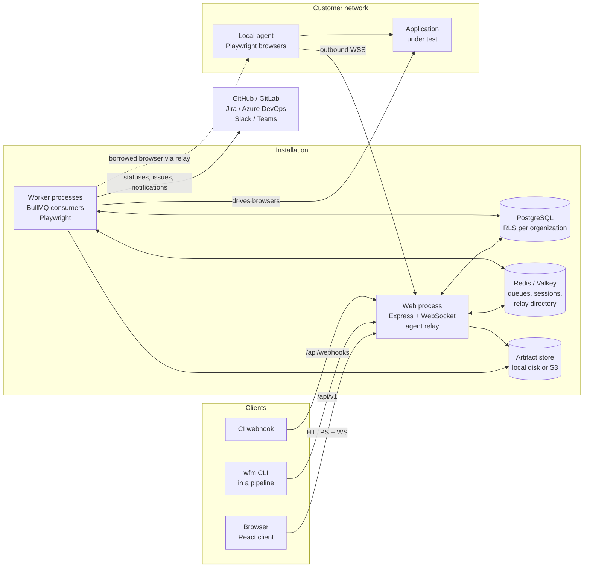

# Architecture overview

This part of the documentation explains how WebFlowMaster is built: which processes run, what they
share, how a request and a test run move through them, and why the main design choices were made.
It is written for the people who maintain and extend the product. Operators and customers have their
own guides.

## What the product does

WebFlowMaster lets a team build automated tests for web applications and HTTP APIs, and run them
reliably:

- **Author** a UI test by recording a session, by assembling steps in a visual builder, or by
  describing it in sentences. API tests are written in an API tester with assertions and
  extractions.
- **Organize** tests into projects, tags, suites and test plans, with versions, reviews and
  publishing.
- **Run** plans on demand, on a schedule, from CI, or from a webhook — across a browser matrix, in
  parallel, on the server's runners or on local agents inside a customer's network.
- **Report** every run with steps, screenshots, video, trace, network capture, visual comparisons
  and accessibility findings, and export it as HTML, PDF, JUnit or Allure. Failures can open
  issues in Jira or Azure DevOps, notify a webhook and set a commit status in GitHub or GitLab.

It is multi-tenant: many organizations share one installation, and the database itself keeps each
organization's data apart.

## The system at a glance



### Processes

| Process | Entry point | What it does |
|---|---|---|
| **Web** | `server/index.ts` → `dist/index.js` | Serves the React client and the HTTP API, authenticates users and API keys, streams live run logs over WebSocket, hosts the agent relay, owns the schedules (with the default cron backend it fires them itself; with `SCHEDULER_BACKEND=bullmq` it registers them in Redis and a worker fires them), and runs the housekeeping sweeps (run recovery, artifact retention). Creates runs; never executes them. |
| **Worker** | `server/worker.ts` → `dist/worker.js` | Consumes the plan queue and the browser-task queue, runs plans with Playwright, writes results and evidence, and registers itself as a *runner* with a heartbeat. Scale it horizontally. |
| **Migrator** | `scripts/apply-migrations.ts` → `dist/apply-migrations.js` | Applies the SQL migrations once, before the other processes start. |
| **Local agent** | `scripts/wfm-agent.ts` → served at `/cli/wfm-agent.mjs` | Runs inside a customer network and lends Playwright browsers to runs through the relay. |
| **CLI** | `scripts/wfm-cli.ts` → served at `/cli/wfm.mjs` | Starts a plan from a pipeline over `/api/v1`, waits, writes JUnit/HTML/PDF/Allure, and exits with a meaningful code. |

### Stores

| Store | Used for |
|---|---|
| **PostgreSQL 15+** | Everything durable: organizations, users, tests, plans, runs, results, audit log. Row-level security isolates organizations (see [Tenancy and access](./tenancy)). In development and tests, PGlite (Postgres compiled to WebAssembly) replaces it when `DATABASE_URL` is not a `postgres://` URL. |
| **Redis / Valkey** | BullMQ queues (plan runs, browser tasks, BullMQ scheduler), the session store in production, and the directory the relay instances share. |
| **Artifact store** | Screenshots, videos, traces, HAR files and visual baselines. Local disk by default, any S3-compatible bucket for more than one machine (`server/artifact-store.ts`). |

## Technology

| Layer | Choice |
|---|---|
| Language | TypeScript 5 everywhere (server, client, shared, scripts) |
| Server | Node.js 20+, Express 4, `ws` for WebSocket, Passport (local strategy) with express-session |
| Data | Drizzle ORM over `pg` (PostgreSQL) or PGlite; hand-written SQL migrations |
| Jobs | BullMQ 5 on ioredis; node-cron or BullMQ job schedulers for schedules |
| Browsers | Playwright (Chromium, Firefox, WebKit, branded Chrome and Edge channels), axe-core for accessibility |
| Client | React 18, Vite 5, wouter (routing), TanStack Query, Radix/shadcn UI, Tailwind CSS, React Flow (visual builder), i18next (en, it, fr, de) |
| AI (optional) | Google Gemini, for selector healing and for turning sentences into steps; the product works without it |
| Tests | Vitest (server against PGlite, client with Testing Library), supertest, real browsers where it matters |
| Build | esbuild bundles the server entry points, the migrator, the CLI and the agent; Vite builds the client |

## How the code is organized

```
client/            React application (its own package.json and Vitest config)
  src/pages/       one component per route (see client/src/App.tsx)
  src/components/  feature components, with their tests next to them
  src/locales/     translation bundles: en, it, fr, de
server/            the web process and the worker
  routes/          HTTP routes, one module per area; routes.ts mounts them
  middleware/      tenancy, roles, scopes, API keys, CSRF, MFA, correlation ids
  agents/          the local agent relay and its credentials
  api-v1/          the OpenAPI document of the public API
  observability/   incident capture for unhandled failures (development)
  tests/           test setup, factories, cross-cutting architecture and isolation tests
  *.ts             domain modules: execution, reporting, scheduling, issues, ...
shared/            code imported by both server and client: schema, enums, pure logic
scripts/           CLI, agent, migrator, schema doctor, importers
migrations/        SQL migrations and their journal (migrations/meta/_journal.json)
integrations/      GitHub Action, GitLab template, Jenkins library, Azure template
docs/              this documentation
```

Modules in `server/` are named after what they decide, and most open with a comment that explains
why they exist and what went wrong before. Pure logic (no network, no database) is kept in its own
module whenever possible, so it can be tested directly: for example `run-policies.ts`,
`issue-tracking.ts`, `junit.ts`, `execution-snapshot.ts`, `commit-status.ts` (decisions) versus
`test-execution-service.ts`, `issue-store.ts` (effects).

## Main flows

### A person uses the web application

1. The browser loads the client from the web process and signs in (`/api/login`, then the second
   factor if the organization requires one). The session lives in Redis in production.
2. Every API request passes through the tenancy middleware, which binds it to the user's
   organization. Queries then run inside a transaction that sets the PostgreSQL role and the
   organization, so row-level security filters every row ([Tenancy and access](./tenancy)).
3. Role checks (`requireRole`) decide which verbs the user may use; RLS decides which rows exist.
4. Browser work a person waits for — previewing a sequence, running one test, surveying a page's
   elements — goes to the worker through the browser-task queue and comes back as the response.
   Recording is the exception: it opens a visible window on the web server's own machine.

### A plan runs

1. Somebody asks for a run: the Run button, a schedule, `/api/v1`, a webhook, or a retry.
2. The **orchestrator** writes the run as `queued` with a snapshot of every setting the runner will
   use, honours the idempotency key and the organization's queue limit, and submits one BullMQ job.
3. A **worker** takes it if the organization is under its concurrency limit, and moves it to
   `running` with one conditional update.
4. The runner resolves the browser matrix (or the agent pool), runs every test on every browser
   with the plan's policies, records steps and evidence, and writes a result row per test.
5. The run ends in exactly one terminal state; then retries are queued, issues filed, notifications
   and commit statuses sent.
6. While it runs, a heartbeat allows cancellation, enforces the maximum duration, and lets the
   recovery sweep end runs whose worker died.

The full story, with the state machine, is in [Run lifecycle](./execution).

### A pipeline runs a plan

The CLI (`wfm run <plan> --wait`) calls `/api/v1` with a scoped API key, sends the CI context it
reads from the CI system's environment (repository, commit, branch, build URL), polls until the run
ends, writes the requested reports, and exits `0` (passed), `1` (failed) or `2` (could not run).
See the [CI integration guide](../CI_INTEGRATION).

## Cross-cutting principles

These run through the whole codebase; knowing them explains most of the code.

- **The database enforces tenancy.** Organization isolation is PostgreSQL row-level security on
  every organization-scoped table, not a `WHERE` clause developers must remember. Code that has to
  step outside (installation-wide tables, bootstrap, erasure) uses a privileged handle whose uses are
  counted by an architecture test.
- **Runs are records, not processes.** A run's state moves only through `server/execution-state.ts`
  with conditional updates, so duplicates, races and late writes cannot corrupt it.
- **A run is decided when it is asked for.** The execution snapshot freezes the plan's
  configuration and the resolved test list at enqueue time.
- **Side effects never fail a run.** Notifications, issues, commit statuses and artifact uploads
  are reported as outcomes and logged; the verdict does not depend on them.
- **Secrets never travel back.** Tokens and keys are shown once, stored as hashes (keys, agent
  tokens, webhook tokens) or encrypted with AES-256-GCM (environment secrets, tracker and source-host
  tokens, saved login states), and never returned by the API.
- **Errors are sentences.** User-facing failures say what happened and what to do, in words: "No
  agent of pool onprem is connected", not "WebSocket error 503".
- **Tests describe behaviour worth protecting**, against real infrastructure where it matters: PGlite
  for SQL and RLS, real Chromium for the runner and the relay, HTTP fakes for GitHub or Jira.

## Where to go next

- [Tenancy and access](./tenancy) — organizations, roles, projects, RLS, API keys, MFA, audit.
- [Run lifecycle](./execution) — from the Run button to the commit status.
- [Data model](./data-model) — the tables, grouped by domain.
- [Local agents (internals)](./agents) — the relay, tickets and several web servers.
- [Web client](./frontend) — the React application.
- [Developer guide](./developer-guide) — setting up, testing, conventions, adding a feature.
- [Decision records](./decisions) — the choices that shaped the system and why.
- [Glossary](./glossary) — the vocabulary used here and in the code.
