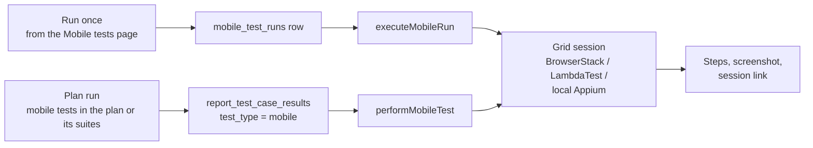
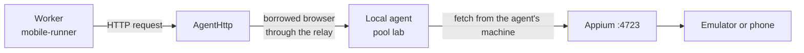

# Mobile subsystem

Native Android and iOS apps are tested as a **third test type**, "mobile app", next to UI (web) and API
tests. A mobile test is not a web test with native steps: its elements are native locators, its steps
are taps and swipes, and it runs through **Appium** on a real or emulated device. This page explains
how that is built. How to use it is in the [Mobile apps guide](../guide/mobile-apps).

(Mobile *web* testing — emulating an iPhone or a Pixel in the browser — is different and lives in the
plan's browser matrix; see [Running tests](../guide/running).)

## Pieces

| Piece | File | Role |
|---|---|---|
| Model | `shared/mobile.ts` | Platforms, the step actions, `MobileStep`, `parseMobileLocator`, `MobileStepResult`. Shared with the client so the editor and the runner agree. |
| Inspector model | `shared/mobile-inspector.ts` | Parses Appium's page source into an element tree and proposes the best locator for an element. |
| Recorder rules | `shared/mobile-recorder.ts` | What a touch on the screenshot becomes: the locator a recorded step uses (and whether it is fragile), a drag's swipe direction, text and password fields, the text an assertion checks. Recording happens in the page; the server only runs each step through `/api/mobile-inspector/:id/actions`. |
| Grids | `shared/browser-grids.ts`, `server/browser-grids.ts`, `routes/browser-grids.routes.ts` | Where devices come from: BrowserStack, LambdaTest, or **local Appium** through an agent pool. Stores the key encrypted and tests the connection. |
| Appium client | `server/appium-client.ts` | `AppiumSession`: a minimal W3C WebDriver client (find, click, type, swipe, source, screenshot). |
| Runner | `server/mobile-runner.ts` | Opens a session on the grid, runs the steps, collects results, uploads apps to a grid. |
| Inspector | `server/mobile-inspector.ts`, `/api/mobile-inspector` | A live session for authoring: screenshot plus element tree, tap to pick a locator. Sessions live in memory and end after `MOBILE_INSPECTOR_IDLE_MS` (5 minutes) of silence. |
| Routes | `routes/mobile-tests.routes.ts` | CRUD, run once from the page, tags, quarantine, project, links to requirements and test management. |
| Agent path | `server/agents/agent-fetch.ts` | `AgentHttp`: lets a local Appium be reached from the server without any inbound port. |

## Test model

A test stores a `platform` (`android` or `ios`), an `app` (a grid upload id such as `bs://…` or `lt://…`, or
a path on the Appium machine), a `device_name`, an optional `os_version`, an optional `grid_id` and
a list of steps:

```text
tap, type, clear, waitFor, assertVisible, assertNotVisible, assertText,
swipe (up / down / left / right), back, hideKeyboard, wait   (MOBILE_ACTIONS in shared/mobile.ts)
```

A step names its element with one string, parsed by `parseMobileLocator`:

| Written | Strategy |
|---|---|
| `~login` | accessibility id (content-desc / accessibilityIdentifier) — the stable one |
| `id=com.shop:id/login` | resource id (Android) or name (iOS) |
| `text=Sign in` | an element showing exactly that text |
| `//android.widget.Button[@text='OK']` | XPath over the view tree |
| `android=new UiSelector()…`, `ios=label == "OK"`, `chain=**/XCUIElementTypeButton` | the platform's own engines |

`{{variables}}` are substituted from the environment before the session opens; unresolved ones fail the
run in words before any device is used.

## Running



- **Once from the page** writes a `mobile_test_runs` row and shows the steps as they finish.
- **In a plan**, a mobile test runs **once per plan run** (not once per browser), on the grid named by
  the test, and appears in the report as a row with `test_type = 'mobile'` and the device as its
  "browser". Schedules, webhooks, CI, retries, quarantine, notifications and issues work as for any test.
- **Steps** wait up to 15 s for an element (`ELEMENT_TIMEOUT_MS`, polling every 500 ms) before failing.
- The grid's **key** is decrypted only when the session opens and travels only to the grid. It is
  redacted from every error message (`redactGridSecret`), so it cannot reach a run row or a log.

## Local Appium through an agent

For emulators and phones on a desk there is a fourth grid provider, `local_appium`: an Appium server
next to a local agent. The server has no way into that network, so requests are sent **through the
agent**: `AgentHttp` borrows a browser of the agent's pool and asks Playwright to execute the HTTP
request from the agent's machine. The grid stores only the pool and Appium's address *as the agent
sees it* (default `http://127.0.0.1:4723`).



Pools are scoped to an organization: another organization with a pool of the same name sees no agent
of yours (there is an acceptance script for this, SEC-25…30, in the [test lab](../admin/test-lab)).

## Between tests and the rest of the product

| Concern | Behaviour |
|---|---|
| Tags, quarantine, projects | Same tables as other tests with `mobile_test_id` and `test_type = 'mobile'`. Restricted-project rules apply. |
| Suites and requirements | A mobile test can be a suite item and cover a requirement (`requirement_tests.mobile_test_id` is a real foreign key). |
| Test management | A mobile test can be linked to a TestRail / Xray / Zephyr case like any other (`test_case_links`). |
| Flaky detection | Computed from recent results, as for UI tests; no extra storage. |
| Snapshot | `SnapshotTestReference` carries `mobileTestId`, so a run still knows what it ran if the test later changes. |

## Limits

- iOS needs a grid with iOS devices or a Mac for local Appium; the test lab runs Android only.
- The inspector shows what Appium's page source gives, nothing more.
- A grid quota or an unreachable grid fails the run with the grid's own sentence.
