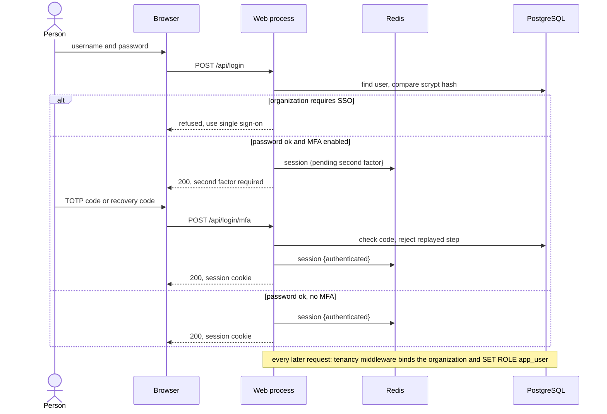
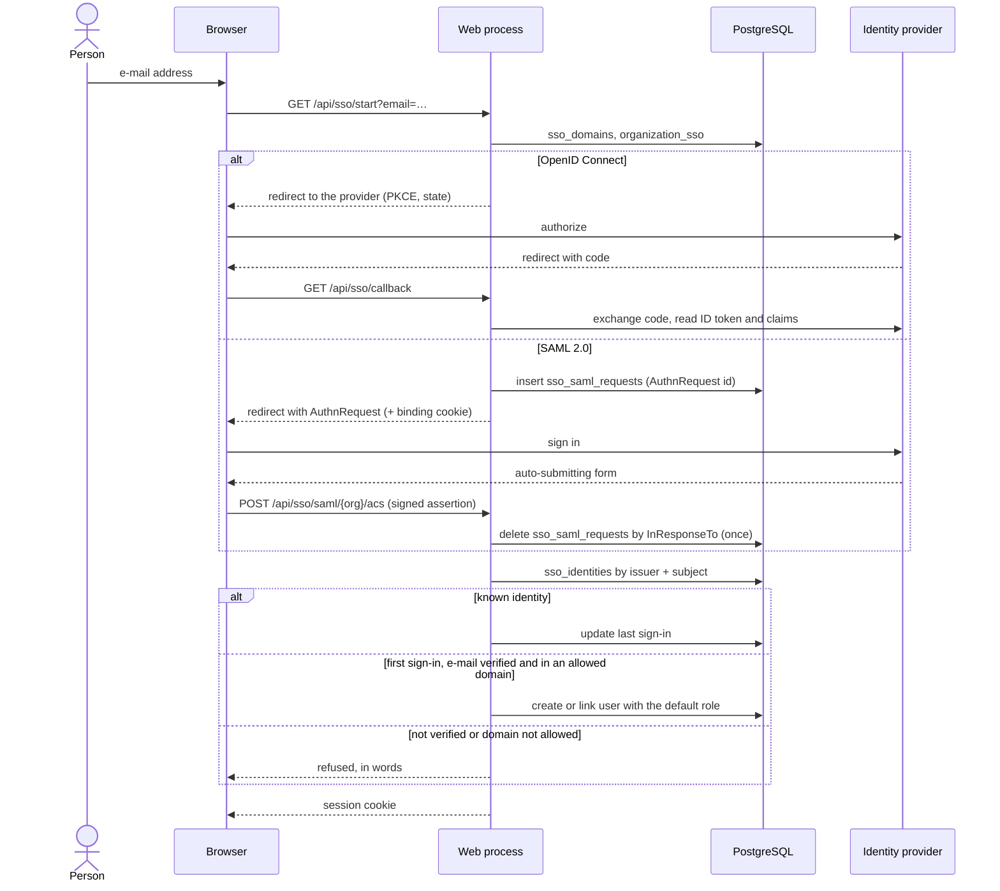
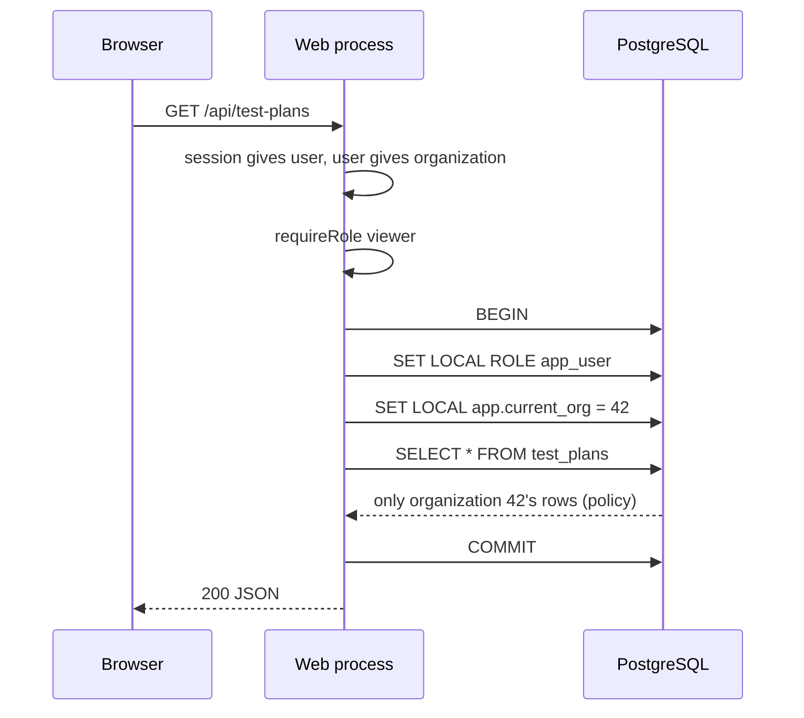
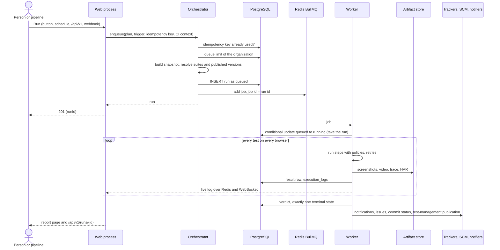
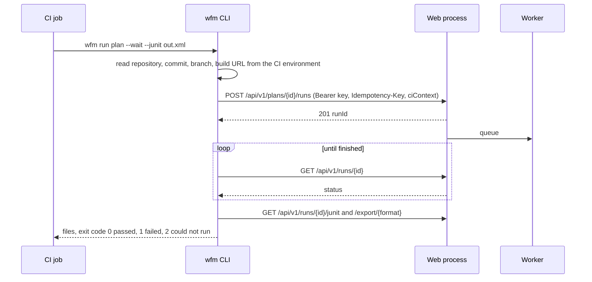
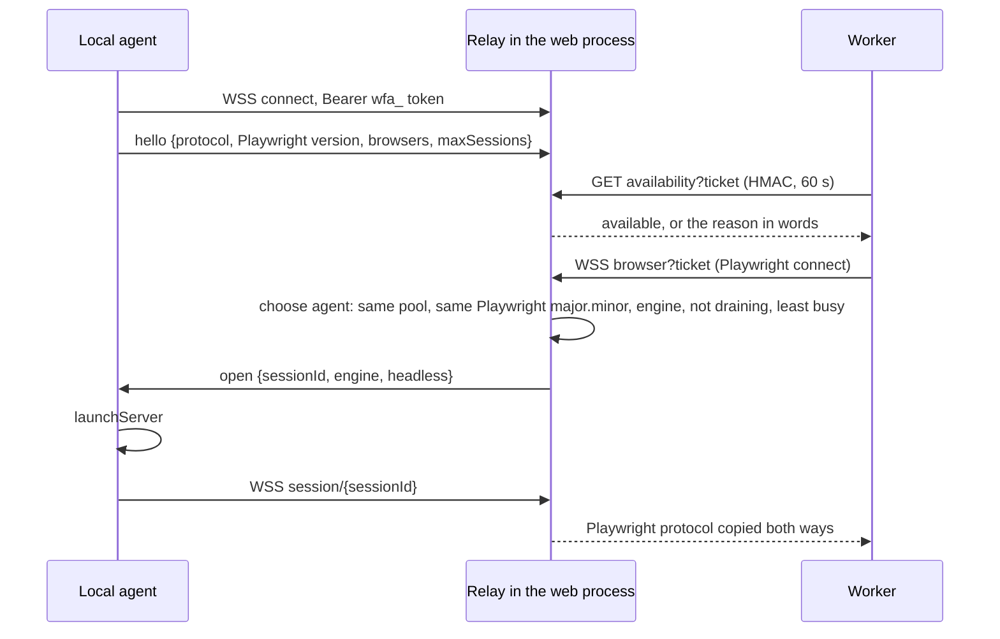
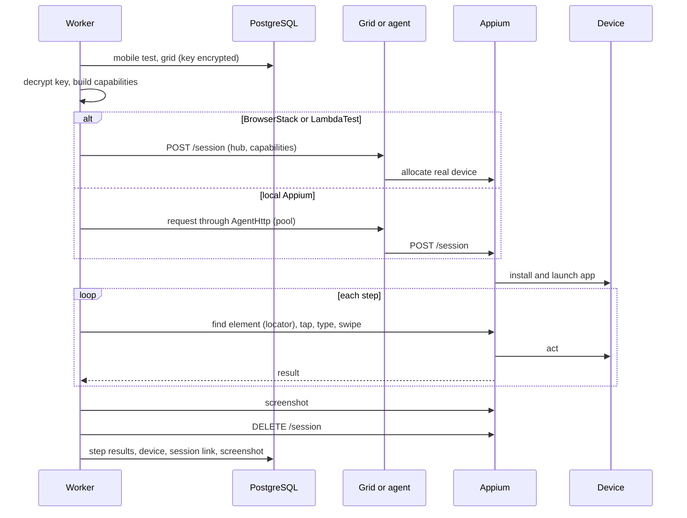
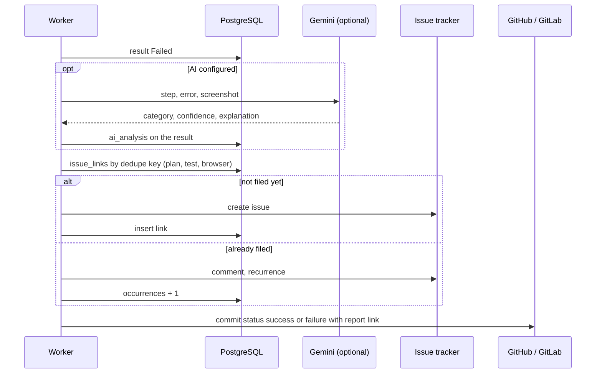
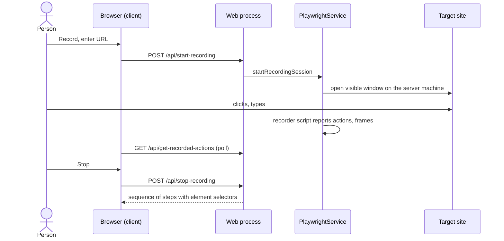
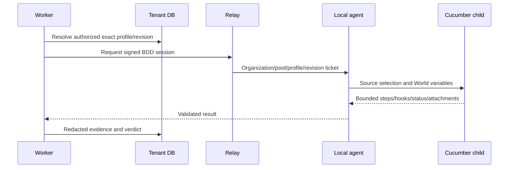

# Sequence diagrams

The main flows of the system as interactions between the processes and stores described in
[System architecture](./system-architecture). Each diagram is followed by the points that are easy to
get wrong. The prose version of the run flow, with every edge case, is [Run lifecycle](./execution).

## 1. Sign-in with a password and a second factor

- The login is rate limited per address (`AUTH_RATE_LIMIT`, 20 per 15 minutes by default).
- A TOTP step is accepted once (`last_used_step`), so a copied code cannot be replayed.

## 2. Single sign-on

## 3. A request from the browser, under row-level security

The `WHERE organization_id = 42` is _not_ in the query. The policy adds it, so a forgotten filter
cannot leak another organization's rows.

## 4. A plan runs

- **Exactly one terminal state:** every state change is a conditional `UPDATE … WHERE status = …`;
  a late or duplicate writer changes nothing.
- **Side effects never decide the verdict:** the last arrow can fail and the run stays `completed` or
  `failed`.
- A worker that dies is found by the recovery sweep (heartbeat older than `RUN_STALE_AFTER_MS`).

## 5. A pipeline runs a plan (CLI)

## 6. A browser borrowed from a local agent

The detailed protocol is in [Local agents (internals)](./agents).

## 7. A mobile test on a device

## 8. A failure becomes an issue and an analysis

## 9. Recording a test

Recording opens a window on the machine of the web process, which is why the test lab has a virtual
display (see [Test lab](../admin/test-lab)); the other browser work is delegated to workers.

## Dedicated Cucumber execution

After preconditions, `bdd-execution.ts` resolves a tenant/project-authorized binding and uses
`agents/agent-bdd.ts`. The agent executes the installed support revision in a child process;
cleanup runs afterward. Browser/locale lanes are independent of these units. Profile absence,
revision mismatch, cancellation and output budgets are explicit failure paths. See
[BDD tests](../guide/bdd-tests) and [suite handbook](./suite-handbook).

