# Suite handbook

This handbook connects the product journeys to the modules a colleague will change. Read it before
designing an improvement that touches more than one test type. The [developer guide](./developer-guide)
covers setup; the [contribution walkthrough](./contributing-guide) turns these principles into a change.
This is a description of the repository, not evidence that every deployment or provider has passed acceptance.

## People and responsibilities

An editor turns a requirement into a repeatable check, selects the target environment and maintains
the test. A reviewer checks the saved version and the evidence before publishing. A viewer follows
reports and trends. An owner manages membership, project access, credentials, integration settings
and execution profiles. A platform operator provisions databases, queues, agents, grids, storage and
monitoring. A pipeline engineer connects a plan to a build and consumes the public API or CLI result.
These are working responsibilities: permissions are still the viewer/editor/owner hierarchy and
project policies, not a separate permission automatically granted by each persona.

Start an improvement by naming the person, the action and the observable outcome. “An editor can
reuse a mobile login flow across devices” requires authoring, validation, expansion, versioning and
evidence work; adding a button alone cannot establish that behavior.

## The objects teams work with

| Object        | Purpose                                                      | Consequence for an implementation                                                      |
| ------------- | ------------------------------------------------------------ | -------------------------------------------------------------------------------------- |
| Organization  | Security and billing/quota boundary                          | Never accept an arbitrary organization ID as authority.                                |
| Project       | Application grouping and optional member restriction         | A row can be in the right organization and still be inaccessible.                      |
| Test          | Reusable definition: browser UI/BDD, API or mobile           | Carry its type with its ID; numeric IDs overlap across tables.                         |
| Version       | Saved content, review and publication history                | Running published content must not silently use an edited draft.                       |
| Tag and suite | Classification; explicit membership or selection rules       | A dynamic suite's future selection and an already queued run are different things.     |
| Plan          | Selection plus execution and delivery policy                 | Settings read by the runner need an explicit snapshot decision.                        |
| Environment   | Target variables, encrypted secrets and saved authentication | Resolve values in the authorized context and redact evidence.                          |
| Run           | Durable execution request with frozen configuration          | Queue retries and worker restarts must preserve identity and legal transitions.        |
| Result        | One executed unit's verdict, timing and evidence references  | A device matrix or browser/locale matrix may create several units per test.            |
| Requirement   | Coverage link to saved tests                                 | Coverage is a traceability measure; a link alone does not mean the requirement passed. |

The schema authority is `shared/schema.ts` plus the SQL migration journal. Read
[data model](./data-model), [database schema](./database-schema) and
[organizing tests](../guide/organizing) for the details. At this documentation revision the journal
contains 83 entries, `0000` through `0082`; use the journal when adding the next migration rather
than treating this count as a configuration value.

## Authoring and running are separate journeys

Browser tests combine elements and actions in the builder, recording, natural-language authoring,
reusable groups, variables, datasets, conditions and loops. Detection or preview needs a live
browser; saving a definition does not require executing a plan. The element repository belongs
to a project, so changing a reused locator affects its consumers and must be reviewed accordingly.
Visual baselines and accessibility checks supplement functional assertions; they answer different
questions. See [web tests](../guide/web-tests).

API tests save a request, authentication, assertions and extractions. The tester can execute a
request interactively, while a plan executes the saved definition through the common request runner.
Extractions make ordered flows possible: create an object, capture its ID, query it, then clean it
up. A failed request is different from a response whose assertion fails. Native gRPC and WebSocket
configuration also requires transport-aware evidence; it cannot be reduced to a JSON HTTP response.
See [API tests](../guide/api-tests).

Mobile tests save platform, application/device settings and native steps. The inspector and recorder
work against a live Appium session; their selectors and operations belong to a native view hierarchy.
Reusable mobile groups and device targets are expanded into the run definition. Device matrices
create device-specific units, independently of the plan's browser matrix. A grid and an available
device/app are execution prerequisites. See [mobile apps](../guide/mobile-apps) and
[mobile internals](./mobile).

BDD tests preserve a Gherkin source, dialect, logical filename and selected scenario/example row.
Manual mode records human steps. Cucumber mode binds the definition to an owner-authorized,
operator-advertised agent profile and exact revision. Gherkin text is not translated automatically
into Playwright actions. Customer step definitions and dependencies live in the agent's support
project. The binding and source are versioned, and changing the profile revision requires rebinding
and publishing the affected tests. See [BDD tests](../guide/bdd-tests).

## Execution paths and where code runs

| Path                 | Controller and execution                                                                                              | Required infrastructure                                                                    | Evidence to inspect                                                                   |
| -------------------- | --------------------------------------------------------------------------------------------------------------------- | ------------------------------------------------------------------------------------------ | ------------------------------------------------------------------------------------- |
| Browser UI           | Worker runs Playwright locally, through a configured grid, or with an agent-borrowed browser                          | Browser binaries or compatible remote browser; network access from that execution location | Steps, screenshot/video/trace/HAR according to policy; browser/locale label           |
| HTTP API             | `api-test-runner.ts` performs requests; an agent transport can reach a customer's network                             | Target/authentication reachable from the selected transport                                | Response/assertion/extraction history with secret redaction                           |
| Native API protocols | `api-protocols.ts` and protocol configuration perform gRPC/WebSocket work, including agent transport where configured | Protocol endpoint, schema/configuration and network policy                                 | Protocol-specific operations and failures                                             |
| Mobile               | `mobile-runner.ts` drives Appium on the configured grid                                                               | Provider credentials, uploaded app and compatible device                                   | Native step log, device label, screenshots and provider session links where available |
| Cucumber BDD         | `bdd-execution.ts` calls the signed relay; agent launches `bdd-child.ts`                                              | Advertised exact profile/revision and installed support project                            | Cucumber steps/hooks/statuses and bounded text attachments                            |
| Manual               | Run/report records the human workflow rather than launching a browser for each sentence                               | A person authorized to enter outcomes                                                      | Recorded step outcomes and supplied evidence                                          |

Do not assume one browser matrix applies to all rows. `test-execution-service.ts` constructs browser
lanes and independent BDD/mobile units separately. Cucumber dataset rows can become independent
units. API extraction chains also constrain execution order: increasing concurrency must preserve
the captured-variable contract. Read this construction before changing sharding or retry behavior.

The agent initiates outbound connections. It is an execution boundary with organization/pool
credentials and signed, short-lived tickets, not a general remote shell. Browser slots, native API
sessions and BDD profiles have capability and lifecycle rules. Agent absence, a stale revision or an
incompatible browser version must yield an actionable error. See [local agents](../LOCAL_AGENT)
and [agent internals](./agents).

## From request to durable report

```mermaid
flowchart LR
  Request["UI / CI / schedule / webhook"] --> Orchestrator["Authorize + snapshot + queued run"]
  Orchestrator --> Queue["BullMQ / Redis"]
  Queue --> Worker["Claim + tenant context + policies"]
  Worker --> Units["UI / API / mobile / BDD units"]
  Units --> Evidence["Results + artifact references"]
  Evidence --> Terminal["Terminal run state"]
  Terminal --> Delivery["Reports / notifications / issues / commit status"]
```

`execution-orchestrator.ts` creates the request, applies queue limits/idempotency and submits work.
`execution-snapshot.ts` captures the settings and selection the run will use. `worker.ts` consumes
jobs; `execution-state.ts` controls conditional state transitions. `test-execution-service.ts`
resolves typed definitions, creates run units, applies policies and persists results. Heartbeats,
cancellation and recovery provide a durable explanation when a worker disappears. Do not set run
status directly from a new route or duplicate this lifecycle for another protocol.

The relational result and the artifact file are separate resources. An artifact reference is useful
only if storage, authorization, retention and download work. Local files require a shared volume
when processes are on different machines; S3-compatible storage supports distributed deployment.
Run failure analysis, flaky detection, quarantine and trend analytics consume historical results;
altering verdict meanings therefore affects more than a report card.

Delivery follows execution: notifications, issue tracking, commit statuses and test-management
publication expose their own outcomes. An integration failure must be visible without rewriting
the test verdict. Export formats serve different consumers: JUnit for CI, HTML/PDF for readers and
Allure for report tooling. See [run lifecycle](./execution), [results](../guide/results) and
[CI integration](../CI_INTEGRATION).

## Security boundaries to preserve

The request establishes an authenticated principal and tenant context. Tenant transactions set the
PostgreSQL role and organization; RLS filters rows, and project restrictions apply within that
organization. Role middleware checks the action. Public `/api/v1` endpoints additionally use API
key scopes and a documented response/error contract. Session routes and the public API are separate
interfaces: exposing a new session route does not make it a supported CLI endpoint.

Secrets are hashed when only comparison is needed, encrypted when execution must recover them,
and redacted in histories, logs and exports. An environment secret may pass into customer execution
code: platform redaction is not a sandbox that stops that code sending data elsewhere. Audit records
must describe the committed change without storing credentials. SSO, MFA, provisioning, invitations,
email delivery and token revocation also affect the principal lifecycle. See
[tenancy](./tenancy), [administration](../admin/administration) and [security](../security/).

Ordinary PGlite tests provide quick database behavior checks. The production isolation gate is
`npm run test:rls` against real PostgreSQL with tenant work executed as non-superuser `app_user`.
Neither a passing mock nor a privileged SQL query proves production RLS enforcement.

## Installation, acceptance and operations

Local development starts a web process and a worker, with Redis and either PGlite or PostgreSQL.
The worker needs the same database, encryption settings and appropriate artifact access. Browser
recording opens on the web host; browser tasks normally use workers, with a deliberate development
inline option. The web process also owns authentication, the relay and scheduling coordination.
Thus “the web process never executes anything” is too broad: distinguish queued plan execution
from authoring/recording and configurable browser tasks.

Docker Compose packages the web/worker/store services. A scaled installation needs shared stores,
trusted proxy/cookie configuration, compatible agent/browser versions, outbound network policy and
an artifact backend visible to all relevant processes. Back up relational state and artifacts and
verify restoration. Read [installation](../admin/installation), [configuration](../admin/configuration),
[operations](../admin/operations) and [SaaS network](../admin/saas-network).

The dedicated E2E installation and Collaudo lab serve different purposes. `test:e2e` exercises a
small set of real interface journeys with production bundles and isolated stores. Collaudo supplies
HTTPS, identity providers, protocol simulators and device/integration fixtures for wider acceptance.
The Collaudo application's own unit tests do not run every acceptance case. Record an actual
execution, environment and evidence link; classify a missing prerequisite separately from a product
defect. See [test lab](../admin/test-lab).

Telemetry connects HTTP requests, queue submission, worker attempts and agent sessions through
correlation IDs and tracing. Logs explain local failures; metrics show queue/load and availability;
traces locate time spent between processes. Customer Cucumber step code is not automatically
instrumented by the platform's agent session span. See [telemetry](../admin/telemetry).

## Designing the next improvement

Write down the existing behavior, desired behavior, affected test types, permissions and failure
cases. Follow the definition from editor to storage/version, snapshot, execution unit, result,
export and acceptance evidence. Reuse the domain module that owns the decision rather than
adding a second implementation in the page or route.

Explicitly decide whether it needs a migration, API contract change, agent capability/revision,
plan snapshot field, evidence schema or retention adjustment. Check quotas, cancellation and
redaction as well as the successful path. Use the
[contribution walkthrough](./contributing-guide) for a concrete implementation recipe, and
[decision records](./decisions) when the tradeoff changes architecture.

For the mechanically generated table/column listing, use the [Schema catalogue](./schema-catalog).
