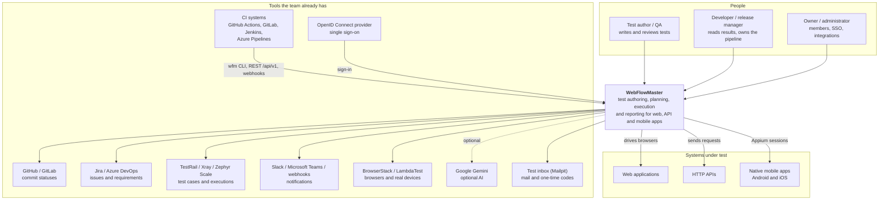
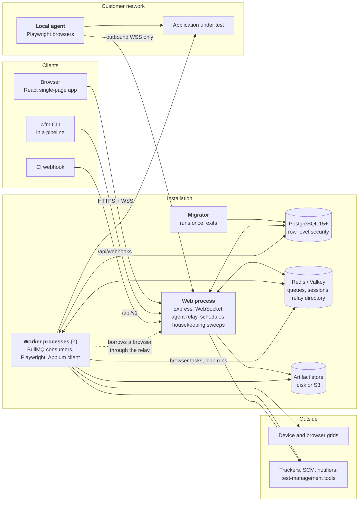
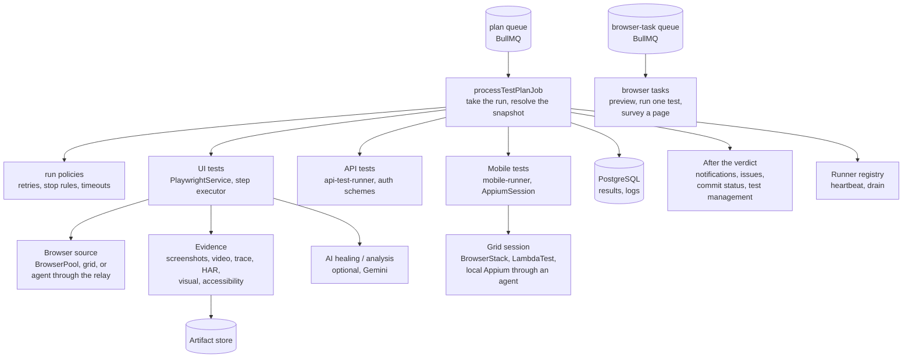
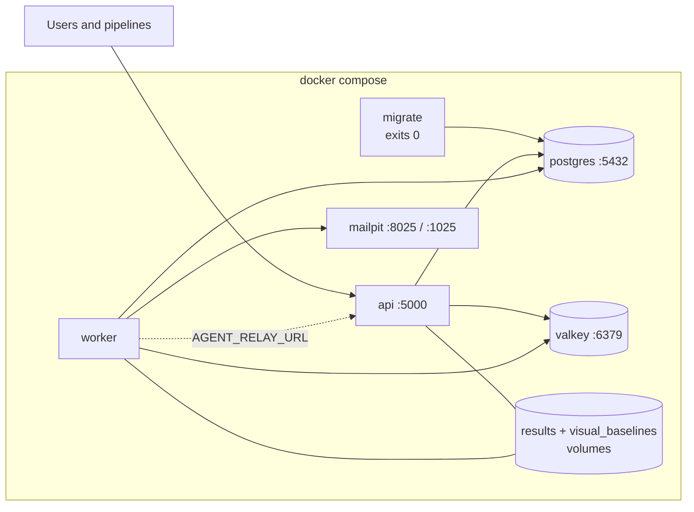
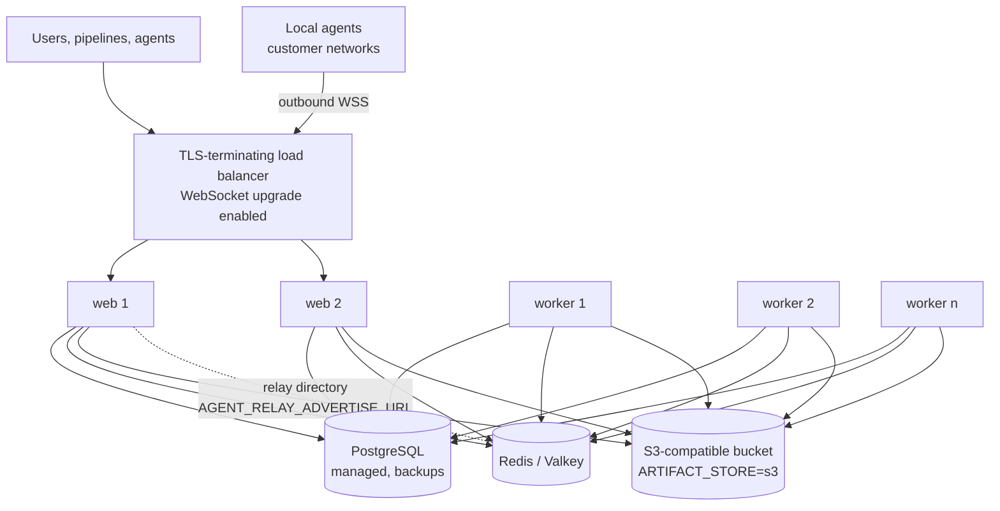

# System architecture

This page describes WebFlowMaster from the outside in, in four levels of zoom — the *context* (who and
what it talks to), the *containers* (the processes and stores it is made of), the *components* (the
modules inside the two processes that matter) and the *deployment* (how it is run). It follows the
C4 model; the diagrams are Mermaid, so they live in the repository and change with the code.

Read it after the [Architecture overview](./), which explains what the product does. The next pages go
deeper: [Class diagrams](./class-diagrams), [Database schema](./database-schema),
[Sequence diagrams](./sequences).

## 1. Context

WebFlowMaster sits between the people who write tests, the pipelines that run them and the systems
under test; it reports to the tools a team already uses.

## 2. Containers

The product is two long-running processes and three stores, plus two programs that run elsewhere.

| Container | Technology | Responsibility | State |
|---|---|---|---|
| **Web process** | Node.js 20, Express 4, `ws`, Passport | Serves the SPA and the REST API; authenticates people (password, second factor, SSO) and machines (API key, agent token, webhook token); creates runs but never executes them; hosts the **agent relay**; fires **schedules**; runs the **recovery** and **retention** sweeps; streams live logs over WebSocket. | Stateless apart from in-memory relay sessions. Any number can run behind a load balancer. |
| **Worker process** | Node.js 20 on the Playwright image | Consumes the plan queue and the browser-task queue; runs UI, API and mobile tests; records evidence; writes results; sends notifications, issues and commit statuses; registers as a *runner* and heartbeats. | Stateless. Scale with `docker compose up --scale worker=N`. |
| **Migrator** | Node.js, bundled `dist/apply-migrations.js` | Applies the numbered SQL migrations, creates the `app_user` role and checks the tenancy preconditions. | None. |
| **PostgreSQL** | 15+ (PGlite in development and tests) | The only durable store for business data. Isolation between organizations is enforced here by RLS. | Durable. |
| **Redis / Valkey** | Valkey or Redis | BullMQ queues, session store, schedule registry (BullMQ backend), the relay directory shared by several web servers, the debugger channel. | Recoverable: queued runs are also rows in PostgreSQL. |
| **Artifact store** | Local volume or S3-compatible bucket | Screenshots, videos, traces, HAR files, visual baselines, report exports. | Durable until retention removes it (`ARTIFACT_RETENTION_DAYS`, 90 by default). |
| **Local agent** | Node.js + Playwright, `wfm-agent.mjs` | Lends browsers inside a customer's network (or fronts a local Appium server) to runs on the workers. Opens only outbound connections. | None. |
| **wfm CLI** | Node.js, `wfm.mjs` | Starts a plan from a pipeline, waits, writes JUnit / HTML / PDF / Allure, exits `0`, `1` or `2`. | None. |

## 3. Components

### 3.1 The web process

Every request crosses the same pipeline, in this order (`server/index.ts`, then `server/routes.ts`). The order is the
security model: nothing reads data before the request knows whose it is.

```mermaid
flowchart LR
  REQ["HTTP request"] --> COR["Correlation id<br/>request logging"]
  COR --> CSRF["CSRF origin check<br/>state-changing requests"]
  CSRF --> SES["Session and Passport<br/>cookie, Redis store"]
  SES --> KEY["apiKeyAuth<br/>Bearer key to a user + scopes"]
  KEY --> RL["Rate limits<br/>API and webhooks"]
  RL --> TEN["tenancyMiddleware<br/>bind to organization,<br/>SET ROLE app_user"]
  TEN --> SSO["requireSso<br/>organization requires SSO"]
  SSO --> MFA["requireMfaEnrollment<br/>organization requires MFA"]
  MFA --> ROUTE["Route module<br/>requireRole / requireScope"]
  ROUTE --> DOM["Domain modules<br/>queries inside the tenant<br/>transaction, RLS filters rows"]
```

Beside the pipeline, the process owns:

| Component | Files | Role |
|---|---|---|
| Route modules | `server/routes/*.routes.ts` (40 modules), mounted by `server/routes.ts` | One module per area: tests, plans, runs and reports, suites, requirements, mobile tests, grids, agents, issue trackers, test management, SSO, MFA, API keys, environments, analytics, observability. |
| Public API | `server/routes/api-v1.routes.ts`, `server/api-v1/` | The versioned REST API and its OpenAPI document, for pipelines. |
| Orchestrator | `server/execution-orchestrator.ts`, `server/execution-snapshot.ts`, `server/execution-state.ts` | Creates a run (snapshot, idempotency, queue limits), submits the BullMQ job, owns every state transition. |
| Scheduling | `server/scheduler-service.ts` | Fires schedules, with the default cron backend or the BullMQ job-scheduler backend. |
| Agent relay | `server/agents/` | Accepts agents, runners and sessions over WebSocket and pipes the Playwright protocol between them. |
| Live channels | `server/websocket.ts`, `server/debug-session.ts`, `server/run-watch.ts` | Live run logs, the step debugger, the report page's progress. |
| Sweeps | `server/run-recovery.ts`, `server/artifact-retention.ts` | End runs whose worker died; remove old evidence. |
| Auth | `server/auth.ts`, `sso.ts`, `mfa.ts`, `totp.ts`, `api-keys.ts`, `registration.ts`, `password-reset.ts` | Who is calling and how they proved it. |

### 3.2 The worker process

Worker modules, grouped by what they decide:

| Area | Files |
|---|---|
| Run control | `worker.ts`, `test-execution-service.ts`, `run-policies.ts`, `execution-state.ts`, `runner-registry.ts`, `concurrency.ts`, `tenant-quotas.ts` |
| UI execution | `playwright-service.ts`, `step-executor.ts`, `flow-cursor.ts`, `browser-pool.ts`, `browsers.ts`, `variables.ts`, `custom-actions.ts`, `step-elements.ts`, `login-state.ts`, `database-step.ts`, `email-inbox.ts`, `totp.ts` |
| API execution | `api-test-runner.ts`, `api-auth.ts`, `oauth2.ts`, `outbound-http.ts` |
| Mobile execution | `mobile-runner.ts`, `appium-client.ts`, `mobile-inspector.ts`, `browser-grids.ts` |
| Evidence | `run-evidence.ts`, `visual-testing.ts`, `accessibility.ts`, `shared/network.ts`, `artifact-store.ts` |
| Reporting | `report-model.ts`, `report-html.ts`, `report-export.ts`, `junit.ts`, `allure-export.ts` |
| After the run | `notifications.ts`, `issue-tracking.ts`, `issue-store.ts`, `issue-providers.ts`, `commit-status.ts`, `test-management.ts`, `test-management-providers.ts` |
| AI (optional) | `ai-automation-service.ts`, `failure-analysis.ts`, `nl-authoring.ts`, `story-tests.ts` |

### 3.3 The client

The React application (`client/`) is a single-page app: wouter for routing, TanStack Query for server
state, a WebSocket for live run logs, React Flow for the visual builder, Radix/shadcn components,
four translation bundles (en, it, fr, de). It is described in [Web client](./frontend).

## 4. Deployment

### 4.1 One machine

`docker-compose.yml` is the smallest complete installation: PostgreSQL, Valkey, Mailpit (a test
inbox), a one-shot migrator, the web process on port 5000 and one worker. Two named volumes hold run
evidence and visual baselines, shared by web and worker.

### 4.2 Production, scaled

What scaling needs (details in [Installation](../admin/installation) and [Operations](../admin/operations)):

- Several web servers share nothing but PostgreSQL and Redis. Set `AGENT_RELAY_ADVERTISE_URL` so their
  relays see each other's agents.
- Workers on other hosts need `ARTIFACT_STORE=s3`: with local disks, screenshots would exist only on
  the worker that took them.
- `ORG_MAX_CONCURRENT_RUNS` and `WORKER_CONCURRENCY` bound how much one organization and one worker
  can run at once; `SCHEDULER_BACKEND=bullmq` moves schedule firing to the workers.

### 4.3 Beside the installation

| Program | Where it runs | Why there |
|---|---|---|
| **Local agent** (`Dockerfile.agent`) | Inside a customer's network | To reach applications the server cannot. Outbound connections only: no inbound port, no VPN. The same agent can front an Appium server for emulators and phones on a desk. |
| **wfm CLI** | In a CI job | To start a plan, wait for it and turn the result into the pipeline's exit code. |
| **Test lab** (`collaudo/`) | A tester's Docker host | The full product behind HTTPS with identity provider, mail inbox, simulated tools, Jenkins and an Android emulator — see [Test lab](../admin/test-lab). |

## 5. Cross-cutting concerns

| Concern | How it is addressed | Where |
|---|---|---|
| **Tenant isolation** | PostgreSQL row-level security on 44 tables; every request runs in a transaction that sets the role and the organization; the privileged handle is budgeted by an architecture test. | [Tenancy and access](./tenancy) |
| **Consistency of runs** | State moves only through conditional updates; one job per run with the run id as job id; idempotency keys; heartbeat plus recovery sweep. | [Run lifecycle](./execution) |
| **Secrets** | AES-256-GCM for stored credentials; SHA-256 hashes for API keys, agent and webhook tokens; shown once. | [Data protection](../security/data-protection) |
| **Observability** | Structured logs (JSON in production) with correlation ids, optional shipping to Loki and a Grafana dashboard; incident capture for unhandled failures in development; runner and queue health on the Settings pages. | [Operations](../admin/operations) |
| **Extensibility** | Custom actions (own steps), step groups, project element repository, issue-tracker / SCM / test-management providers behind interfaces, grid providers. | [Developer guide](./developer-guide) |
| **Internationalization** | Four client languages; run and analysis languages; a locale matrix for plans. | [Web client](./frontend) |
| **Testing the product itself** | Vitest on PGlite for server and RLS, Testing Library for the client, real Chromium for runner and relay, architecture tests that read the code, and a manual acceptance protocol run in the [test lab](../admin/test-lab). | [Developer guide](./developer-guide) |

## 6. Network and ports

| Port | Service | Direction |
|---|---|---|
| 5000 | Web process (HTTP, WebSocket) | In, from users, pipelines and agents |
| 5432 | PostgreSQL | Internal |
| 6379 | Redis / Valkey | Internal |
| 8025 / 1025 | Mailpit web / SMTP (test environments) | Internal |
| 443 → 5000 | Reverse proxy | In; the proxy must pass WebSocket upgrades on `/ws` and `/api/agent/v1/*` |
| Outbound 443 | Trackers, SCM, notifiers, grids, Gemini, S3, the applications under test | Out, from web and workers; from agents to the web process |

Outbound HTTP from the server goes through `server/outbound-http.ts`, which keeps a deliberate
allowlist for self-signed certificates (`INSECURE_TLS_HOSTS`) and substitutes `{{variables}}`.
