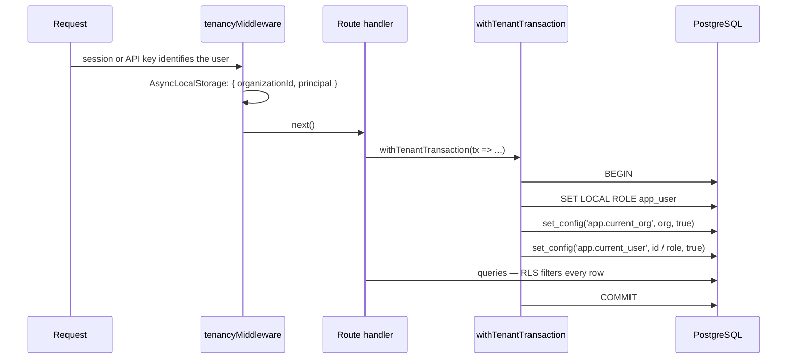

# Tenancy and access

Many organizations share one installation. This page explains how their data is kept apart, who may
do what inside an organization, and how people and machines authenticate.

## Organizations and members

An **organization** owns everything a team creates: projects, tests, plans, runs, environments,
credentials. Every organization-scoped table carries an `organization_id`, and every user belongs to
exactly one organization with one **role**:

| Role | May |
|---|---|
| `viewer` | Read everything the organization can see; run nothing, change nothing. |
| `editor` | Create and change tests, plans, schedules, suites, environments; start and cancel runs. |
| `owner` | Everything an editor may, plus members and invitations, API keys of others, service accounts, local agents, GitHub/GitLab connections, security policy, runners, the audit log. |

Roles are checked by `requireRole(minimum)` (`server/middleware/require-role.ts`) on each route. They
decide which **verbs** a user may use. Which **rows** exist for them is decided by the database.

New members join by **invitation** (`invitations` table): an owner invites with a role, and the
registration that uses the token creates the account inside the inviting organization. Registration
is a privileged operation because the user does not exist yet (`server/storage.ts`).

## Row-level security: the database keeps organizations apart

Isolation is enforced by PostgreSQL **row-level security (RLS)**, not by `WHERE` clauses in the
application. Every organization-scoped table has:

```sql
ALTER TABLE "x" ENABLE ROW LEVEL SECURITY;
ALTER TABLE "x" FORCE ROW LEVEL SECURITY;
CREATE POLICY org_isolation ON "x"
  USING (NULLIF(current_setting('app.current_org', true), '')::int = organization_id)
  WITH CHECK (NULLIF(current_setting('app.current_org', true), '')::int = organization_id);
GRANT SELECT, INSERT, UPDATE[, DELETE] ON TABLE "x" TO app_user;
```

The list of such tables is `ORG_SCOPED_TABLES` in `shared/schema.ts`, and an isolation test
(`server/tests/isolation.test.ts`, run with `npm run test:rls`) proves for each of them that another
organization's rows are invisible and cannot be written.

### How a request is bound to its organization



Three details carry the whole design (`server/middleware/tenancy.ts`):

- **`SET LOCAL ROLE app_user`**: RLS does nothing for a superuser or a role with `BYPASSRLS`. The
  connection role owns the tables and may bypass RLS; `app_user` may not. Every tenant query runs as
  `app_user`.
- **`LOCAL`**: the connection comes from a pool. A non-local setting would outlive the transaction
  and leak the organization into the next request on that connection.
- **Bound parameters** for `set_config`: a hostile value is rejected by the integer cast in the
  policy instead of being executed.

Nested calls join the open transaction rather than opening a second one, and binding a different
organization inside an open transaction throws `TenantConflictError`.

At startup, `assertTenancyPreconditions` (`server/db.ts`) checks that `app_user` exists, that the
connection role may switch to it, and that `app_user` cannot bypass RLS, and refuses to start
otherwise.

### Background work

Work that is not a request — the worker running a plan, a scheduled run, a sweep — binds the
organization explicitly with `runWithTenant(orgId, fn)` or `runAsOrganization(orgId, fn)`. With no
principal bound, the transaction is "the system" and sees everything its organization's RLS allows.
`runDetachedForOrganization` starts a fresh context for work that must not join the caller's
transaction (the commit status notice, for example).

### The privileged handle

`privilegedDb` connects without the role switch and therefore bypasses RLS. It exists for
installation-wide tables (`runners`, `system_settings`, `sessions`), for bootstrap (registration,
login, API key and agent token lookups, where the organization is not known yet), and for
organization export and erasure (`server/organization-lifecycle.ts`). Every file allowed to use it,
and how many times, is listed in `PRIVILEGED_BOOTSTRAP_BUDGET` in
`server/tests/architecture.test.ts`; a new use fails the build until someone writes down why.

### Links between rows of the same organization

A foreign key from a row in organization A to a row in organization B would be a leak through a
join. A drift test in `server/test-suites.test.ts` lists every foreign key between organization
tables and requires each to be guarded by a same-organization constraint, or to be declared as an
authorship link (`created_by` and similar, pointing at users).

## Restricted projects

A **project** is open by default: the organization role applies to its tests. A project can be
**restricted** (migration 0031): it is then visible only to the organization's owners and to its
`project_members`, and each member's project role (`viewer` or `editor`) can narrow their
organization role but never widen it.

This is also enforced by RLS: restrictive policies read `app.current_user` and
`app.current_user_role`, which `withTenantTransaction` sets for a request. Tests, API tests, step
groups, elements and suites of a restricted project are invisible to non-members. Plans, runs and
reports stay organization-wide: a plan may run a restricted project's tests.

`effectiveProjectRole` (`server/routes/projects.routes.ts`) computes the same answer for the
interface, so it does not offer an edit the database would refuse.

## Authentication

### People

- **Password**: Passport's local strategy; passwords are hashed with scrypt and a per-user salt.
- **Session**: `express-session`, stored in Redis in production (the server refuses to start in
  production without it) and in memory in development. The cookie is `Secure` in production and
  not elsewhere; `SESSION_COOKIE_SECURE=true|false` overrides that (the shipped docker-compose stack
  serves plain HTTP on localhost and sets it to `false`).
- **Second factor**: TOTP (RFC 6238) from an authenticator app, plus one-time recovery codes
  (`server/mfa.ts`). A password accepted with a second factor still owed is not a login. An owner can
  require MFA for the organization; `requireMfaEnrollment` then lets a member without it do nothing
  but enrol, on every request, so the policy applies to sessions already open.
- **CSRF**: a state-changing request that carries an `Origin` or `Referer` must name the
  application's own host (`server/middleware/csrf.ts`); requests without either are
  server-to-server (CLI, webhooks) and authenticate with a key or token instead. A front end on
  another origin is allowed explicitly with `CSRF_TRUSTED_ORIGINS`.

### Machines

| Credential | For | Stored as | Details |
|---|---|---|---|
| **API key** (`wfm_…`) | Pipelines and scripts | SHA-256 hash + prefix | Acts as its user or service account. Optional **scopes** restrict it to `/api/v1` and to named permissions (`plans:read`, `runs:read`, `runs:write`); the owner's role still applies on top. Optional expiry; last use recorded. |
| **Service account** | Keys that must outlive a person | A user row that cannot sign in | Has a role (never `owner`) and holds keys; disabling it revokes them all. |
| **Webhook token** | CI systems that trigger a plan by URL | SHA-256 hash + prefix | Sent in `X-Webhook-Token` or `Authorization: Bearer`; masked in logs. |
| **Agent token** (`wfa_…`) | Local agents | SHA-256 hash + prefix | Names one agent of one organization; revoking disconnects it. |
| **Relay ticket** | A runner borrowing an agent browser | Not stored | HMAC-signed, names organization, pool and browser, valid 60 seconds. |

A high-entropy token needs no stretching: a single SHA-256 makes the lookup one indexed query and
leaves nothing to guess. Every one of them is shown once, when it is created.

## Secrets the product holds for customers

Environment secrets (`{{secret_…}}` variables), issue tracker tokens, GitHub/GitLab tokens and saved
login states (cookies of the application under test) are encrypted with **AES-256-GCM** using the
installation's `ENCRYPTION_KEY` (`server/crypto.ts`), each with its own IV and authentication tag.
None of them is ever returned by the API; an edit form that cannot show the current value treats an
empty field as "leave it unchanged". Logs pass through a redactor (`server/utils/log-redactor.ts`)
that masks passwords, tokens and keys, and HAR captures are sanitised before they are stored.

## Audit trail

`audit_log` records who did what: the actor (user, API key, or system), the action
(`AUDIT_ACTIONS` in `shared/schema.ts`), the target, changed fields, and where the request came
from: the API key it authenticated with (null for a session) and the client's IP address (behind a
proxy, the one the proxy reports). `app_user` holds only `SELECT` and `INSERT` on it: the
application cannot rewrite its own history. Entries are written in the same transaction as the
change they describe (`recordAudit(tx, …)`), so a change and its record commit or roll back
together. Owners read it in Settings.

## Limits per organization

`server/tenant-quotas.ts` keeps one organization from starving the others: a maximum of runs
executing at once (a worker puts a run past it back for later — it waits, it does not fail), a
maximum of runs waiting (a request past it gets `429`), and a fair place in the queue for an
organization with fewer runs in flight. The limits are set by the operator on the `organizations`
row; the application has no grant to change them.

## Export and erasure

`server/organization-lifecycle.ts` exports an organization's data and erases an organization
completely, including rows the application itself is not allowed to delete (the audit log). It is
the one domain module that is privileged by design, because erasing an organization is an act on
the tenancy boundary, not within it.
