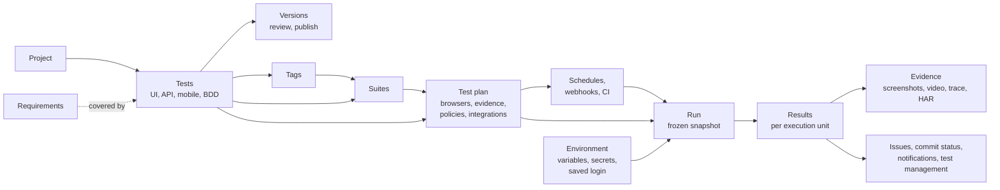
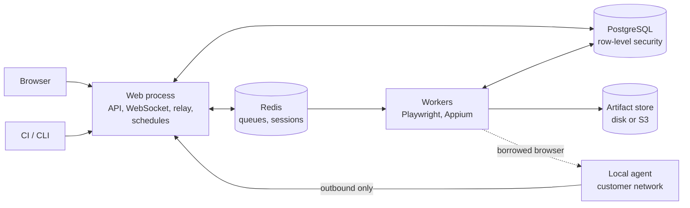

# WebFlowMaster at a glance

This is the page to read first, or to send to someone who has to understand WebFlowMaster without
using it yet. It says what the product is, who uses it for what, how it is built, and where the detailed
documentation is. Reading it takes about fifteen minutes.

## What it is

WebFlowMaster is a **test automation platform** for teams that need to check web applications, HTTP APIs and
native mobile apps and Gherkin/Cucumber scenarios, repeatedly and reliably, and to know the result without being in front of a screen.

A team uses it to:

1. **Author** tests — by recording a browser session, assembling steps in a visual builder with
   conditions and loops, describing a test in a sentence, generating tests from user stories, writing API
   requests with assertions and chaining, or defining mobile steps with a live inspector.
2. **Organize** them — projects, tags, suites (static or tag-driven), versions with review and
   publishing, quarantine for unreliable tests, requirements with computed coverage.
3. **Run** them — from the button, on a schedule, from a CI pipeline, from a webhook — across a browser
   matrix and a locale matrix, in parallel, on the platform's own workers, on cloud grids
   (BrowserStack, LambdaTest), or on **local agents** inside a customer's network.
4. **Understand** the results — steps, screenshots, video, trace, network capture, visual comparison,
   accessibility findings, an AI explanation of a failure, flaky-test detection, trends; exports to HTML,
   PDF, JUnit and Allure.
5. **Connect** it to the rest of the toolchain — commit statuses in GitHub and GitLab, issues in Jira and
   Azure DevOps, publication to TestRail, Xray and Zephyr Scale, notifications to Slack, Teams or a webhook,
   single sign-on, GitHub Actions, GitLab, Jenkins, Azure Pipelines, Bitbucket Pipelines and CircleCI templates, a command-line client.

It is **multi-tenant**: many organizations share one installation, and the database itself keeps their data
apart. It is **self-hosted**: a Docker Compose stack for one machine, or separate web and worker processes
behind a load balancer for more.

## Who uses it

| Role                         | What they do                                                      | Start with                                                                                                                                                                             |
| ---------------------------- | ----------------------------------------------------------------- | -------------------------------------------------------------------------------------------------------------------------------------------------------------------------------------- |
| **Test author** (editor)     | Records and builds tests, runs plans, reads reports               | [User guide](./guide/)                                                                                                                                                                 |
| **Reviewer / viewer**        | Reads results; editors with review permission approve publication | [Results](./guide/results)                                                                                                                                                             |
| **Owner / administrator**    | Members, roles, SSO and MFA, integrations, environments, keys     | [Administration](./admin/administration)                                                                                                                                               |
| **Platform operator**        | Installs, scales, backs up, monitors                              | [Installation](./admin/installation), [Operations](./admin/operations)                                                                                                                 |
| **Pipeline engineer**        | Starts plans from CI and reads the exit code                      | [CI integration](./CI_INTEGRATION), [CLI](./reference/cli), [REST API](./reference/api)                                                                                                |
| **Security reviewer**        | Checks isolation, secrets, hardening                              | [Security](./security/)                                                                                                                                                                |
| **Developer of the product** | Changes it                                                        | [Architecture](./internals/), [Developer guide](./internals/developer-guide), [Suite handbook](./internals/suite-handbook), [Contribution walkthrough](./internals/contributing-guide) |

## The concepts, in one picture

## How it is built

Two processes and three stores.

- The **web process** serves the React client and the REST API, authenticates people and machines,
  queues plan runs for workers; browser recording and optional inline authoring tasks have separate execution paths.
- **Workers** take runs from a queue, drive the browsers or devices, record evidence and results, then
  send notifications, issues and commit statuses. Add workers to run more in parallel.
- **PostgreSQL** holds everything durable and enforces tenant isolation with row-level security.
  **Redis** holds queues and sessions. **The artifact store** holds screenshots, videos and traces.
- A **local agent** supplies browsers, API transports and authorized Cucumber profiles inside a customer's network; it only ever connects _out_.

The five rules that explain most of the code:

1. **The database enforces tenancy**, not the application's `WHERE` clauses.
2. **A run is a record, not a process**: its state moves only through conditional updates.
3. **A run is decided when requested**: configuration and the list of tests are frozen in a snapshot.
4. **Side effects never fail a run**: notifications, issues and statuses are reported, not decisive.
5. **Secrets never travel back**: hashed or encrypted, shown once.

## Technology

TypeScript throughout. Node.js 20, Express, `ws`, Passport; Drizzle ORM on PostgreSQL 15+ with hand-written
SQL migrations (83 journal entries through `0082` at this revision); BullMQ on Redis/Valkey; Playwright for browsers and axe-core for accessibility;
Appium for mobile apps; React 18, Vite, TanStack Query, Radix/shadcn, Tailwind, React Flow; optional Google
Gemini for AI features; Vitest, Testing Library and supertest for tests; Docker for packaging.

## The repository in a table

| Folder           | Contents                                                                                                                 |
| ---------------- | ------------------------------------------------------------------------------------------------------------------------ |
| `client/`        | The React application                                                                                                    |
| `server/`        | The web process and the worker: routes, middleware, domain modules                                                       |
| `shared/`        | Schema and types used by both client and server                                                                          |
| `migrations/`    | The SQL migrations (`0000` … `0082`; see the migration journal)                                                          |
| `scripts/`       | CLI (`wfm`), local agent, migrator, schema doctor, importers                                                             |
| `integrations/`  | GitHub Action, GitLab template, Jenkins shared library, Azure Pipelines template, Bitbucket Pipelines step, CircleCI orb |
| `collaudo/`      | The acceptance test lab: HTTPS, Keycloak, simulators, Jenkins, Android emulator                                          |
| `docs/`          | This documentation (VitePress, English and Italian)                                                                      |
| `observability/` | Loki and Grafana configuration                                                                                           |

## The documentation, by question

| If you want to know…              | Read                                                                                                                                                                                                                                                                                                                                                                                        |
| --------------------------------- | ------------------------------------------------------------------------------------------------------------------------------------------------------------------------------------------------------------------------------------------------------------------------------------------------------------------------------------------------------------------------------------------- |
| How to use it                     | [User guide](./guide/): [web tests](./guide/web-tests), [API tests](./guide/api-tests), [mobile apps](./guide/mobile-apps), [BDD tests](./guide/bdd-tests), [organizing](./guide/organizing), [running](./guide/running), [results](./guide/results)                                                                                                                                        |
| How to install and run it         | [Installation](./admin/installation), [Operations](./admin/operations), [Configuration reference](./admin/configuration)                                                                                                                                                                                                                                                                    |
| How to administer an organization | [Administration](./admin/administration)                                                                                                                                                                                                                                                                                                                                                    |
| How safe it is                    | [Security overview](./security/), [Data protection](./security/data-protection), [Hardening](./security/hardening)                                                                                                                                                                                                                                                                          |
| How to call it from a pipeline    | [CI integration](./CI_INTEGRATION), [CLI](./reference/cli), [REST API](./reference/api)                                                                                                                                                                                                                                                                                                     |
| How agents work                   | [Local agents](./LOCAL_AGENT), [internals](./internals/agents), [BDD tests](./guide/bdd-tests)                                                                                                                                                                                                                                                                                              |
| How it is built                   | [Architecture overview](./internals/), [System architecture](./internals/system-architecture), [Class diagrams](./internals/class-diagrams), [Database schema](./internals/database-schema), [Sequence diagrams](./internals/sequences), [Mobile subsystem](./internals/mobile), [Run lifecycle](./internals/execution), [Tenancy](./internals/tenancy), [Web client](./internals/frontend) |
| Why it is built that way          | [Decision records](./internals/decisions)                                                                                                                                                                                                                                                                                                                                                   |
| How it was accepted               | [Test lab](./admin/test-lab)                                                                                                                                                                                                                                                                                                                                                                |
| What a word means                 | [Glossary](./internals/glossary)                                                                                                                                                                                                                                                                                                                                                            |
