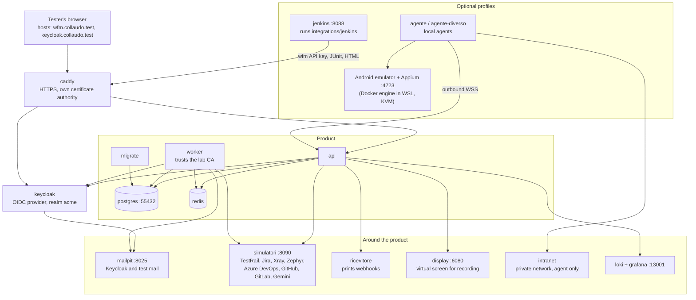

# Ambiente di collaudo

Il repository contiene un ambiente completo per **accettare il prodotto a mano**: WebFlowMaster come lo avvia
`docker-compose.yml`, in modalità produzione e dietro HTTPS, con tutto ciò che i casi di collaudo richiedono
intorno — un identity provider, una casella e-mail, strumenti esterni simulati, Jenkins, uno stack di log e un
emulatore Android. Sta in `collaudo/`.

La procedura passo per passo (comandi, account, valori per ciascun caso) è in
[`collaudo/README.md`](https://github.com/Markg981/WebFlowMaster/blob/main/collaudo/README.md). Questa pagina
spiega di cosa è fatto l'ambiente e come funziona. I diagrammi hanno etichette in inglese.

## A cosa serve

Eseguire `npm run dev:collaudo` dalla radice del repository e aprire `http://localhost:4322`
per la pagina locale: riprende la presentazione dell'artifact originale, con ricerca,
filtri, avanzamento, esiti, salvataggio automatico delle note e backup JSON importabili.
`npm run dev:docs` resta dedicato alla documentazione. Il catalogo è versionato in
`collaudo/casi.json`; cicli ed esiti sono in `collaudo/.local/state.json`, escluso da Git.
La pagina funziona senza Claude e senza Docker. Per eseguire i casi sul prodotto,
usare l'ambiente descritto qui sotto.

Ogni ciclo congela il catalogo, comprese istruzioni e presentazione, con un `catalogHash`
SHA-256; gli esiti registrati contengono il relativo `caseHash`. Pagine storiche ed export CSV
usano quel catalogo. Per provare definizioni aggiornate creare un nuovo ciclo. I cicli esistenti
congelano il catalogo salvato localmente prima dell'aggiornamento dal repository; le definizioni
già sovrascritte prima della migrazione non sono recuperabili automaticamente.
Prima di ogni salvataggio o migrazione viene scritto un backup JSON ripristinabile in
`collaudo/.local/backups/auto-*.json`. Si conservano gli ultimi 30 backup automatici, senza
eliminare file manuali. Se il backup fallisce, il salvataggio viene rifiutato. L'importazione
accetta file fino a 50 MiB e unisce lo storico senza sovrascrivere esiti in conflitto.
Per ripristinare uno stato precedente, arrestare il server, copiare `.local` al sicuro,
rinominare `state.json`, riavviare e importare il backup scelto. Conservare anche una copia
su un'altra macchina: i backup locali non proteggono da guasti del disco.

I test automatici provano il codice; l'ambiente di collaudo prova il *prodotto come lo incontra una persona*: le
immagini vere, TLS, cookie, single sign-on, e-mail, agenti in un'altra rete, un emulatore vero. Il protocollo è
un elenco di casi numerati (aree ACC, MFA, SSO, MEM, ENV, WEB, API, LIB, PLN, SCH, REP, INT, AGT, ADM, SEC, OPS,
UX, TMG, TRC, MOB) conservato localmente in `collaudo/casi.json`; ogni esito registrato è legato all'id del
caso, quindi gli id non si rinominano mai.

## Topologia

| Servizio | Scopo | Casi |
|---|---|---|
| `caddy` | HTTPS con un'autorità di certificazione propria; il prodotto e il worker la conoscono già, il browser di chi collauda la importa una volta | tutti |
| `keycloak` | Identity provider per SSO, OAuth 2.0 client credentials, utenti TOTP, e-mail di reimpostazione password | SSO, API-04, WEB-45…49 |
| `mailpit` | Casella per Keycloak e per gli step «Wait for email» | WEB-45…47 |
| `simulatori` | Un server Node che risponde come TestRail, Jira (e Xray Server), Xray Cloud, Zephyr Scale, Azure DevOps, GitHub, GitLab e Gemini, con i dati che i casi si aspettano; una pagina di amministrazione mostra cosa ha ricevuto | TMG, TRC, INT-07, REP-15…22, WEB-16 |
| `intranet` | Un sito su una rete privata che solo l'agente raggiunge | AGT |
| `ricevitore` | Stampa i webhook delle notifiche | PLN-13 |
| `display` | Uno schermo virtuale (noVNC) dove si apre la finestra di registrazione | WEB-11, ENV-04 |
| `loki`, `grafana` | I log dell'applicazione | OPS-09 |
| `agente`, `agente-diverso` | Agenti locali; il secondo ha un'altra versione di Playwright per provare il messaggio di incompatibilità | AGT |
| `jenkins` | Jenkins configurato da codice che esegue la shared library di `integrations/jenkins` contro l'ambiente | INT-08 |
| Emulatore Android | Un emulatore vero con Appium (`budtmo/docker-android`), raggiunto tramite un agente e una griglia *Local Appium* | MOB |

## Comandi

Sono tutti script `npm run` alla radice del repository; usano il nome di progetto `wfm-collaudo`, quindi database
e volumi dell'ambiente non si mescolano mai con uno stack di sviluppo.

| Comando | Fa |
|---|---|
| `collaudo:up` | Costruisce l'immagine dal codice attuale e avvia ogni servizio, attendendo che sia sano. |
| `collaudo:prepare` | Crea persone, una sessione aperta per ruolo, l'ambiente *Staging*, un test di login e un piano già eseguito una volta, e un progetto riservato. Ripetibile. |
| `collaudo:check` | Stampa «Pronto» o, per ogni problema, cosa fare. I siti pubblici usati dai casi sono avvisi: se non rispondono il caso è *Bloccato*, non *Fallito*. |
| `collaudo:simulatori` | Crea le connessioni «Simulato · …» e verifica ciascuna attraverso il prodotto. |
| `collaudo:jenkins` | Crea una chiave API, avvia Jenkins ed esegue il job INT-08. |
| `collaudo:mobile` | Avvia l'emulatore e Appium, scarica l'app di prova. |
| `collaudo:sicurezza-mobile` | Esegue via API i passi di isolamento SEC-25…30 dei test mobili. |
| `collaudo:reset` | Rimuove lo stack e i suoi volumi. |

## Scelte di progetto da conoscere

- **L'ambiente è il prodotto vero.** Sono le immagini di produzione con variabili d'ambiente diverse, non una
  build speciale; ciò che all'ambiente serviva e al prodotto mancava è stato aggiunto al prodotto (per esempio il
  worker che si fida di una CA in più, `collaudo/worker/trust-ca.sh`).
- **Ogni servizio esterno è simulato, in modo deterministico.** I casi si ripetono senza account, e la pagina
  di amministrazione del simulatore mostra esattamente cosa ha inviato il prodotto (REP-17 vi legge il prompt
  inviato all'AI).
- **Le impostazioni che un caso cambia sono variabili**, applicate ricreando il servizio e tolte ricreandolo di
  nuovo (`INSTALLATION_ADMINS`, `ORG_MAX_CONCURRENT_RUNS`, `RUN_MAX_DURATION_MS`, `API_RATE_LIMIT`,
  `AUTH_RATE_LIMIT`, `REGISTRATION`, `GEMINI_API_KEY`, `DEBUG_IDLE_TIMEOUT_MS`).
- **Le credenziali valgono solo nell'ambiente** (`Collaudo.2026!`, segreti fissi). Non vanno mai riusate.
- **Un caso che fallisce dopo «Pronto» fallisce per l'applicazione, non per l'ambiente.**

## Cosa l'ambiente non copre

Jira, Azure DevOps, GitHub e i sistemi di CI veri sono esterni; i casi corrispondenti usano i simulatori oppure
richiedono un progetto, un repository e dei token propri. Il caso GitHub INT-06 richiede che l'installazione sia
raggiungibile da GitHub (un runner self-hosted o un tunnel). I casi iOS richiedono un Mac.
