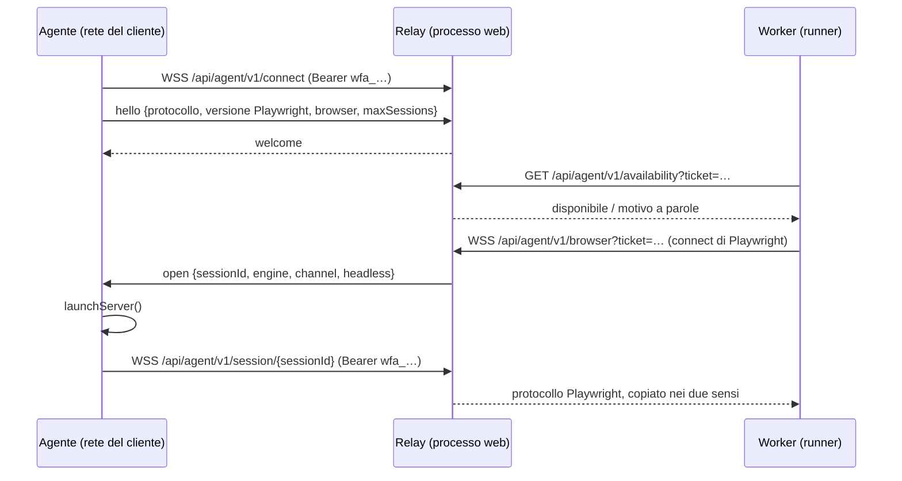

# Agenti locali (interni)

Un agente locale presta browser che girano dentro la rete di un cliente ai run eseguiti sui worker del
server. Questa pagina spiega come funziona all'interno. Come installarne e gestirne uno è nella
[guida agli agenti locali](../LOCAL_AGENT).

## L'idea: prestare il browser, tenere il runner

Il runner resta dov'è. Si sposta il browser: invece di `chromium.launch()`, un passaggio di un piano
impostato su un pool di agenti chiama `chromium.connect()` verso un browser che un agente ha avviato con
`launchServer` di Playwright. Tutto ciò che pilota un browser — step, correzione automatica, screenshot,
video, trace, HAR, confronto visivo, accessibilità — funziona invariato, e le pagine si aprono dalla
macchina dell'agente, quindi raggiungono ciò che raggiunge quella macchina.

Nessuno chiama un agente. È l'agente ad aprire ogni connessione, verso l'esterno, quindi non servono
porte in ingresso né VPN.

## Componenti

| Parte | File | Ruolo |
|---|---|---|
| Tipi del protocollo | `shared/agents.ts` | Percorsi, versione del protocollo, forma dei messaggi, regola dei nomi dei pool, compatibilità Playwright. |
| Credenziali | `server/agents/agent-credentials.ts` | Token degli agenti (`wfa_…`, salvati come SHA-256), ticket del relay (HMAC, 60 s). |
| Verifica del token | `server/agents/agent-auth.ts` | A quale agente appartiene un token (privilegiata: è il token a indicare l'organizzazione). |
| Relay | `server/agents/relay.ts` | Accetta agenti, runner e sessioni; sceglie un agente; inoltra il protocollo. |
| Directory | `server/agents/relay-directory.ts` | Cosa tiene ogni istanza del relay, quando ci sono più server web. |
| Lato runner | `server/agents/agent-browser.ts` | Firma un ticket, chiede la disponibilità, si connette. |
| Richieste API | `server/agents/agent-fetch.ts` | `fetch` eseguita tramite l'API request di un browser in prestito. |
| Avvio | `server/agents/setup.ts` | Avvia il relay nel processo web, modalità cluster da `AGENT_RELAY_ADVERTISE_URL`. |
| Programma dell'agente | `scripts/wfm-agent.ts` | Connessione di controllo, `launchServer`, inoltro delle sessioni, riconnessione, drenaggio. |
| Rotte | `server/routes/agents.routes.ts` | Elenco, creazione (token mostrato una volta), revoca; disponibilità. |

## Credenziali

- Il **token dell'agente** dice "sono questo agente di questa organizzazione". Mostrato una volta,
  salvato come hash. Revocarlo imposta `revoked_at` e disconnette l'agente.
- Il **ticket** dice "questo runner può prendere in prestito un browser del pool di questa
  organizzazione, adesso". L'endpoint del relay per i browser sta sull'indirizzo pubblico che gli agenti
  chiamano, quindi senza ticket chiunque potrebbe prendere in prestito un browser dentro la rete di un
  cliente. Un ticket è firmato con `AGENT_RELAY_SECRET` (che per default è `SESSION_SECRET`), indica
  organizzazione, pool, motore, canale, headless e la versione di Playwright del runner, e scade dopo 60
  secondi.

## Scelta dell'agente

Per un ticket, il relay considera gli agenti della stessa organizzazione e dello stesso pool, poi filtra:

1. la versione **major.minor** di Playwright deve coincidere con quella del runner (il protocollo cambia
   fra le minor);
2. l'agente deve avere installato il **motore** richiesto;
3. non deve essere in **drenaggio** e deve essere sotto il suo `maxSessions`.

Sceglie il meno occupato. Quando nessuno è adatto, risponde con il primo motivo che si applica, a parole
("No agent of pool "onprem" is connected", "…run Playwright 1.58, and this server 1.61: they must match",
"…has firefox installed", "Every agent … is busy or draining"). Il runner chiede
`/api/agent/v1/availability` prima di connettersi, così nel log del run arriva quel motivo e non un
codice di errore WebSocket.

## Sessioni

Scelto l'agente, il relay registra una sessione in sospeso, tiene in un buffer i primi messaggi del
runner e invia `open` all'agente. L'agente avvia un browser server e connette
`/api/agent/v1/session/{id}` con il proprio token. Solo l'agente a cui è stato chiesto può rispondere per
quella sessione. I messaggi nel buffer vengono consegnati e da lì in poi i messaggi si copiano nei due
sensi, senza essere letti. Se l'agente segnala `open_failed` o non risponde entro 30 secondi, la
connessione del runner viene chiusa con il motivo.

L'agente riconnette la connessione di controllo con backoff (fino a 30 s). Un `401` o un messaggio
`refused` (token revocato, protocollo non supportato) è fatale: l'agente esce con codice 2. `SIGTERM`
annuncia `draining` e lascia finire le sessioni in corso.

## Richieste API dall'agente

Per un piano su un pool di agenti, anche test API, precondizioni API e richieste di token OAuth devono
partire dalla rete del cliente. `AgentHttp` prende in prestito un browser per run alla prima richiesta e
usa `context.request.fetch()`, che Playwright esegue dove sta il browser. Ogni richiesta ha un nuovo
contesto di browser (un contesto conserva i cookie; `fetch` no), gli header ripetuti vengono mantenuti,
la lista dei certificati self-signed ammessi vale come sul server, e un'interruzione viene rispettata
subito. Non è servita alcuna modifica all'agente: qualsiasi agente che presta un browser può inviare
richieste.

## Più server web

Ogni server web ha la propria istanza del relay, e un agente è connesso all'istanza che gli ha assegnato
il load balancer. Con `AGENT_RELAY_ADVERTISE_URL` impostata, le istanze pubblicano su Redis gli agenti
che tengono ogni 5 secondi (le voci durano almeno 15 secondi) e leggono quelli delle altre.

- Un **runner** la cui richiesta arriva a un'istanza senza un agente adatto viene inoltrato all'istanza
  che ha il meno occupato, come un'ulteriore WebSocket copiata nei due sensi.
- Anche la **connessione di sessione** dell'agente può arrivare ovunque. Gli id di sessione contengono
  l'id dell'istanza che tiene il runner (`istanza~uuid`), quindi la connessione viene inoltrata lì; se
  quell'istanza non è nella directory in cache, la directory viene riletta prima.
- Una richiesta inoltrata porta l'header `x-wfm-relay-hop` e viene servita o rifiutata dove arriva, mai
  inoltrata di nuovo. L'istanza di destinazione verifica da sé il ticket o il token dell'agente, e il suo
  rifiuto (stato e motivo) viene restituito invariato; un'istanza irraggiungibile viene nominata, con
  l'impostazione da controllare.
- La **revoca** raggiunge ogni istanza: ciascuna riautentica i token dei propri agenti a ogni heartbeat
  (20 s).

## Limiti

- Playwright dell'agente e del server devono avere la stessa major.minor. L'immagine Docker ha il tag
  della versione del server, e Settings segnala una discrepanza.
- Le richieste API tramite un agente richiedono Chromium sull'agente.
- La pagina API Tester e le esecuzioni ad hoc dal builder inviano le richieste dal server: non
  appartengono a un piano e quindi a nessun pool.
