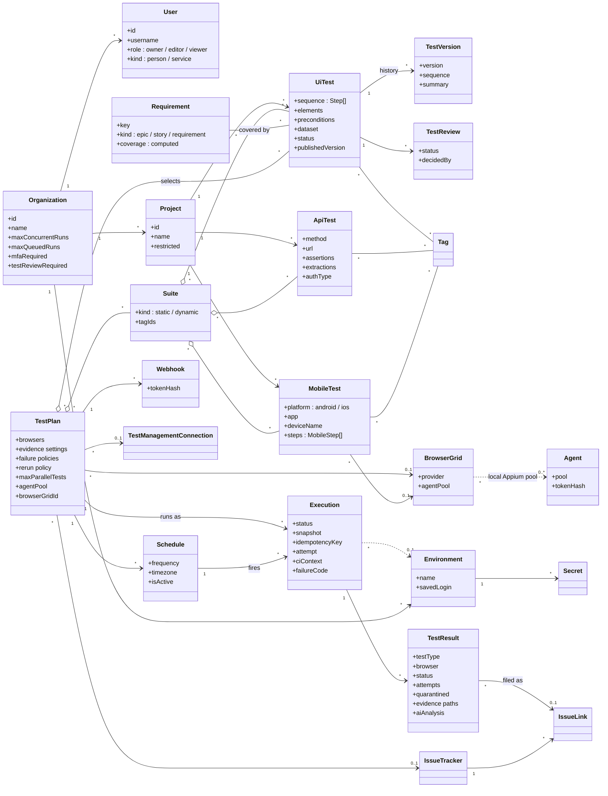
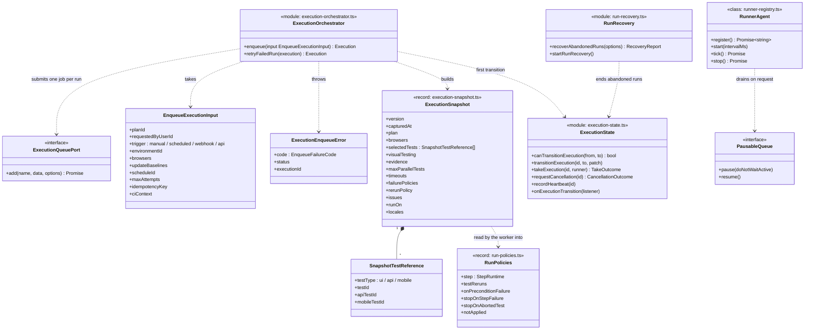
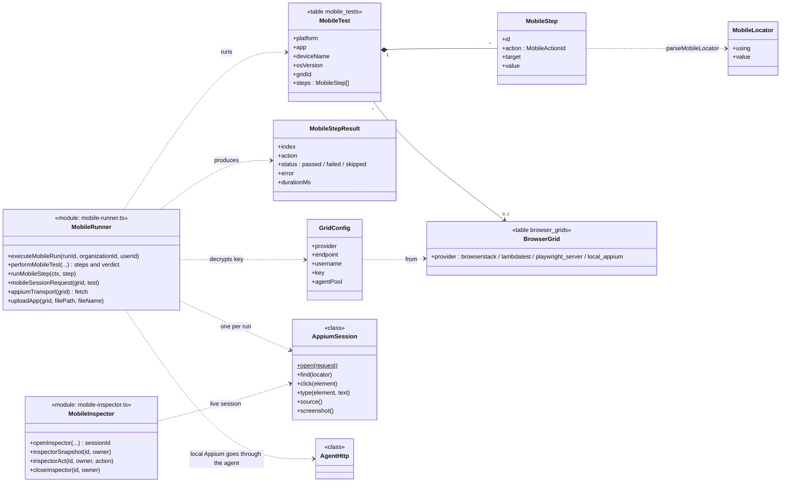
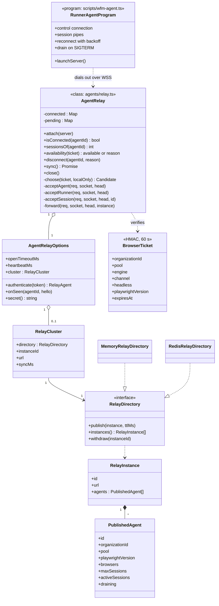
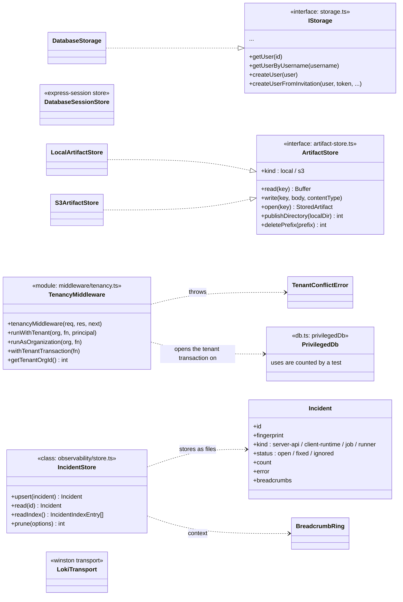

# Diagrammi delle classi

WebFlowMaster è scritto per lo più come moduli di funzioni: le decisioni sono funzioni pure in file propri, gli
effetti stanno nei moduli che li eseguono. Il prodotto ha quindi poche classi, e quelle che ha stanno proprio
dove serve *uno stato con una vita*: un relay WebSocket, un pool di browser, una sessione su un dispositivo, un
debugger. Questa pagina le disegna e disegna accanto il **modello di dominio**: i tipi che l'intero sistema si
scambia, che sono interfacce e record più che classi. I diagrammi sono in inglese, come i nomi nel codice.

Tutti i diagrammi sono ricavati dal codice. Le firme sono abbreviate a ciò che conta; su ogni diagramma è
indicato il file, così la definizione completa è a una ricerca di distanza. Per le tabelle dietro i tipi di
dominio vedi [Schema del database](./database-schema).

## 1. Il modello di dominio

I concetti di business e come si collegano. Ogni riquadro è una tabella del database o un documento salvato; i
nomi delle colonne sono in [Schema del database](./database-schema).

Tre cose che il diagramma non può mostrare:

- **Un run è congelato quando viene richiesto.** `Execution.snapshot` contiene la configurazione del piano e
  l'*elenco risolto dei test*; modificare il piano dopo non cambia nulla di un run già esistente.
- **La copertura si calcola, non si salva.** `Requirement.coverage` deriva dagli ultimi risultati dei test che
  la coprono (`shared/requirements.ts`).
- **Un risultato appartiene a un test *e a un browser*.** Un test su tre browser sono tre righe `TestResult`,
  ciascuna con i propri tentativi, evidenze ed esito.

## 2. Creazione e controllo dei run

L'orchestratore crea i run; `execution-state` è l'unico posto in cui cambia lo stato di un run; il `RunnerAgent`
del worker mantiene visibile il processo. Questi sono i tipi intorno a loro.

La macchina a stati del run (`queued → running → completed | failed | error | timed_out`, con
`cancelling → cancelled`) è disegnata in [Ciclo di vita di un run](./execution).

## 3. Esecuzione dei test

```mermaid
classDiagram
  direction TB
  class PlaywrightService {
    <<class: playwright-service.ts>>
    +startRecordingSession(url, userId)
    +stopRecordingSession(id, userId)
    +getRecordedActions(id, userId)
    +detectElements(url, userId) DetectionResult
    +captureLoginState(sessionId, environment)
    +registerSession(id, session)
    +disposeAllRecordingSessions()
  }
  class BrowserPool {
    <<singleton: browser-pool.ts>>
    +getInstance()$ BrowserPool
    +acquire(browserType, headless) Browser
    +release(browser)
  }
  class FlowCursor {
    <<class: flow-cursor.ts>>
    +advance(outcome) string
    +iterationKey() string
  }
  class StepResult {
    <<record>>
    +name
    +type
    +status : passed / failed
    +screenshot
    +error
    +healed
    +visual
    +accessibility
  }
  class AgentHttp {
    <<class: agents/agent-fetch.ts>>
    +fetch : fetch through a borrowed browser
    +close() Promise
  }
  class AIAutomationService {
    <<class: ai-automation-service.ts>>
    +isAvailable() bool
    +proposeTestSteps(prompt)
    +proposeTestCases(prompt)
    +explainFailure(prompt, screenshot)
    +healSelector(selector, pageSource, error)
  }
  class DebugController {
    <<class: debug-session.ts>>
    +watch(vars)
    +record(record) Promise
    +finish(outcome) Promise
    +fail(message) Promise
  }
  class DebugHooks {
    <<interface>>
    +watch(vars)
    +beforeStep(context) DebugDecision
    +afterFailure(context) DebugDecision
    +record(record)
    +finish(outcome)
  }
  class DebugChannel {
    <<interface>>
    +open(id, meta)
    +publish(id, state)
    +read(id) DebugState
    +send(id, command)
    +drain(id) DebugCommand[]
    +next(id, ms) DebugCommand
  }
  class ExcelService {
    <<class: excel-service.ts>>
    +parseExcelFile(path) ExcelTestCase[]
    +detectColumns(path) string[]
  }
  class AppiumSession {
    <<class: appium-client.ts>>
    +open(request)$ AppiumSession
    +find(locator) string
    +click(element)
    +type(element, text)
    +drag(from, to, durationMs)
    +source() string
    +screenshot() string
    +close()
  }
  class WebDriverError

  PlaywrightService ..> BrowserPool : local browsers
  PlaywrightService ..> FlowCursor : conditions and loops
  PlaywrightService ..> StepResult : produces
  PlaywrightService ..> AIAutomationService : healing, optional
  PlaywrightService ..> DebugHooks : pauses when debugged
  DebugController ..|> DebugHooks
  DebugController ..> DebugChannel : state out, commands in
  AppiumSession ..> WebDriverError : throws
```

Note:

- `PlaywrightService` è la classe più grande (registrazione, rilevamento degli elementi, aiuti per l'esecuzione
  degli step). Un run non la usa come un sacco di metodi: `test-execution-service.ts` e `step-executor.ts`
  usano le sue sessioni di browser e gli aiuti puri che la circondano.
- `DebugChannel` ha due implementazioni: `memoryDebugChannel` quando i browser task girano inline nel processo
  web, e `redisDebugChannel` quando li esegue un worker; è ciò che fa funzionare il debugger passo-passo con il
  browser su un worker e la persona su un server web.
- `AgentHttp` è descritta in [Agenti locali (interni)](./agents).

## 4. Mobile

Il sottosistema mobile è una fetta verticale a sé; la sua storia è in [Sottosistema mobile](./mobile).

## 5. Agenti e relay

## 6. Archiviazione, tenancy e tipi trasversali

### Gli errori

Ogni area ha la propria sottoclasse di `Error` con un *codice* che la rotta trasforma in uno stato e in una
frase. Nessuna viene intercettata per tipo fuori dalla sua area; un gestore generico trasforma il resto in un
`500` e in un incidente.

| Classe | File | Sollevata quando |
|---|---|---|
| `ExecutionEnqueueError` | `execution-orchestrator.ts` | Non si può creare un run: piano sconosciuto, coda piena, coda irraggiungibile, input non valido. |
| `BrowserTaskError` | `browser-tasks.ts` | Un task per un worker è scaduto, è stato rifiutato o non ha trovato un worker. |
| `TenantConflictError` | `middleware/tenancy.ts` | Il codice tenta di eseguire in due organizzazioni insieme. |
| `PublishingError`, `QuarantineError` | `test-publishing.ts`, `test-quarantine.ts` | Un test non può essere pubblicato, revisionato o messo in quarantena nel suo stato attuale. |
| `SsoConfigError` | `sso.ts` | La configurazione del provider non è valida o è irraggiungibile. |
| `ReportExportError` | `report-export.ts` | Un report non può essere generato. |
| `WebDriverError` | `appium-client.ts` | Il server Appium ha risposto con un errore W3C WebDriver. |
| `InspectorError` | `mobile-inspector.ts` | Una sessione dell'inspector non esiste più, è occupata o è stata rifiutata. |

## 7. Come leggere il codice con questi diagrammi

- Parti da un **record** (`ExecutionSnapshot`, `StepResult`, `MobileStep`): sono i contratti fra processo
  web, worker, client e JSON salvato. Quasi tutti stanno in `shared/`, così client e server non possono
  essere in disaccordo.
- Un riquadro **module** (`<<module>>`) è un file di funzioni. La sua parte pura si testa direttamente; i suoi
  effetti si testano su PGlite o con un finto HTTP.
- Un riquadro **class** è stato con una vita: possiede un socket, un browser o un timer, quindi ha un `close()`
  o `stop()` esplicito e un test che lo chiama.
