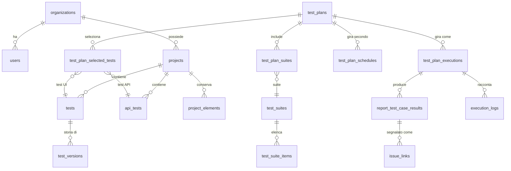

# Modello dati

Lo schema è dichiarato una sola volta, con Drizzle, in `shared/schema.ts`, e creato dalle migrazioni SQL
scritte a mano in `migrations/` (vedi la [guida sviluppatore](./developer-guide#migrazioni-del-database)).
Questa pagina raggruppa le tabelle per dominio e spiega a cosa serve ciascuna. Il dettaglio delle colonne
è in `shared/schema.ts`, dove la maggior parte delle colonne ha un commento.

Salvo indicazione contraria, una tabella ha un `organization_id` ed è protetta dalla row-level security
([Tenancy e accessi](./tenancy)).

## Le relazioni principali

## Organizzazioni, persone e accessi

| Tabella | Scopo |
|---|---|
| `organizations` | Il tenant. Contiene anche le sue quote (`max_concurrent_runs`, `max_queued_runs`), la policy MFA e se i test richiedono revisione prima della pubblicazione. Non è filtrata per `organization_id` (è l'organizzazione stessa). |
| `users` | Persone e service account. Contiene il riferimento all'organizzazione e il ruolo. Senza RLS: le query indicano l'organizzazione esplicitamente. |
| `user_mfa` | Segreto TOTP e codici di recupero. Senza RLS e senza permessi per `app_user`: la legge solo il modulo MFA privilegiato. |
| `user_settings` | Preferenze per utente: tema, lingua, URL di test predefinito, browser predefinito, headless, timeout. |
| `invitations` | Inviti in sospeso con ruolo e scadenza; monouso. Letta prima che l'utente esista, quindi senza RLS. |
| `projects` / `project_members` | Progetti e, per quelli riservati, chi può vederli e con quale ruolo di progetto. |
| `api_keys` | Credenziali delle pipeline: hash, prefisso, scope, scadenza, ultimo uso, utente o service account titolare. |
| `audit_log` | Registro in sola aggiunta di chi ha fatto cosa; `app_user` può solo leggere e inserire. |
| `sessions` | Lo store delle sessioni quando le tiene PostgreSQL (in produzione le tiene Redis). Dell'installazione. |

## Scrivere i test

| Tabella | Scopo |
|---|---|
| `tests` | Test UI: la sequenza di step, gli elementi rilevati, le precondizioni, il dataset, il riferimento alla versione pubblicata. |
| `detected_elements` | Elementi trovati su una pagina per un test (la palette del builder). |
| `project_elements` | Il repository degli elementi: una definizione per elemento per progetto, che gli step possono richiamare; la correzione automatica la aggiorna una volta per tutti i test. |
| `step_groups` | Sequenze di step riutilizzabili con un nome, richiamate dai test; espanse al momento dell'esecuzione. |
| `api_tests` | Test API: metodo, URL, header, body, autenticazione, asserzioni, estrazioni. |
| `api_test_history` | Richieste inviate dall'API tester, per il pannello della cronologia. |
| `tags` / `test_tags` | Il vocabolario proprio di un'organizzazione, applicato ai test; guida le suite dinamiche. |
| `test_versions` | Ogni stato salvato di un test. `app_user` non può cancellare: la storia non si può riscrivere. |
| `test_publications` | Quale versione è stata pubblicata o ripristinata, quando e da chi (solo lettura e inserimento). |
| `test_reviews` | Richieste di revisione e decisioni, quando l'organizzazione richiede la revisione. |
| `test_quarantines` | Test messi da parte perché instabili, con motivo, evidenze e rilascio. |
| `excel_sequences_map` | Test Manager: righe di un foglio importato collegate a sequenze salvate. |
| `test_runs` | Risultati di singoli test avviati dal builder (non run di piani). |

## Pianificare ed eseguire

| Tabella | Scopo |
|---|---|
| `test_plans` | Un piano: macchine/browser, evidenze, test visivi, timeout, policy di fallimento, policy di riesecuzione, parallelismo, notifiche, issue tracker, pool di agenti. |
| `test_plan_selected_tests` | I test che un piano esegue direttamente, in ordine. |
| `test_suites` / `test_suite_items` | Suite: statiche (test elencati) o dinamiche (test con determinati tag). |
| `test_plan_suites` | Suite incluse da un piano; espanse in test quando si crea un run. |
| `test_plan_schedules` | Quando gira un piano: frequenza o cron, fuso orario, browser, ambiente, policy di retry, sovrascrittura delle notifiche. |
| `test_plan_webhooks` | Webhook CI che avviano un piano; token salvato come hash. |
| `test_plan_executions` | Run: stato e timestamp del ciclo di vita, heartbeat, runner, snapshot, chiave di idempotenza, tentativi, contesto CI, aggregati, codice e messaggio di errore. |
| `report_test_case_results` | Una riga per test per browser per run: stato, step (con screenshot, correzioni, risultati visivi e di accessibilità), percorsi delle evidenze, riepilogo di rete, versione del test, flag di quarantena, tentativi. |
| `execution_logs` | Il log in diretta di un run, riproposto dalla pagina del report. |
| `issue_trackers` / `issue_links` | Collegamenti Jira o Azure DevOps (token cifrato), e quale fallimento è diventato quale issue (univoco per fallimento, così un fallimento viene segnalato una volta). |
| `source_hosts` | Collegamenti GitHub o GitLab per lo stato dei commit (token cifrato), con l'esito dell'ultimo invio. |

## Ambienti e credenziali del sistema sotto test

| Tabella | Scopo |
|---|---|
| `environments` | Destinazioni con un nome (Staging, Produzione…), con uno stato di login salvato opzionale (cookie e storage del browser, cifrati) perché i test possano partire già autenticati. |
| `secrets` | I valori dell'ambiente, cifrati, offerti ai test come variabili `{{nome}}`; uno chiamato `baseUrl` sovrascrive il default dell'installazione. |

## Piano di esecuzione

| Tabella | Scopo |
|---|---|
| `runners` | Processi worker registrati, con heartbeat, capacità, browser installati e stato desiderato (drenaggio). Dell'installazione, senza RLS. |
| `agents` | Agenti locali: pool, hash del token, ciò che hanno dichiarato (host, versioni, browser), revoca. |
| `system_settings` | Impostazioni dell'installazione (livelli di log e simili). Senza RLS. |

## Convenzioni

- **Chiavi primarie**: interi seriali per le tabelle più vecchie e voluminose (test, progetti, utenti);
  UUID testuali per le più recenti e per tutto ciò il cui id compare in un URL o in un job (run, piani,
  schedulazioni).
- **Timestamp** di tipo `timestamp` senza fuso, sempre scritti e letti in UTC: ogni sessione del database
  imposta `TIME ZONE 'UTC'` alla connessione (`server/db.ts`).
- **jsonb** contiene documenti strutturati e versionati (step, snapshot, contesto CI, riepiloghi). Chi li
  legge accetta sia la forma già interpretata sia quella testuale, perché alcune righe vecchie sono state
  scritte come stringhe.
- **Cancellare** è raro per scelta: i test conservano le versioni, i run conservano i risultati anche
  dopo che la conservazione ne ha rimosso i file, gli agenti si revocano invece di cancellarli. Dove
  `app_user` non ha il permesso `DELETE`, l'applicazione non può cancellare.
- I **collegamenti nella stessa organizzazione** fra tabelle per organizzazione sono protetti, e
  verificati da un test di deriva.
