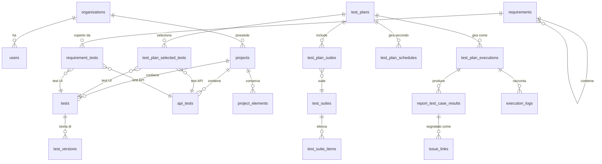

# Modello dati

Lo schema è dichiarato una sola volta, con Drizzle, in `shared/schema.ts`, e creato dalle migrazioni SQL
scritte a mano in `migrations/` (vedi la [guida sviluppatore](./developer-guide#migrazioni-del-database)).
Questa pagina raggruppa le tabelle per dominio e spiega a cosa serve ciascuna. Il dettaglio delle colonne
è in `shared/schema.ts`, dove la maggior parte delle colonne ha un commento.

Salvo indicazione contraria, una tabella ha un `organization_id` ed è protetta dalla row-level security
([Tenancy e accessi](./tenancy)).

## Le relazioni principali

```mermaid
erDiagram
  organizations ||--o{ users : ha
  organizations ||--o{ projects : possiede
  projects ||--o{ tests : contiene
  projects ||--o{ api_tests : contiene
  projects ||--o{ project_elements : conserva
  tests ||--o{ test_versions : "storia di"
  test_plans ||--o{ test_plan_selected_tests : seleziona
  test_plan_selected_tests }o--|| tests : "test UI"
  test_plan_selected_tests }o--|| api_tests : "test API"
  test_plans ||--o{ test_plan_suites : include
  test_plan_suites }o--|| test_suites : suite
  test_suites ||--o{ test_suite_items : elenca
  requirements ||--o{ requirements : contiene
  requirements ||--o{ requirement_tests : "coperto da"
  requirement_tests }o--|| tests : "test UI"
  requirement_tests }o--|| api_tests : "test API"
  test_plans ||--o{ test_plan_schedules : "gira secondo"
  test_plans ||--o{ test_plan_executions : "gira come"
  test_plan_executions ||--o{ report_test_case_results : produce
  test_plan_executions ||--o{ execution_logs : racconta
  report_test_case_results ||--o{ issue_links : "segnalato come"
```

## Organizzazioni, persone e accessi

| Tabella | Scopo |
|---|---|
| `organizations` | Il tenant. Contiene anche le sue quote (`max_concurrent_runs`, `max_queued_runs`), la policy MFA e se i test richiedono revisione prima della pubblicazione. Non è filtrata per `organization_id` (è l'organizzazione stessa). |
| `users` | Persone e service account. Contiene il riferimento all'organizzazione e il ruolo. Senza RLS: le query indicano l'organizzazione esplicitamente. |
| `user_mfa` | Segreto TOTP e codici di recupero. Senza RLS e senza permessi per `app_user`: la legge solo il modulo MFA privilegiato. |
| `user_settings` | Preferenze per utente: tema, lingua, URL di test predefinito, browser predefinito, headless, timeout. |
| `invitations` | Inviti in sospeso con ruolo e scadenza; monouso. Letta prima che l'utente esista, quindi senza RLS. |
| `projects` / `project_members` | Progetti e, per quelli riservati, chi può vederli e con quale ruolo di progetto. |
| `api_keys` | Credenziali delle pipeline: hash, prefisso, scope, scadenza, ultimo uso, utente o service account titolare. |
| `audit_log` | Registro in sola aggiunta di chi ha fatto cosa; `app_user` può solo leggere e inserire. |
| `password_resets` | Link di reimpostazione della password monouso e con scadenza, creati da un owner o dallo script `password-reset-link`; del token si salva solo l'hash. |
| `organization_sso` | Un identity provider per organizzazione, OpenID Connect o SAML 2.0 (`protocol`): l'issuer (entity ID per SAML), poi client id e client secret (cifrato) per OpenID Connect o URL di accesso e certificato di firma per SAML, più ruolo predefinito, se è attivo e se è obbligatorio. Senza RLS e senza permessi per `app_user`: il provider si trova prima che qualcuno abbia effettuato l'accesso. |
| `sso_saml_requests` | Le AuthnRequest SAML in attesa di risposta: id e organizzazione, conservate dieci minuti. La risposta deve corrispondere a una di esse, che viene cancellata mentre la si usa, così una risposta non si può riusare. Stanno nel database e non nella sessione perché il provider risponde con un POST cross-site. Senza RLS e senza permessi per `app_user`. |
| `sso_domains` | I domini e-mail che indirizzano un accesso al provider di un'organizzazione. Un dominio appartiene a una sola organizzazione. |
| `sso_identities` | Il legame fra una persona presso il provider (`issuer` + `subject`) e una riga di `users`, con l'ultimo accesso. |
| `sessions` | Lo store delle sessioni quando le tiene PostgreSQL (in produzione le tiene Redis). Dell'installazione. |

I diagrammi completi, a livello di colonna, di tutte le tabelle sono in [Schema del database](./database-schema).

## Scrivere i test

| Tabella | Scopo |
|---|---|
| `tests` | Test UI: la sequenza di step, gli elementi rilevati, le precondizioni, il dataset, il riferimento alla versione pubblicata. |
| `detected_elements` | Elementi trovati su una pagina per un test (la palette del builder). |
| `project_elements` | Il repository degli elementi: una definizione per elemento per progetto, che gli step possono richiamare; la correzione automatica la aggiorna una volta per tutti i test. |
| `step_groups` | Sequenze di step riutilizzabili con un nome, richiamate dai test; espanse al momento dell'esecuzione. |
| `api_tests` | Test API: metodo, URL, header, body, autenticazione, asserzioni, estrazioni e il controllo prestazioni facoltativo (ripetizioni e soglie sui tempi di risposta). |
| `api_test_history` | Richieste inviate dall'API tester, per il pannello della cronologia. |
| `tags` / `test_tags` | Il vocabolario proprio di un'organizzazione, applicato ai test; guida le suite dinamiche. |
| `test_versions` | Ogni stato salvato di un test. `app_user` non può cancellare: la storia non si può riscrivere. |
| `test_publications` | Quale versione è stata pubblicata o ripristinata, quando e da chi (solo lettura e inserimento). |
| `test_reviews` | Richieste di revisione e decisioni, quando l'organizzazione richiede la revisione. |
| `test_quarantines` | Test messi da parte perché instabili, con motivo, evidenze e rilascio. |
| `custom_actions` | Gli step propri di un'organizzazione: un nome, parametri tipizzati e uno script che gira nella pagina del browser; un test la usa come qualsiasi azione predefinita. |
| `test_data_sets` | Dati di test condivisi: un nome, colonne e righe. Ogni colonna della prima riga è `{{data.<nome>.<colonna>}}` in ogni test; un test UI gira sulle righe quando il suo `dataset` contiene il marcatore `[{"$sharedSet": "<id>"}]`, espanso subito prima del run (`server/test-data.ts`). |
| `excel_sequences_map` | Test Manager: righe di un foglio importato collegate a sequenze salvate. |
| `test_runs` | Risultati di singoli test avviati dal builder (non run di piani). |
| `mobile_tests` / `mobile_test_runs` | Test di app native Android e iOS — piattaforma, app sulla griglia (`bs://`, `lt://`), dispositivo, passi con locator nativi — e le loro esecuzioni su un dispositivo della griglia, passo per passo, con lo screenshot finale e la pagina della sessione (`shared/mobile.ts`, `server/mobile-runner.ts`). |
| `requirements` / `requirement_tests` | Epic, user story e requisiti (scritti a mano o importati da un issue tracker, con il loro padre) e i test che li coprono. La copertura non è mai salvata: si calcola dagli ultimi risultati dei test (`shared/requirements.ts`). |

## Pianificare ed eseguire

| Tabella | Scopo |
|---|---|
| `test_plans` | Un piano: macchine/browser, evidenze, test visivi, timeout, policy di fallimento, policy di riesecuzione, parallelismo, notifiche, issue tracker, connessione di test management, pool di agenti. |
| `test_plan_selected_tests` | I test che un piano esegue direttamente, in ordine. |
| `test_suites` / `test_suite_items` | Suite: statiche (test elencati) o dinamiche (test con determinati tag). |
| `test_plan_suites` | Suite incluse da un piano; espanse in test quando si crea un run. |
| `test_plan_schedules` | Quando gira un piano: frequenza o cron, fuso orario, browser, ambiente, policy di retry, sovrascrittura delle notifiche. |
| `test_plan_webhooks` | Webhook CI che avviano un piano; token salvato come hash. |
| `test_plan_executions` | Run: stato e timestamp del ciclo di vita, heartbeat, runner, snapshot, chiave di idempotenza, tentativi, contesto CI, aggregati, codice e messaggio di errore. |
| `report_test_case_results` | Una riga per test per browser per run: stato, step (con screenshot, correzioni, risultati visivi e di accessibilità), percorsi delle evidenze, riepilogo di rete, versione del test, flag di quarantena, tentativi. |
| `execution_logs` | Il log in diretta di un run, riproposto dalla pagina del report. |
| `test_management_connections` / `test_case_links` / `test_management_publications` | Connessioni TestRail, Xray o Zephyr Scale (token cifrato), il caso di ogni test in ciascuna (un test il cui nome contiene `[CHIAVE]` non ne ha bisogno), e ogni pubblicazione di un run: dove, con quale esito, la chiave e il link di ciò che ha creato là (`server/test-management.ts`). |
| `issue_trackers` / `issue_links` | Collegamenti Jira o Azure DevOps (token cifrato), e quale fallimento è diventato quale issue (univoco per fallimento, così un fallimento viene segnalato una volta). |
| `source_hosts` | Collegamenti GitHub o GitLab per lo stato dei commit (token cifrato), con l'esito dell'ultimo invio. |

## Ambienti e credenziali del sistema sotto test

| Tabella | Scopo |
|---|---|
| `environments` | Destinazioni con un nome (Staging, Produzione…), con uno stato di login salvato opzionale (cookie e storage del browser, cifrati) perché i test possano partire già autenticati. |
| `secrets` | I valori dell'ambiente, cifrati, offerti ai test come variabili `{{nome}}`; uno chiamato `baseUrl` sovrascrive il default dell'installazione. |

## Piano di esecuzione

| Tabella | Scopo |
|---|---|
| `runners` | Processi worker registrati, con heartbeat, capacità, browser installati e stato desiderato (drenaggio). Dell'installazione, senza RLS. |
| `agents` | Agenti locali: pool, hash del token, ciò che hanno dichiarato (host, versioni, browser), revoca. |
| `browser_grids` | Da dove arrivano browser o dispositivi quando i runner non li hanno: BrowserStack, LambdaTest, un server Playwright proprio, oppure un **Appium locale** raggiunto tramite un pool di agenti. La chiave è cifrata. I piani puntano a una griglia per i browser; i test mobili per i dispositivi (`shared/browser-grids.ts`, `server/browser-grids.ts`). |
| `system_settings` | Impostazioni dell'installazione (livelli di log e simili). Senza RLS. |

## Convenzioni

- **Chiavi primarie**: interi seriali per le tabelle più vecchie e voluminose (test, progetti, utenti);
  UUID testuali per le più recenti e per tutto ciò il cui id compare in un URL o in un job (run, piani,
  schedulazioni).
- **Timestamp** di tipo `timestamp` senza fuso, sempre scritti e letti in UTC: ogni sessione del database
  imposta `TIME ZONE 'UTC'` alla connessione (`server/db.ts`).
- **jsonb** contiene documenti strutturati e versionati (step, snapshot, contesto CI, riepiloghi). Chi li
  legge accetta sia la forma già interpretata sia quella testuale, perché alcune righe vecchie sono state
  scritte come stringhe.
- **Cancellare** è raro per scelta: i test conservano le versioni, i run conservano i risultati anche
  dopo che la conservazione ne ha rimosso i file, gli agenti si revocano invece di cancellarli. Dove
  `app_user` non ha il permesso `DELETE`, l'applicazione non può cancellare.
- I **collegamenti nella stessa organizzazione** fra tabelle per organizzazione sono protetti, e
  verificati da un test di deriva.
