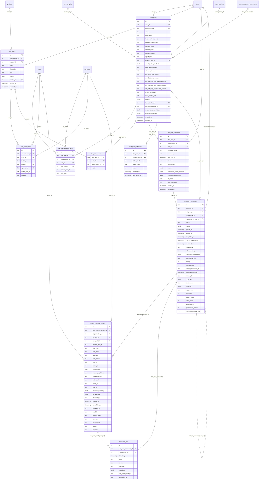
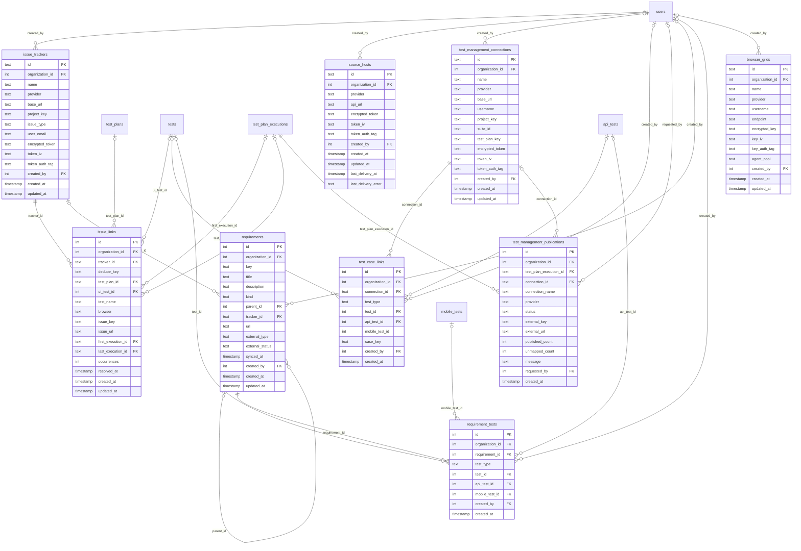
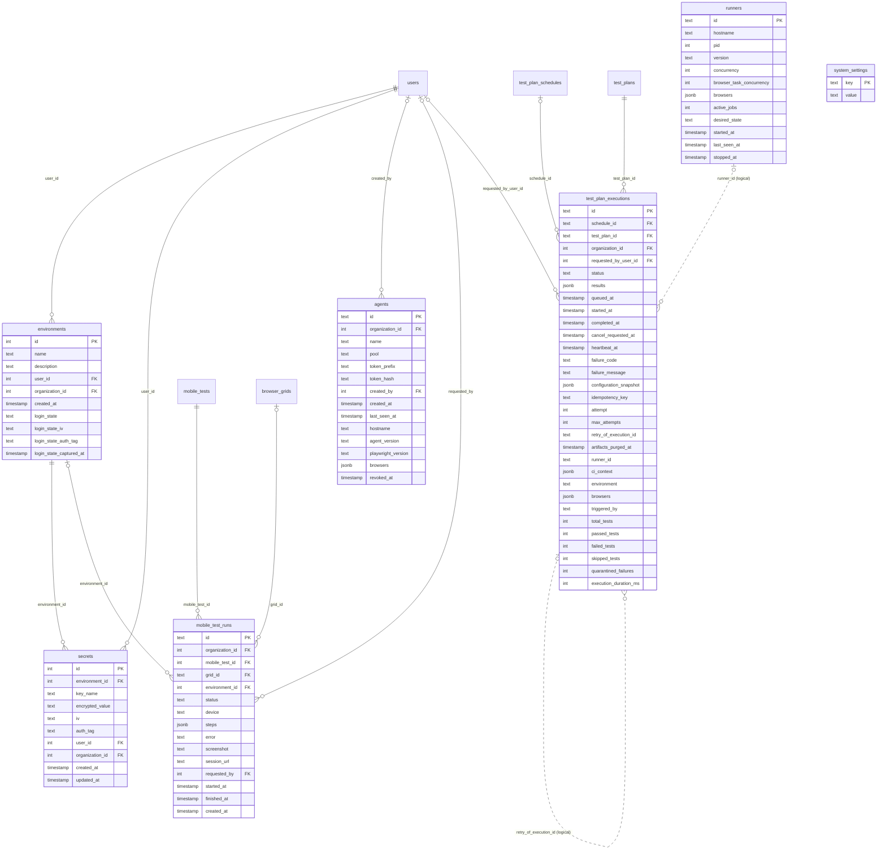

# Schema del database

Questa pagina è il riferimento del database: ogni tabella, ogni colonna e ogni relazione, ricavate da
`shared/schema.ts` (l'unica dichiarazione dello schema) da uno script, così non possono divergere dal codice. Lo
scopo di ciascuna tabella, a parole, è in [Modello dati](./data-model); come le righe restano separate fra
organizzazioni è in [Tenancy e accessi](./tenancy).

**60 tabelle**, di cui 45 hanno un `organization_id` e sono protette dalla row-level security. Le altre 15 sono
dell'intera installazione o si leggono prima che l'organizzazione sia nota: `organizations`, `users`, `user_mfa`,
`user_settings`, `invitations`, `organization_sso`, `sso_domains`, `sso_identities`, `sso_saml_requests`, `scim_users`, `scim_groups`, `scim_group_members`, `sessions`, `runners`
e `system_settings`.

## Come leggere i diagrammi

- **PK** chiave primaria, **FK** chiave esterna. I tipi sono quelli logici: `int` (serial o integer), `text`, `bool`,
  `timestamp` (UTC, senza fuso orario), `jsonb`, `bigint`.
- Una linea continua è una vera chiave esterna. `||` dal lato del padre significa che la colonna è `NOT NULL`; `|o`
  che può essere vuota. Una **linea tratteggiata** con *(logical)* è un legame che l'applicazione mantiene senza un
  vincolo del database — per esempio un test UI, API o mobile nella stessa coppia di colonne (`test_type` dice quale).
- Nei diagrammi di dominio il legame di ogni tabella con `organizations` è omesso: c'è su tutte e disegnato nasconderebbe
  il resto. Il primo diagramma, la panoramica, omette anche le colonne per lo stesso motivo.
- Varie tabelle contengono riferimenti *polimorfi* ai test: `ui_test_id` / `test_id`, `api_test_id` e
  `mobile_test_id`, con `test_type` (`ui`, `api` o `mobile`) che indica quello valorizzato. Solo i primi due sono
  chiavi esterne; i test mobili sono arrivati dopo e li controlla l'applicazione.

## Panoramica

Tutte le tabelle e le relazioni fra loro, senza colonne e senza i legami con l'organizzazione e con la persona che ha creato una riga.

```mermaid
erDiagram
  projects ||--o{ project_members : "project_id"
  projects |o--o{ tests : "project_id"
  tests ||--o{ test_runs : "test_id"
  tests ||--o{ detected_elements : "test_id"
  projects |o--o{ api_tests : "project_id"
  browser_grids |o--o{ test_plans : "browser_grid_id"
  issue_trackers |o--o{ test_plans : "issue_tracker_id"
  test_management_connections |o--o{ test_plans : "test_management_id"
  test_plans ||--o{ test_plan_schedules : "test_plan_id"
  test_plan_schedules |o--o{ test_plan_executions : "schedule_id"
  test_plans ||--o{ test_plan_executions : "test_plan_id"
  test_plan_executions ||--o{ report_test_case_results : "test_plan_execution_id"
  tests |o--o{ report_test_case_results : "ui_test_id"
  api_tests |o--o{ report_test_case_results : "api_test_id"
  test_plan_executions ||--o{ execution_logs : "test_plan_execution_id"
  test_plan_executions ||--o{ run_work_items : "execution_id"
  environments ||--o{ secrets : "environment_id"
  test_plans ||--o{ test_plan_webhooks : "test_plan_id"
  test_plans ||--o{ test_plan_selected_tests : "test_plan_id"
  tests |o--o{ test_plan_selected_tests : "test_id"
  api_tests |o--o{ test_plan_selected_tests : "api_test_id"
  tests ||--o{ excel_sequences_map : "test_id"
  projects |o--o{ step_groups : "project_id"
  projects ||--o{ project_elements : "project_id"
  tags ||--o{ test_tags : "tag_id"
  tests |o--o{ test_tags : "test_id"
  api_tests |o--o{ test_tags : "api_test_id"
  tests ||--o{ test_versions : "test_id"
  tests ||--o{ test_publications : "test_id"
  tests ||--o{ test_reviews : "test_id"
  projects |o--o{ test_suites : "project_id"
  test_suites ||--o{ test_suite_items : "suite_id"
  tests |o--o{ test_suite_items : "test_id"
  api_tests |o--o{ test_suite_items : "api_test_id"
  test_plans ||--o{ test_plan_suites : "test_plan_id"
  test_suites ||--o{ test_plan_suites : "suite_id"
  tests |o--o{ test_quarantines : "test_id"
  api_tests |o--o{ test_quarantines : "api_test_id"
  requirements |o--o{ requirements : "parent_id"
  issue_trackers |o--o{ requirements : "tracker_id"
  test_management_connections ||--o{ test_case_links : "connection_id"
  tests |o--o{ test_case_links : "test_id"
  api_tests |o--o{ test_case_links : "api_test_id"
  test_plan_executions ||--o{ test_management_publications : "test_plan_execution_id"
  test_management_connections |o--o{ test_management_publications : "connection_id"
  projects |o--o{ mobile_tests : "project_id"
  browser_grids |o--o{ mobile_tests : "grid_id"
  mobile_tests ||--o{ mobile_test_runs : "mobile_test_id"
  browser_grids |o--o{ mobile_test_runs : "grid_id"
  environments |o--o{ mobile_test_runs : "environment_id"
  requirements ||--o{ requirement_tests : "requirement_id"
  tests |o--o{ requirement_tests : "test_id"
  api_tests |o--o{ requirement_tests : "api_test_id"
  mobile_tests |o--o{ requirement_tests : "mobile_test_id"
  issue_trackers ||--o{ issue_links : "tracker_id"
  test_plans |o--o{ issue_links : "test_plan_id"
  tests |o--o{ issue_links : "ui_test_id"
  test_plan_executions |o--o{ issue_links : "first_execution_id"
  test_plan_executions |o--o{ issue_links : "last_execution_id"
  organizations ||--o{ users : "organization_id"
  organizations ||--o{ projects : "organization_id"
```

## Identità, tenancy e accessi

Organizzazioni, persone, accesso (password, secondo fattore, single sign-on), inviti, progetti e loro membri, chiavi API e registro di audit.

```mermaid
erDiagram
  organizations ||--o{ users : "organization_id"
  users ||--o{ user_mfa : "user_id"
  users ||--o{ user_settings : "user_id"
  organizations ||--o{ invitations : "organization_id"
  users |o--o{ invitations : "invited_by_user_id"
  organizations ||--o{ password_resets : "organization_id"
  users ||--o{ password_resets : "user_id"
  users |o--o{ password_resets : "created_by"
  organizations ||--o{ organization_sso : "organization_id"
  organizations ||--o{ sso_domains : "organization_id"
  users ||--o{ sso_identities : "user_id"
  organizations ||--o{ sso_saml_requests : "organization_id"
  users ||--o| scim_users : "user_id"
  organizations ||--o{ scim_users : "organization_id"
  organizations ||--o{ scim_groups : "organization_id"
  scim_groups ||--o{ scim_group_members : "group_id"
  users ||--o{ scim_group_members : "user_id"
  users ||--o{ projects : "user_id"
  organizations ||--o{ projects : "organization_id"
  projects ||--o{ project_members : "project_id"
  users ||--o{ project_members : "user_id"
  organizations ||--o{ project_members : "organization_id"
  organizations ||--o{ api_keys : "organization_id"
  users ||--o{ api_keys : "user_id"
  organizations ||--o{ audit_log : "organization_id"
  users |o--o{ audit_log : "actor_user_id"
  organizations {
    int id PK
    text name
    timestamp created_at
    int max_concurrent_runs
    int max_queued_runs
    bool mfa_required
    bool test_review_required
  }
  users {
    int id PK
    text username
    text password
    int organization_id FK
    text role
    text kind
    text display_name
    timestamp disabled_at
    timestamp created_at
  }
  user_mfa {
    int user_id PK,FK
    text secret_encrypted
    text secret_iv
    text secret_auth_tag
    text pending_secret_encrypted
    text pending_secret_iv
    text pending_secret_auth_tag
    timestamp enabled_at
    bigint last_used_step
    jsonb recovery_codes
    timestamp updated_at
  }
  user_settings {
    int user_id PK,FK
    text theme
    text default_test_url
    text playwright_browser
    bool playwright_headless
    int playwright_default_timeout
    int playwright_wait_time
    text language
    bool notify_by_email
    bool notify_run_completed
    bool notify_run_failed
    timestamp updated_at
  }
  invitations {
    int id PK
    int organization_id FK
    text username
    text role
    text token
    int invited_by_user_id FK
    timestamp expires_at
    timestamp accepted_at
    timestamp created_at
  }
  password_resets {
    text id PK
    int organization_id FK
    int user_id FK
    text token_hash
    int created_by FK
    timestamp expires_at
    timestamp used_at
    timestamp created_at
  }
  organization_sso {
    int organization_id PK,FK
    text protocol
    text issuer
    text client_id
    text client_secret_encrypted
    text client_secret_iv
    text client_secret_auth_tag
    text saml_sso_url
    text saml_certificate
    text default_role
    bool enabled
    bool required
    text group_attribute
    jsonb role_mappings
    bool require_group
    text scim_token_hash
    text scim_token_prefix
    timestamp scim_token_created_at
    timestamp scim_token_last_used_at
    timestamp updated_at
  }
  sso_domains {
    text domain PK
    int organization_id FK
    text verification_token
    timestamp verified_at
  }
  sso_identities {
    text issuer
    text subject
    int user_id FK
    timestamp created_at
    timestamp last_sign_in_at
  }
  sso_saml_requests {
    text id PK
    int organization_id FK
    timestamp created_at
  }
  scim_users {
    int user_id PK,FK
    int organization_id FK
    text external_id
    bool disabled_by_groups
    timestamp created_at
    timestamp updated_at
  }
  scim_groups {
    text id PK
    int organization_id FK
    text display_name
    text external_id
    timestamp created_at
    timestamp updated_at
  }
  scim_group_members {
    text group_id PK,FK
    int user_id PK,FK
  }
  projects {
    int id PK
    text name
    int user_id FK
    int organization_id FK
    timestamp created_at
    bool restricted
  }
  project_members {
    int project_id FK
    int user_id FK
    int organization_id FK
    text role
    timestamp created_at
  }
  api_keys {
    text id PK
    int organization_id FK
    int user_id FK
    text name
    text prefix
    text hashed_key
    timestamp created_at
    timestamp last_used_at
    timestamp expires_at
    timestamp revoked_at
    text scopes
  }
  audit_log {
    int id PK
    int organization_id FK
    int actor_user_id FK
    text actor_username
    text action
    text target_type
    text target_id
    jsonb metadata
    text api_key_id
    text ip_address
    timestamp created_at
  }
  sessions {
    text sid PK
    jsonb sess
    timestamp expire
  }
```

## Scrivere i test

Test UI, API e mobili, le loro versioni, pubblicazione e revisione, il repository degli elementi, i gruppi di step, le azioni personalizzate, i tag e la quarantena.

```mermaid
erDiagram
  users ||--o{ projects : "user_id"
  users ||--o{ tests : "user_id"
  projects |o--o{ tests : "project_id"
  tests ||--o{ test_versions : "test_id"
  users |o--o{ test_versions : "created_by"
  tests ||--o{ test_publications : "test_id"
  users |o--o{ test_publications : "published_by"
  tests ||--o{ test_reviews : "test_id"
  users |o--o{ test_reviews : "requested_by"
  users |o--o{ test_reviews : "decided_by"
  tests |o--o{ test_quarantines : "test_id"
  api_tests |o--o{ test_quarantines : "api_test_id"
  users |o--o{ test_quarantines : "quarantined_by"
  users |o--o{ test_quarantines : "released_by"
  tests ||--o{ detected_elements : "test_id"
  projects ||--o{ project_elements : "project_id"
  users ||--o{ step_groups : "user_id"
  projects |o--o{ step_groups : "project_id"
  users ||--o{ custom_actions : "user_id"
  users ||--o{ api_tests : "user_id"
  projects |o--o{ api_tests : "project_id"
  users ||--o{ api_test_history : "user_id"
  tags ||--o{ test_tags : "tag_id"
  tests |o--o{ test_tags : "test_id"
  api_tests |o--o{ test_tags : "api_test_id"
  tests ||--o{ excel_sequences_map : "test_id"
  tests ||--o{ test_runs : "test_id"
  projects |o--o{ mobile_tests : "project_id"
  browser_grids |o--o{ mobile_tests : "grid_id"
  users |o--o{ mobile_tests : "created_by"
  mobile_tests ||--o{ mobile_test_runs : "mobile_test_id"
  browser_grids |o--o{ mobile_test_runs : "grid_id"
  environments |o--o{ mobile_test_runs : "environment_id"
  users |o--o{ mobile_test_runs : "requested_by"
  mobile_tests |o..o{ test_tags : "mobile_test_id (logical)"
  mobile_tests |o..o{ test_quarantines : "mobile_test_id (logical)"
  test_reviews |o..o{ test_publications : "review_id (logical)"
  projects {
    int id PK
    text name
    int user_id FK
    int organization_id FK
    timestamp created_at
    bool restricted
  }
  tests {
    int id PK
    int user_id FK
    int organization_id FK
    int project_id FK
    text name
    text url
    jsonb sequence
    jsonb elements
    jsonb preconditions
    jsonb cleanups
    jsonb dataset
    text status
    int published_version
    timestamp created_at
    timestamp updated_at
    text module
    text feature_area
    text scenario
    text component
    text priority
    text severity
  }
  test_versions {
    int id PK
    int organization_id FK
    int test_id FK
    int version
    text name
    text url
    jsonb sequence
    jsonb elements
    jsonb preconditions
    jsonb cleanups
    jsonb dataset
    text summary
    int restored_from_version
    int created_by FK
    timestamp created_at
  }
  test_publications {
    int id PK
    int organization_id FK
    int test_id FK
    int version
    text kind
    int review_id
    int published_by FK
    timestamp published_at
  }
  test_reviews {
    int id PK
    int organization_id FK
    int test_id FK
    int version
    text status
    text note
    int requested_by FK
    timestamp requested_at
    int decided_by FK
    timestamp decided_at
    text decision_comment
  }
  test_quarantines {
    int id PK
    int organization_id FK
    text test_type
    int test_id FK
    int api_test_id FK
    int mobile_test_id
    text reason
    int quarantined_by FK
    timestamp quarantined_at
    int released_by FK
    timestamp released_at
    text release_note
  }
  detected_elements {
    int id PK
    int test_id FK
    int organization_id FK
    text element_id
    text selector
    text original_selector
    text type
    text text
    text tag
    jsonb attributes
    timestamp created_at
  }
  project_elements {
    text id PK
    int organization_id FK
    int project_id FK
    text name
    text selector
    text original_selector
    text frame_selector
    text tag
    text element_type
    text text
    jsonb attributes
    timestamp healed_at
    timestamp created_at
    timestamp updated_at
  }
  step_groups {
    text id PK
    int organization_id FK
    int user_id FK
    int project_id FK
    text name
    text description
    jsonb sequence
    timestamp created_at
    timestamp updated_at
  }
  custom_actions {
    text id PK
    int organization_id FK
    int user_id FK
    text name
    text description
    jsonb parameters
    text script
    timestamp created_at
    timestamp updated_at
  }
  test_data_sets {
    int id PK
    int organization_id FK
    text name
    text description
    jsonb columns
    jsonb rows
    timestamp created_at
    timestamp updated_at
  }
  run_work_items {
    text execution_id PK
    text key PK
    int organization_id FK
    int position
    jsonb unit
    text state
    text claimed_by
    timestamp heartbeat_at
    timestamp finished_at
    text error
    jsonb results
  }
  api_tests {
    int id PK
    int user_id FK
    int organization_id FK
    int project_id FK
    text name
    text method
    text url
    jsonb query_params
    jsonb request_headers
    text request_body
    jsonb assertions
    jsonb extractions
    jsonb performance
    text auth_type
    jsonb auth_params
    text body_type
    text body_raw_content_type
    jsonb body_form_data
    jsonb body_url_encoded
    text body_graphql_query
    text body_graphql_variables
    timestamp created_at
    timestamp updated_at
    text module
    text feature_area
    text scenario
    text component
    text priority
    text severity
  }
  api_test_history {
    int id PK
    int user_id FK
    int organization_id FK
    text method
    text url
    jsonb query_params
    jsonb request_headers
    text request_body
    int response_status
    jsonb response_headers
    text response_body
    int duration_ms
    timestamp created_at
  }
  tags {
    text id PK
    int organization_id FK
    text name
    timestamp created_at
  }
  test_tags {
    int id PK
    int organization_id FK
    text tag_id FK
    int test_id FK
    int api_test_id FK
    int mobile_test_id
    text test_type
    timestamp created_at
  }
  excel_sequences_map {
    int id PK
    int test_id FK
    int organization_id FK
    text excel_test_case_id
    timestamp created_at
  }
  test_runs {
    int id PK
    int test_id FK
    int organization_id FK
    text status
    jsonb results
    timestamp started_at
    timestamp completed_at
  }
  mobile_tests {
    int id PK
    int organization_id FK
    int project_id FK
    text name
    text platform
    text app
    text device_name
    text os_version
    text grid_id FK
    jsonb steps
    int created_by FK
    timestamp created_at
    timestamp updated_at
  }
  mobile_test_runs {
    text id PK
    int organization_id FK
    int mobile_test_id FK
    text grid_id FK
    int environment_id FK
    text status
    text device
    jsonb steps
    text error
    text screenshot
    text session_url
    int requested_by FK
    timestamp started_at
    timestamp finished_at
    timestamp created_at
  }
```

## Pianificare ed eseguire

Piani, suite, pianificazioni, webhook, run, risultati per test e log in diretta. Un run è una riga di `test_plan_executions`; ogni test su ogni browser è una riga di `report_test_case_results`.

## Integrazioni e tracciabilità

Issue tracker, source host, strumenti di test management, requisiti e loro copertura, e le griglie di browser e dispositivi.

## Ambienti e piano di esecuzione

Ambienti con i loro segreti cifrati e il login salvato, i runner registrati, gli agenti locali e le impostazioni dell'installazione. Le due tabelle dei run sono ripetute qui solo per mostrare cosa le richiama.

## Legami che il database non impone

Queste relazioni esistono nell'applicazione ma non hanno una chiave esterna. Sono il prezzo di un disegno polimorfo (tre tipi di test nello stesso insieme di colonne) o del conservare la storia quando la destinazione non c'è più.

| Colonna | Punta a | Perché non c'è un vincolo |
|---|---|---|
| `mobile_test_id` in `report_test_case_results`, `test_plan_selected_tests`, `test_suite_items`, `test_tags`, `test_quarantines`, `test_case_links` | `mobile_tests.id` | Aggiunto dopo le colonne UI e API; fa eccezione `requirement_tests`, che lo referenzia davvero. |
| `execution_logs.test_case_result_id` | `report_test_case_results.id` | Facoltativa: lega una riga di log a un test del run. |
| `test_publications.review_id` | `test_reviews.id` | Una pubblicazione può non nascere da una revisione (pubblicazione diretta o ripristino). |
| `excel_sequences_map.test_id` | `tests.id` | Test Manager: la sequenza salvata a cui corrisponde una riga del foglio. |
| `test_plan_executions.runner_id` | `runners.id` | La riga di un runner può essere eliminata mentre il run conserva il proprio record. |
| `test_plan_executions.retry_of_execution_id` | `test_plan_executions.id` | Il run che una riesecuzione ripete. |

## Vincoli da conoscere

- **Legami nella stessa organizzazione.** Quando una tabella di organizzazione ne richiama un'altra, un vincolo o un
  trigger garantisce che le due righe siano della stessa organizzazione (migrazione 0034 e successive); un test di
  deriva fallisce se un nuovo legame ne è privo.
- **Tabelle in sola aggiunta.** `audit_log`, `test_versions` e `test_publications` danno a `app_user` solo
  `SELECT` e `INSERT`: l'applicazione non può riscriverle.
- **Unicità.** I nomi degli ambienti sono univoci per organizzazione (migrazione 0041); un invito è univoco per nome
  utente finché è in sospeso (0044); un legame con un'issue è univoco per fallimento (`dedupe_key`), così un
  fallimento si segnala una volta; la chiave di idempotenza di un run è univoca per organizzazione, così una richiesta ripetuta
  restituisce lo stesso run.
- **Migrazioni.** 64 file SQL numerati in `migrations/` (da `0000` a `0063`), applicati una volta dal migratore
  prima che partano gli altri processi; il journal è `migrations/meta/_journal.json`.
