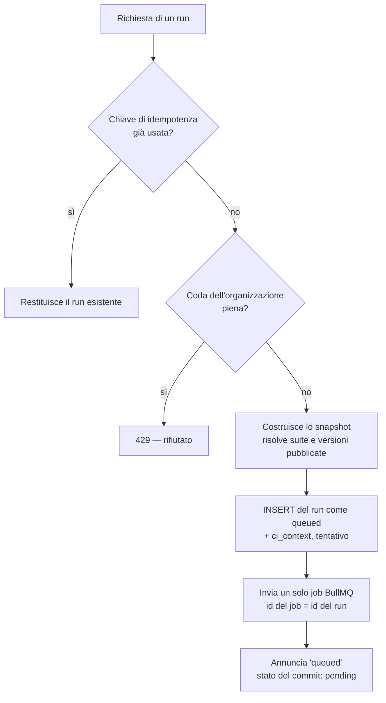
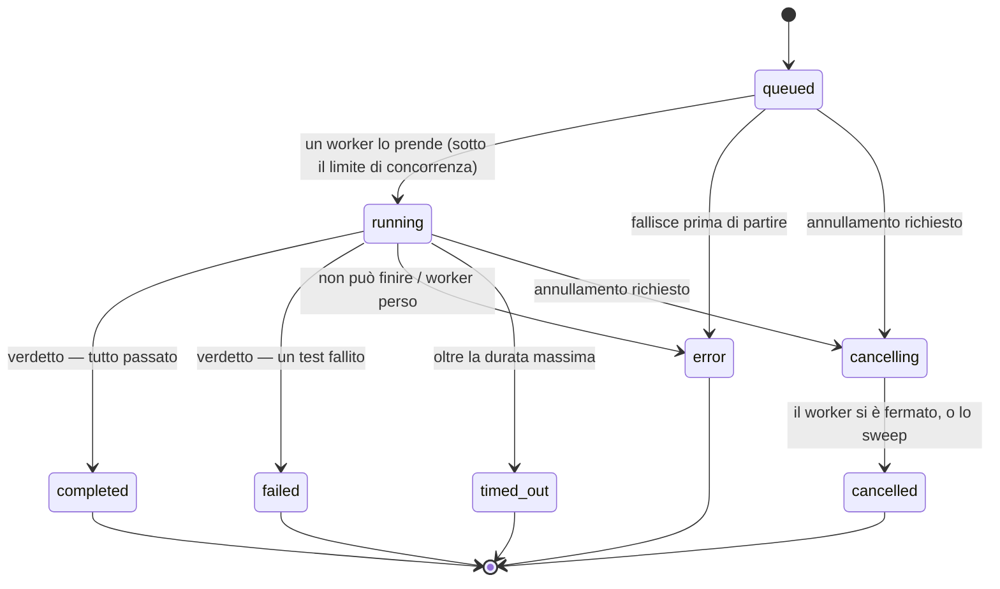

# Ciclo di vita di un run

Un **run** (una riga di `test_plan_executions`) è un'esecuzione di un piano di test. Questa pagina segue
un run dal momento in cui qualcuno lo chiede fino allo stato del commit che lo riporta, e spiega i
meccanismi che lo mantengono corretto quando i processi cadono, le richieste si ripetono e i worker
entrano in competizione.

## Chi chiede un run

| Origine | Percorso | `triggered_by` |
|---|---|---|
| Pulsante Run nell'applicazione | `POST /api/test-plans/:id/run` | `manual` |
| Schedulazione | `server/scheduler-service.ts` (cron nel processo web, o job scheduler BullMQ avviati da un worker) | `scheduled` |
| Pipeline | `POST /api/v1/plans/:planId/runs` (la usa la CLI) | `api` |
| Webhook CI | `POST /api/webhooks/execute` con un token di webhook | `webhook` |
| Nuovo tentativo di un run schedulato fallito | il worker, tramite l'orchestrator | come il primo tentativo |

Passano tutti da un'unica funzione: l'**orchestrator** (`server/execution-orchestrator.ts`).

## 1. Creazione: l'orchestrator

1. **Idempotenza.** Chi chiama può inviare una chiave di idempotenza; chiedere due volte con la stessa
   chiave restituisce il primo run. Un indice univoco per organizzazione risolve due richieste che
   arrivano nello stesso istante.
2. **Limite di coda.** Oltre `max_queued_runs` dell'organizzazione la richiesta è rifiutata con `429`
   invece di riempire la coda per tutti ([limiti](./tenancy#limiti-per-organizzazione)).
3. **Snapshot.** Tutto ciò che il runner leggerà viene scritto in `configuration_snapshot`
   (`server/execution-snapshot.ts`): la configurazione dei browser, i test selezionati (con le suite già
   espanse in test), i test visivi, la cattura delle evidenze, il parallelismo, i timeout, le policy di
   fallimento, la policy di riesecuzione, le notifiche, l'apertura di issue e il pool di agenti. Un piano
   modificato mentre il run aspetta non può cambiare ciò che il run fa. Un test aggiunto al piano dopo non
   fa parte di questo run.
4. **Un solo job.** Viene inviato esattamente un job BullMQ, con id uguale a quello del run: BullMQ
   rifiuta un secondo job con lo stesso id, quindi anche un duplicato sfuggito alla chiave non può girare
   due volte. Se Redis rifiuta l'invio, il run termina come `error` con `queue_submission_failed` e può
   essere recuperato chiedendolo di nuovo.
5. **Priorità.** La priorità del job è equa fra organizzazioni: quella con meno run in corso passa avanti
   a quella che ne ha accodati cinquanta.

## 2. La macchina a stati

Lo `status` di un run si muove solo attraverso `server/execution-state.ts`. Ogni passaggio è un unico
`UPDATE … WHERE status IN (stati da cui può arrivare)` condizionale: quando due processi competono, il
database ne lascia passare esattamente uno, e da uno stato finale non si esce.

I timestamp appartengono al passaggio, non a chi lo chiama: `running` imposta `started_at` e il primo
heartbeat, uno stato finale imposta `completed_at`, `cancelling` imposta `cancel_requested_at`.
L'annullamento di un run ancora `queued` lo chiude subito (`queued → cancelling → cancelled` in una sola
chiamata), perché nessun worker lo tiene.

Dopo ogni passaggio registrato, la macchina a stati **annuncia** la nuova riga ai listener registrati
nel processo (`onExecutionTransition`); il modulo dello stato dei commit è uno di questi.

## 3. Il worker prende il run

`server/worker.ts` consuma la coda dei piani con `WORKER_CONCURRENCY` job alla volta e chiama
`processTestPlanJob` (`server/test-execution-service.ts`):

1. **Presa.** `takeExecution` conta, sotto lock, i run in esecuzione dell'organizzazione e porta il run a
   `running` solo se è sotto `max_concurrent_runs`. Altrimenti il job è ritardato di `RUN_DEFERRAL_MS`
   (10 s) e il run resta `queued` — aspetta, non fallisce. Un run non più `queued` (già preso, annullato)
   non viene preso, ed è questo che fa girare una sola volta un job consegnato due volte.
2. **Sorveglianza.** `watchRun` (`server/run-watch.ts`) avvia un heartbeat ogni
   `RUN_HEARTBEAT_INTERVAL_MS` (15 s). Ogni battito dice anche al worker se qualcuno ha chiesto di
   annullare, se il run è terminato altrove e se ha superato `RUN_MAX_DURATION_MS` (3 h). I test lo
   ricevono tramite un `AbortSignal` e si fermano allo step successivo.
3. **Lettura dello snapshot.** I run di prima degli snapshot ripiegano sul piano com'è ora.
4. **Risoluzione delle variabili**, una volta per run: i default dell'installazione, i valori
   dell'ambiente e i suoi segreti decifrati (`server/variables.ts`). La stessa risoluzione alimenta
   precondizioni, step UI e richieste API.

## 4. L'esecuzione del piano

### Passaggi per browser

`browsersForRun` (`server/browsers.ts`) trasforma ciò che il piano o la schedulazione indicano
("chrome", "edge", "safari", visibile o headless) in motori e canali Playwright, e dichiara ciò che non
può rispettare (un sistema operativo, una versione di browser, Safari vero e proprio). I browser della
schedulazione prevalgono sulle macchine del piano. Se non ne è configurato nessuno, il run usa il
browser predefinito dell'utente che lo ha richiesto.

Se il piano è impostato su un **pool di agenti**, ogni passaggio prende in prestito il browser dagli
agenti locali del pool invece di avviarne uno ([Agenti locali](./agents)), e anche le richieste API del
run partono dall'agente.

Ogni browser viene provato prima dei test; uno che non parte è riportato come guasto di
infrastruttura del run (che diventa `error`), non come test falliti. Un browser visibile che non può
partire su una macchina senza display ripiega su headless, e lo dice.

### Corsie e parallelismo

Ogni test gira una volta per ogni browser utilizzabile. Una **corsia** è il passaggio di un browser sul
piano, con la propria mappa di valori catturati. `max_parallel_tests` del piano (limitato da
`RUN_MAX_PARALLEL` dell'installazione) decide quanti test girano insieme:

- `1` — l'ordine storico: un browser alla volta, test in sequenza.
- `> 1` con test API **concatenati** (un'estrazione alimenta una richiesta successiva) — browser
  affiancati, test in ordine dentro ogni corsia.
- `> 1` negli altri casi — qualsiasi test di qualsiasi corsia, fino al limite.

### Un test

`runTest` gestisce un test su un browser:

- **Quale versione.** I piani eseguono la **versione pubblicata** di un test quando esiste; se
  l'organizzazione richiede la revisione, un test non pubblicato viene saltato invece di essere eseguito
  senza revisione (`server/test-publishing.ts`).
- Le **precondizioni** (chiamate API che preparano lo stato) girano per prime; ciascuna può essere
  saltata quando un controllo mostra che lo stato esiste già. Cosa significhi una precondizione fallita
  lo decide la policy del piano: bloccare il test (`error`), saltarlo o proseguire comunque.
- I **test UI** girano tramite `playwrightService.executeTestSequence`. Prima del primo step si espandono
  i gruppi di step (la chiamata a un gruppo diventa gli step attuali del gruppo) e si risolvono gli
  elementi del repository (uno step che nomina un elemento condiviso usa il selettore attuale
  dell'elemento). Un test con un **dataset** gira una volta per riga, e ogni riga aggiunge le proprie
  `{{variabili}}`.
- Ogni step passa da `server/step-executor.ts`, l'unica implementazione di ogni azione: `navigate`,
  `click`, `input`, `select`, `selectByText`, `hover`, `scroll`, `wait`, attese condizionali
  (`waitForElement`, `waitForText`, `waitForNetworkIdle`), asserzioni (`assert`, `assertTextContains`,
  `assertElementCount`, `assertState`, `assertAccessible`) ed `ensureState`. Le asserzioni aspettano
  fino a 5 s che la pagina si stabilizzi; le attese esplicite fino a 15 s.
- **Correzione automatica.** Quando un clic o un inserimento non trova il proprio elemento ed è
  configurata una chiave AI, il DOM della pagina e l'errore vanno al modello, che propone un selettore.
  Se il nuovo tentativo con quel selettore riesce, lo step è marcato *healed* e il nuovo selettore è
  salvato — sull'elemento condiviso del repository quando lo step ne nomina uno, così ogni test che lo
  usa è corretto in una volta.
- **Evidenze.** Screenshot secondo la policy del piano; video, trace di Playwright e cattura di rete HAR
  secondo le impostazioni (`never`, `on_failure`, `always`); confronto visivo con le baseline per step
  quando i test visivi sono attivi; risultati di accessibilità per gli step `assertAccessible`.
- I **test API** girano tramite `server/api-test-runner.ts`: variabili sostituite, autenticazione
  applicata (Bearer, Basic, chiave API, OAuth 2.0 client credentials o password grant), asserzioni
  valutate, valori estratti nella mappa della corsia per le richieste successive.

### Dopo ogni test

- La riga di risultato (`report_test_case_results`) viene scritta con stato, step, percorsi delle
  evidenze, browser, versione del test, e se il test è in **quarantena**.
- **Riesecuzione in caso di fallimento**: la policy del piano riesegue un test fallito; conta l'ultimo
  tentativo, e il numero di tentativi viene registrato, così un test che ne ha richiesti due appare
  instabile.
- **Policy di fallimento**: uno step fallito può fermare il test o l'intero run, secondo il piano
  (`server/run-policies.ts`). Il fallimento di un test in quarantena non ferma mai un run.

## 5. Il verdetto

Quando tutte le corsie hanno finito, le evidenze rimaste nella cartella del run vengono pubblicate
nell'archivio degli artefatti e gli aggregati vengono calcolati dalle righe di risultato:

| Esito | Stato |
|---|---|
| Fermato da un annullamento | `cancelled` |
| Oltre la durata massima | `timed_out` (`run_timed_out`) |
| Almeno un fallimento non in quarantena | `failed` |
| Un browser che non è partito, o un test che non è stato eseguito | `error` (`run_incomplete`) |
| Altrimenti | `completed` |

I fallimenti dei test in quarantena vengono contati (`quarantined_failures`) ma non decidono il run.

Poi, per un run arrivato a un verdetto:

1. **Nuovo tentativo.** Un tentativo fallito con tentativi rimasti accoda il successivo dopo
   `RETRY_DELAY_MS` (30 s). I tentativi vengono dalla policy di retry di una schedulazione
   (`max_attempts`, al massimo 5); gli altri run ne hanno uno. Issue e notifiche aspettano il tentativo
   che decide.
2. **Issue.** Con un tracker configurato e l'apertura attiva, ogni nuovo fallimento apre una issue in
   Jira o Azure DevOps, e un fallimento già segnalato riceve invece un commento (`server/issue-store.ts`).
3. **Notifica.** Il webhook del piano (Slack, Teams o qualsiasi cosa accetti una POST) viene avvisato,
   secondo i suoi interruttori (`server/notifications.ts`).
4. **Stato del commit.** Per un run avviato da GitHub Actions o GitLab CI, il commit riceve lo stato
   finale con il link al report (`server/commit-status.ts`).

Nessuno di questi può cambiare il verdetto: ogni errore è registrato e riportato come esito.

## 6. Quando qualcosa va storto

| Situazione | Cosa succede |
|---|---|
| Qualcuno annulla | `running → cancelling`; il worker lo sente al battito successivo, termina lo step in corso e chiude il run come `cancelled`. |
| Uno step si blocca | Il timeout dello step, poi la durata massima del run (`timed_out`). |
| Il worker muore | Il suo heartbeat si ferma. Lo sweep di recupero nel processo web (`server/run-recovery.ts`) chiude i run silenziosi da `RUN_STALE_AFTER_MS` (default 2 min): `running → error` (`worker_lost`), `cancelling → cancelled`. Un run schedulato con tentativi rimasti riceve il tentativo successivo. Non viene rieseguito di nascosto: metà run potrebbe aver già creato dati nell'applicazione sotto test. |
| Il worker è vivo ma bloccato | Oltre la durata massima più 5 minuti di tolleranza, lo sweep lo chiude come `timed_out`. |
| BullMQ consegna un job due volte | Il secondo `takeExecution` trova il run non più `queued` e non fa nulla. |
| Arriva una scrittura tardiva da un worker dato per perso | L'update condizionale non trova nulla; la chiusura registrata resta valida. |

Più server web possono fare lo sweep contemporaneamente: ogni chiusura passa dalla macchina a stati,
quindi ogni run viene chiuso una sola volta.

## 7. Avanzamento in diretta

Mentre un run gira, il worker emette voci di log (messaggi di sistema, avanzamento degli step, console
del browser) tramite `server/websocket.ts`. Vengono salvate in `execution_logs` e inviate via WebSocket
alla pagina del report, che le mostra in diretta e le ripropone a run concluso.

## 8. Task browser

Non ogni sessione di browser è un run di un piano. L'anteprima di una sequenza, l'esecuzione di un
singolo test dal builder e la rilevazione degli elementi di una pagina sono **task browser**
(`server/browser-tasks.ts`): la rotta web mette il task nella sua coda BullMQ, un worker lo esegue e la
rotta risponde con il risultato — così una persona non aspetta dietro un run notturno di quaranta
minuti, e il processo web non tiene mai un browser. `BROWSER_TASKS=inline` li esegue invece nel processo
web (test, sviluppo su una sola macchina).

La **registrazione** fa eccezione: apre una finestra di browser visibile tramite Playwright sulla
macchina che esegue il processo web, quindi funziona solo dove quella macchina ha un display.

## 9. Schedulazioni

Una schedulazione (`test_plan_schedules`) indica un piano, una frequenza (o un'espressione cron) e un
fuso orario, i browser, un ambiente, una sovrascrittura delle notifiche e una policy di retry. Ogni
occorrenza ha una chiave di idempotenza stabile (`occurrenceKey`), quindi due repliche dello scheduler
che scattano nello stesso minuto producono un solo run. Il backend predefinito è node-cron nel processo
web (un solo server web). `SCHEDULER_BACKEND=bullmq` usa invece i job scheduler di Redis, che
sopravvivono ai riavvii e non si duplicano fra istanze; il trigger lo gestisce un worker.
