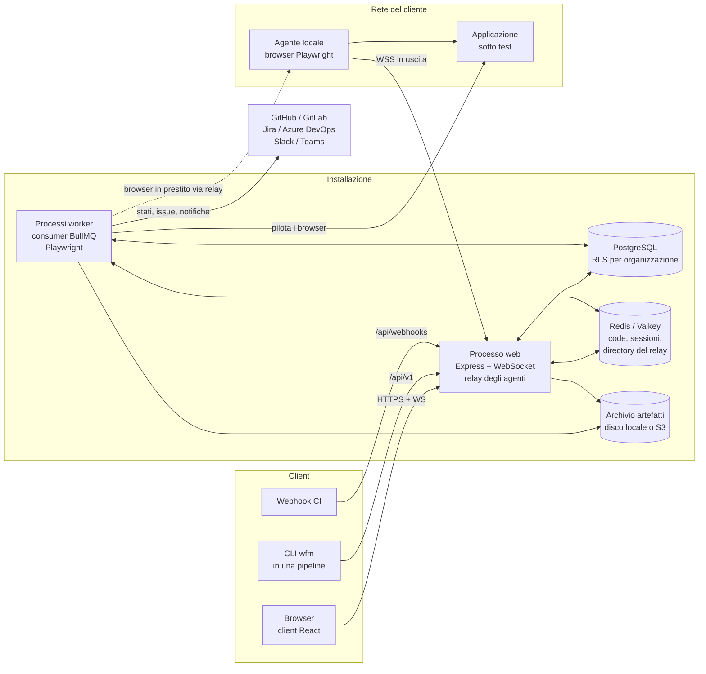

# Panoramica dell'architettura

Questa parte della documentazione spiega come è costruito WebFlowMaster: quali processi girano, cosa
condividono, come una richiesta e un'esecuzione di test li attraversano, e perché sono state fatte le
scelte di progetto principali. È scritta per chi mantiene ed estende il prodotto. Operatori e clienti
hanno le loro guide.

## Cosa fa il prodotto

WebFlowMaster permette a un team di costruire test automatici per applicazioni web e API HTTP, e di
eseguirli in modo affidabile:

- **Scrivere** un test UI registrando una sessione, componendo gli step in un builder visuale o
  descrivendolo a frasi. I test API si scrivono in un API tester con asserzioni ed estrazioni.
- **Organizzare** i test in progetti, tag, suite e piani di test, con versioni, revisioni e
  pubblicazione.
- **Eseguire** i piani a richiesta, a orario, dalla CI o da un webhook — su una matrice di browser, in
  parallelo, sui runner del server o su agenti locali dentro la rete di un cliente.
- **Documentare** ogni run con step, screenshot, video, trace, cattura di rete, confronti visivi e
  risultati di accessibilità, ed esportarlo in HTML, PDF, JUnit o Allure. I fallimenti possono aprire
  issue in Jira o Azure DevOps, notificare un webhook e impostare lo stato del commit in GitHub o
  GitLab.

È multi-tenant: molte organizzazioni condividono un'installazione, ed è il database stesso a tenere
separati i dati di ciascuna.

## Il sistema in sintesi



### Processi

| Processo | Punto di ingresso | Cosa fa |
|---|---|---|
| **Web** | `server/index.ts` → `dist/index.js` | Serve il client React e l'API HTTP, autentica utenti e chiavi API, trasmette i log dei run in diretta via WebSocket, ospita il relay degli agenti, gestisce le schedulazioni (con il backend cron predefinito le avvia da sé; con `SCHEDULER_BACKEND=bullmq` le registra in Redis e le avvia un worker) ed esegue le pulizie periodiche (recupero dei run, conservazione degli artefatti). Crea i run; non li esegue mai. |
| **Worker** | `server/worker.ts` → `dist/worker.js` | Consuma la coda dei piani e quella dei task browser, esegue i piani con Playwright, scrive risultati ed evidenze e si registra come *runner* con un heartbeat. Si scala orizzontalmente. |
| **Migrator** | `scripts/apply-migrations.ts` → `dist/apply-migrations.js` | Applica le migrazioni SQL una volta, prima che partano gli altri processi. |
| **Agente locale** | `scripts/wfm-agent.ts` → servito su `/cli/wfm-agent.mjs` | Gira dentro la rete di un cliente e presta browser Playwright ai run tramite il relay. |
| **CLI** | `scripts/wfm-cli.ts` → servita su `/cli/wfm.mjs` | Avvia un piano da una pipeline tramite `/api/v1`, attende, scrive JUnit/HTML/PDF/Allure ed esce con un codice significativo. |

### Archivi

| Archivio | Usato per |
|---|---|
| **PostgreSQL 15+** | Tutto ciò che deve durare: organizzazioni, utenti, test, piani, run, risultati, audit log. La row-level security isola le organizzazioni (vedi [Tenancy e accessi](./tenancy)). In sviluppo e nei test lo sostituisce PGlite (Postgres compilato in WebAssembly) quando `DATABASE_URL` non è un URL `postgres://`. |
| **Redis / Valkey** | Code BullMQ (run dei piani, task browser, scheduler BullMQ), lo store delle sessioni in produzione e la directory condivisa dalle istanze del relay. |
| **Archivio artefatti** | Screenshot, video, trace, file HAR e baseline visive. Disco locale per default, qualsiasi bucket compatibile S3 con più di una macchina (`server/artifact-store.ts`). |

## Tecnologie

| Livello | Scelta |
|---|---|
| Linguaggio | TypeScript 5 ovunque (server, client, codice condiviso, script) |
| Server | Node.js 20+, Express 4, `ws` per WebSocket, Passport (strategia locale) con express-session |
| Dati | Drizzle ORM su `pg` (PostgreSQL) o PGlite; migrazioni SQL scritte a mano |
| Job | BullMQ 5 su ioredis; node-cron o job scheduler BullMQ per le schedulazioni |
| Browser | Playwright (Chromium, Firefox, WebKit, canali Chrome ed Edge), axe-core per l'accessibilità |
| Client | React 18, Vite 5, wouter (routing), TanStack Query, UI Radix/shadcn, Tailwind CSS, React Flow (builder visuale), i18next (en, it, fr, de) |
| AI (opzionale) | Google Gemini, per la correzione dei selettori e per trasformare frasi in step; il prodotto funziona anche senza |
| Test | Vitest (server su PGlite, client con Testing Library), supertest, browser reali dove serve |
| Build | esbuild impacchetta i punti di ingresso del server, il migrator, la CLI e l'agente; Vite compila il client |

## Organizzazione del codice

```
client/            applicazione React (con package.json e configurazione Vitest propri)
  src/pages/       un componente per rotta (vedi client/src/App.tsx)
  src/components/  componenti per funzionalità, con i test accanto
  src/locales/     traduzioni: en, it, fr, de
server/            il processo web e il worker
  routes/          rotte HTTP, un modulo per area; routes.ts le monta
  middleware/      tenancy, ruoli, scope, chiavi API, CSRF, MFA, correlation id
  agents/          il relay degli agenti locali e le sue credenziali
  api-v1/          il documento OpenAPI dell'API pubblica
  observability/   cattura degli incidenti per i fallimenti non gestiti (sviluppo)
  tests/           setup dei test, factory, test trasversali di architettura e isolamento
  *.ts             moduli di dominio: esecuzione, report, schedulazioni, issue, ...
shared/            codice importato da server e client: schema, enum, logica pura
scripts/           CLI, agente, migrator, schema doctor, importer
migrations/        migrazioni SQL e il loro journal (migrations/meta/_journal.json)
integrations/      GitHub Action, template GitLab, libreria Jenkins, template Azure
docs/              questa documentazione
```

I moduli in `server/` prendono il nome da ciò che decidono, e la maggior parte si apre con un commento
che spiega perché esistono e cosa non funzionava prima. La logica pura (senza rete e senza database)
sta, quando possibile, in un modulo a sé, così da poterla testare direttamente: per esempio
`run-policies.ts`, `issue-tracking.ts`, `junit.ts`, `execution-snapshot.ts`, `commit-status.ts`
(decisioni) contro `test-execution-service.ts`, `issue-store.ts` (effetti).

## Flussi principali

### Una persona usa l'applicazione web

1. Il browser carica il client dal processo web ed effettua l'accesso (`/api/login`, poi il secondo
   fattore se l'organizzazione lo richiede). In produzione la sessione sta in Redis.
2. Ogni richiesta API passa dal middleware di tenancy, che la lega all'organizzazione dell'utente. Le
   query girano poi in una transazione che imposta il ruolo PostgreSQL e l'organizzazione, così la
   row-level security filtra ogni riga ([Tenancy e accessi](./tenancy)).
3. I controlli di ruolo (`requireRole`) decidono quali operazioni l'utente può fare; la RLS decide quali
   righe esistono per lui.
4. Il lavoro sul browser che una persona aspetta — anteprima di una sequenza, esecuzione di un singolo
   test, rilevazione degli elementi di una pagina — va al worker tramite la coda dei task browser e
   torna come risposta. Fa eccezione la registrazione: apre una finestra visibile sulla macchina del
   server web.

### Un piano viene eseguito

1. Qualcuno chiede un run: il pulsante Run, una schedulazione, `/api/v1`, un webhook o un nuovo
   tentativo.
2. L'**orchestrator** scrive il run come `queued` con uno snapshot di ogni impostazione che il runner
   userà, rispetta la chiave di idempotenza e il limite di coda dell'organizzazione, e invia un job
   BullMQ.
3. Un **worker** lo prende se l'organizzazione è sotto il suo limite di concorrenza, e lo porta a
   `running` con un unico update condizionale.
4. Il runner risolve la matrice dei browser (o il pool di agenti), esegue ogni test su ogni browser
   secondo le policy del piano, registra step ed evidenze e scrive una riga di risultato per test.
5. Il run termina in esattamente uno stato finale; poi si accodano i nuovi tentativi, si aprono le
   issue, si inviano notifiche e stati dei commit.
6. Mentre gira, un heartbeat permette la cancellazione, impone la durata massima e consente allo sweep
   di recupero di chiudere i run il cui worker è morto.

La storia completa, con la macchina a stati, è in [Ciclo di vita di un run](./execution).

### Una pipeline esegue un piano

La CLI (`wfm run <piano> --wait`) chiama `/api/v1` con una chiave API con scope, invia il contesto CI
che legge dalle variabili d'ambiente del sistema di CI (repository, commit, branch, URL della build),
interroga il run finché termina, scrive i report richiesti ed esce con `0` (passato), `1` (fallito) o
`2` (non eseguibile). Vedi la [guida all'integrazione CI](../CI_INTEGRATION).

## Principi trasversali

Attraversano tutto il codice; conoscerli spiega la maggior parte delle scelte.

- **È il database a imporre la tenancy.** L'isolamento delle organizzazioni è la row-level security di
  PostgreSQL su ogni tabella per organizzazione, non una clausola `WHERE` che gli sviluppatori devono
  ricordare. Il codice che deve uscirne (tabelle dell'installazione, bootstrap, cancellazione) usa un
  handle privilegiato i cui usi sono contati da un test di architettura.
- **I run sono record, non processi.** Lo stato di un run si muove solo attraverso
  `server/execution-state.ts` con update condizionali, quindi duplicati, race e scritture tardive non
  possono corromperlo.
- **Un run è deciso quando viene richiesto.** Lo snapshot di esecuzione congela la configurazione del
  piano e l'elenco dei test al momento dell'accodamento.
- **Gli effetti collaterali non fanno mai fallire un run.** Notifiche, issue, stati dei commit e upload
  di artefatti sono riportati come esiti e registrati nei log; il verdetto non dipende da loro.
- **I segreti non tornano mai indietro.** Token e chiavi si mostrano una sola volta, si salvano come
  hash (chiavi, token degli agenti, token dei webhook) o cifrati con AES-256-GCM (segreti degli
  ambienti, token di tracker e source host, stati di login salvati), e l'API non li restituisce mai.
- **Gli errori sono frasi.** I fallimenti visibili all'utente dicono cosa è successo e cosa fare, a
  parole: "No agent of pool onprem is connected", non "WebSocket error 503".
- **I test descrivono comportamenti da proteggere**, su infrastruttura reale dove conta: PGlite per SQL
  e RLS, Chromium reale per il runner e il relay, finti server HTTP per GitHub o Jira.

## Dove andare poi

- [Tenancy e accessi](./tenancy) — organizzazioni, ruoli, progetti, RLS, chiavi API, MFA, audit.
- [Ciclo di vita di un run](./execution) — dal pulsante Run allo stato del commit.
- [Modello dati](./data-model) — le tabelle, raggruppate per dominio.
- [Agenti locali (interni)](./agents) — il relay, i ticket e più web server.
- [Client web](./frontend) — l'applicazione React.
- [Guida sviluppatore](./developer-guide) — ambiente, test, convenzioni, aggiungere una funzionalità.
- [Registro delle decisioni](./decisions) — le scelte che hanno dato forma al sistema e perché.
- [Glossario](./glossary) — il vocabolario usato qui e nel codice.
