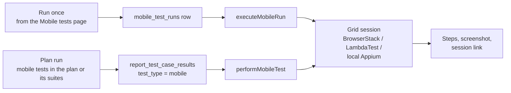
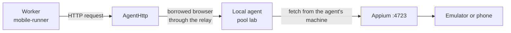

# Sottosistema mobile

Le app native Android e iOS si testano come un **terzo tipo di test**, «app mobile», accanto ai test UI (web)
e API. Un test mobile non è un test web con step nativi: i suoi elementi sono locator nativi, i suoi step sono
tocchi e swipe, e gira tramite **Appium** su un dispositivo reale o emulato. Questa pagina spiega com'è
costruito. Come si usa è nella [guida alle app mobili](../guide/mobile-apps).

(Il test del *web* mobile — emulare un iPhone o un Pixel nel browser — è un'altra cosa e sta nella matrice dei
browser del piano; vedi [Eseguire i test](../guide/running).)

## Le parti

| Parte | File | Ruolo |
|---|---|---|
| Modello | `shared/mobile.ts` | Piattaforme, azioni degli step, `MobileStep`, `parseMobileLocator`, `MobileStepResult`. Condiviso con il client, così editor e runner concordano. |
| Modello dell'inspector | `shared/mobile-inspector.ts` | Interpreta il page source di Appium come albero di elementi e propone il locator migliore per un elemento. |
| Griglie | `shared/browser-grids.ts`, `server/browser-grids.ts`, `routes/browser-grids.routes.ts` | Da dove arrivano i dispositivi: BrowserStack, LambdaTest o **Appium locale** tramite un pool di agenti. Salva la chiave cifrata e prova la connessione. |
| Client Appium | `server/appium-client.ts` | `AppiumSession`: un client W3C WebDriver minimo (find, click, type, swipe, source, screenshot). |
| Runner | `server/mobile-runner.ts` | Apre una sessione sulla griglia, esegue gli step, raccoglie i risultati, carica le app su una griglia. |
| Inspector | `server/mobile-inspector.ts`, `/api/mobile-inspector` | Una sessione in diretta per scrivere i test: screenshot più albero degli elementi, un tocco sceglie il locator. Le sessioni stanno in memoria e finiscono dopo `MOBILE_INSPECTOR_IDLE_MS` (5 minuti) di silenzio. |
| Rotte | `routes/mobile-tests.routes.ts` | CRUD, esecuzione singola dalla pagina, tag, quarantena, progetto, collegamenti a requisiti e test management. |
| Percorso dell'agente | `server/agents/agent-fetch.ts` | `AgentHttp`: permette di raggiungere un Appium locale dal server senza alcuna porta in ingresso. |

## Il modello di un test

Un test salva una `platform` (`android` o `ios`), una `app` (l'id di un upload sulla griglia come `bs://…` o
`lt://…`, oppure un percorso sulla macchina di Appium), un `device_name`, un `os_version` facoltativo, un
`grid_id` facoltativo e un elenco di step:

```text
tap, type, clear, waitFor, assertVisible, assertNotVisible, assertText,
swipe (up / down / left / right), back, hideKeyboard, wait   (MOBILE_ACTIONS in shared/mobile.ts)
```

Uno step indica il proprio elemento con una sola stringa, interpretata da `parseMobileLocator`:

| Scritto | Strategia |
|---|---|
| `~login` | accessibility id (content-desc / accessibilityIdentifier) — quello stabile |
| `id=com.shop:id/login` | resource id (Android) o name (iOS) |
| `text=Sign in` | un elemento che mostra esattamente quel testo |
| `//android.widget.Button[@text='OK']` | XPath sull'albero delle view |
| `android=new UiSelector()…`, `ios=label == "OK"`, `chain=**/XCUIElementTypeButton` | i motori propri della piattaforma |

Le `{{variabili}}` si sostituiscono dall'ambiente prima che la sessione si apra; quelle non risolte fanno
fallire il run a parole prima di usare un dispositivo.

## Esecuzione



- **Una volta dalla pagina** scrive una riga `mobile_test_runs` e mostra gli step man mano che finiscono.
- **In un piano**, un test mobile gira **una volta per run del piano** (non una per browser), sulla griglia
  indicata dal test, e compare nel report come una riga con `test_type = 'mobile'` e il dispositivo come
  «browser». Pianificazioni, webhook, CI, riesecuzioni, quarantena, notifiche e issue funzionano come per
  qualsiasi test.
- Gli **step** attendono fino a 15 s un elemento (`ELEMENT_TIMEOUT_MS`, con controllo ogni 500 ms) prima di
  fallire.
- La **chiave** della griglia si decifra solo quando la sessione si apre e viaggia solo verso la griglia. Viene
  oscurata in ogni messaggio d'errore (`redactGridSecret`), quindi non può finire in una riga di run o in un log.

## Appium locale tramite un agente

Per emulatori e telefoni su una scrivania c'è un quarto provider di griglia, `local_appium`: un server Appium
accanto a un agente locale. Il server non ha modo di entrare in quella rete, quindi le richieste passano **dall'agente**:
`AgentHttp` prende in prestito un browser del pool dell'agente e chiede a Playwright di eseguire la richiesta
HTTP dalla macchina dell'agente. La griglia salva solo il pool e l'indirizzo di Appium *come lo vede l'agente*
(default `http://127.0.0.1:4723`).



I pool sono limitati a un'organizzazione: un'altra organizzazione con un pool con lo stesso nome non vede alcun
agente vostro (c'è uno script di accettazione per questo, SEC-25…30, nell'[ambiente di collaudo](../admin/test-lab)).

## Fra i test e il resto del prodotto

| Aspetto | Comportamento |
|---|---|
| Tag, quarantena, progetti | Stesse tabelle degli altri test con `mobile_test_id` e `test_type = 'mobile'`. Valgono le regole dei progetti riservati. |
| Suite e requisiti | Un test mobile può essere elemento di una suite e coprire un requisito (`requirement_tests.mobile_test_id` è una vera chiave esterna). |
| Test management | Un test mobile si può collegare a un caso TestRail / Xray / Zephyr come qualsiasi altro (`test_case_links`). |
| Rilevamento dei test instabili | Calcolato dai risultati recenti, come per i test UI; nessun salvataggio in più. |
| Snapshot | `SnapshotTestReference` porta `mobileTestId`, così un run sa cosa ha eseguito anche se il test cambia dopo. |

## Limiti

- iOS richiede una griglia con dispositivi iOS o un Mac per l'Appium locale; l'ambiente di collaudo esegue solo Android.
- L'inspector mostra ciò che dà il page source di Appium, niente di più.
- Una quota della griglia o una griglia irraggiungibile fa fallire il run con la frase della griglia stessa.
