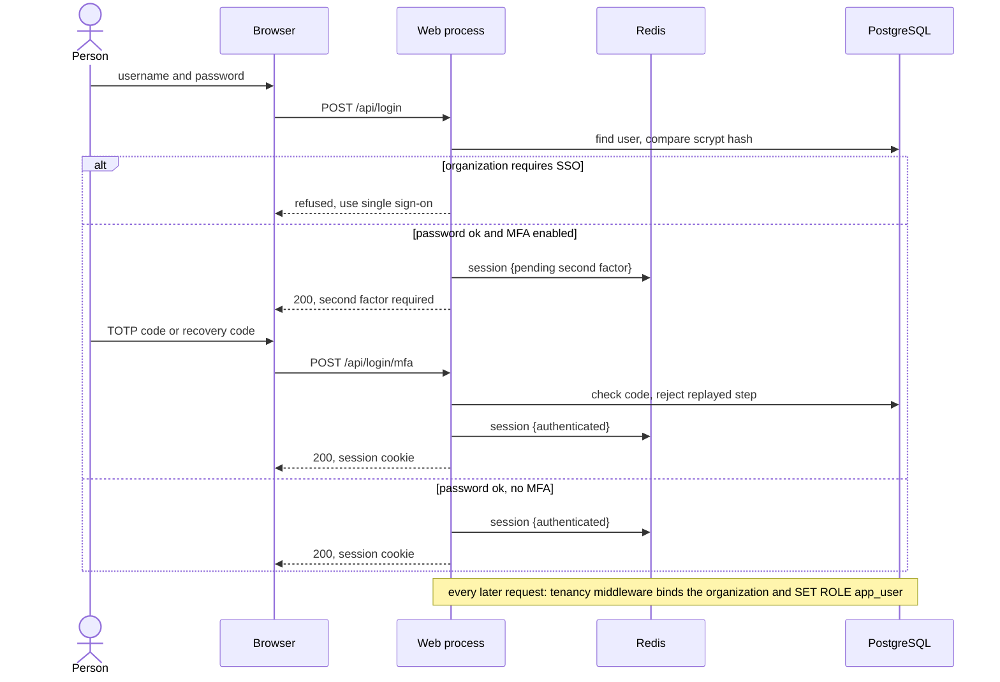
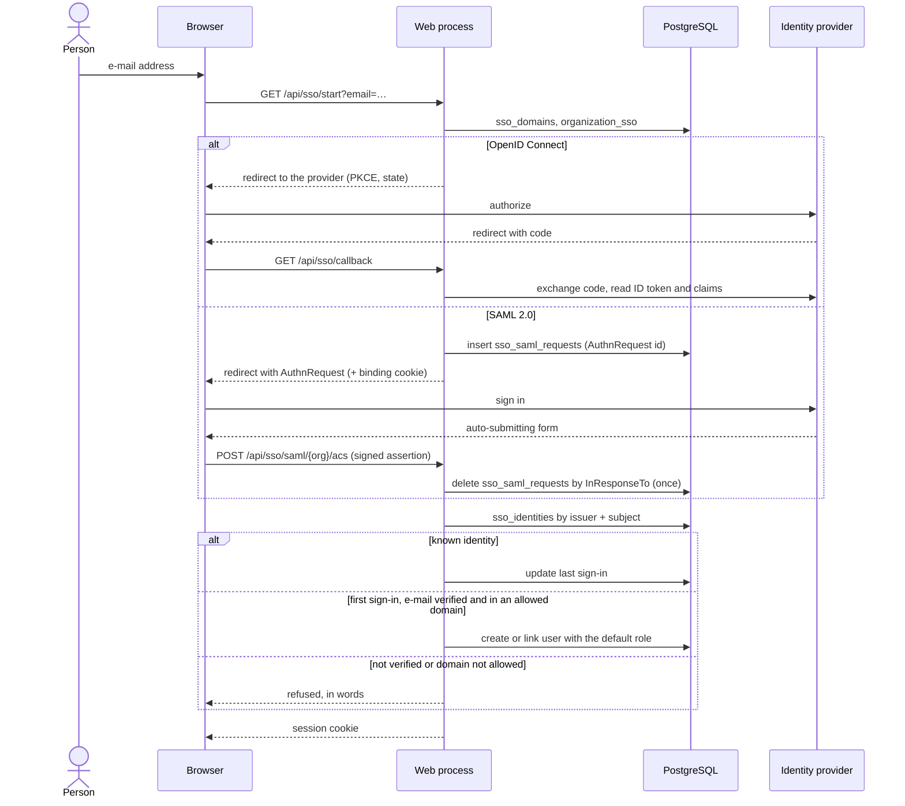
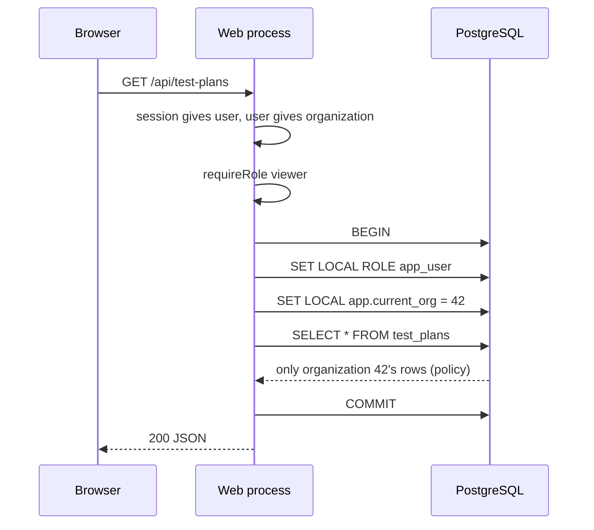
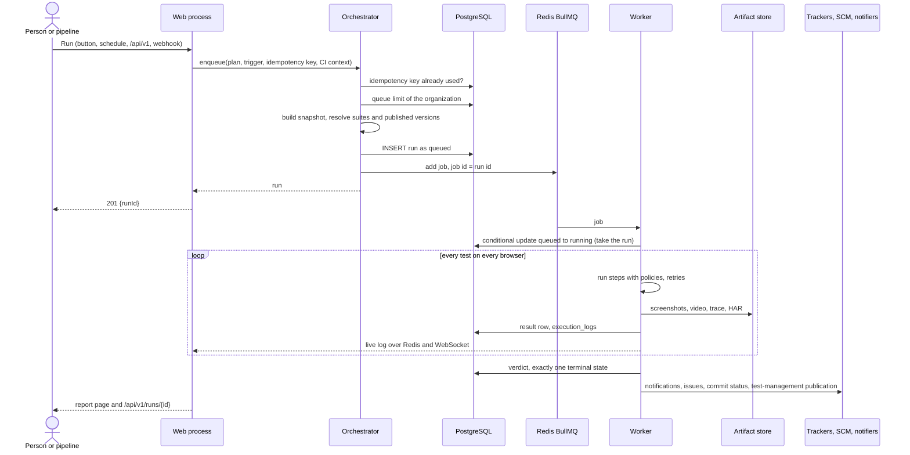
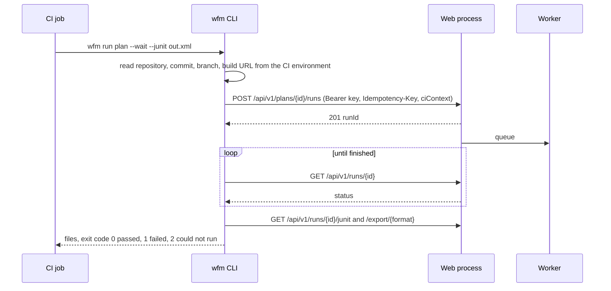
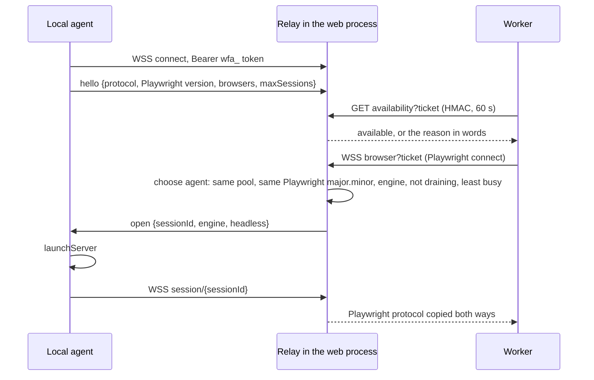
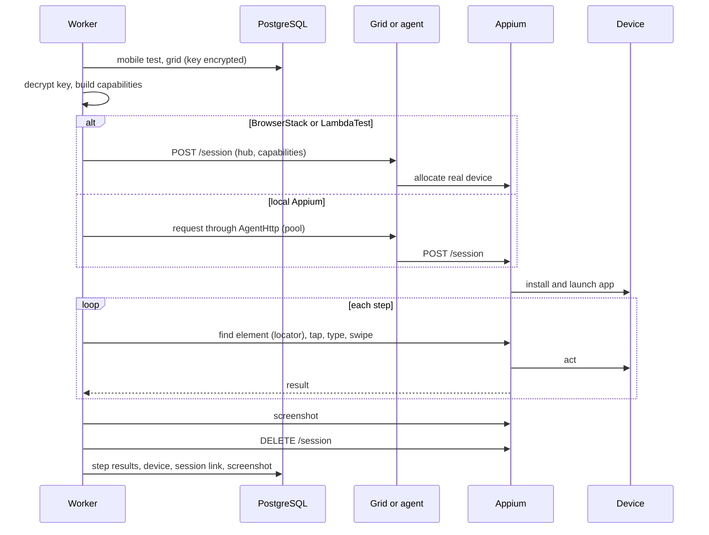
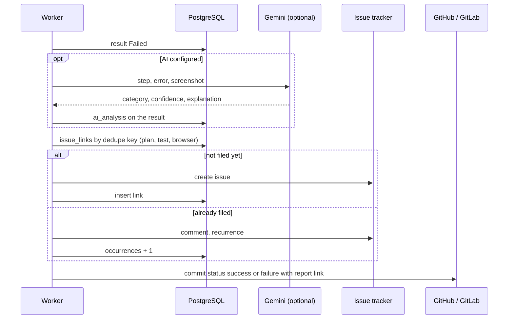
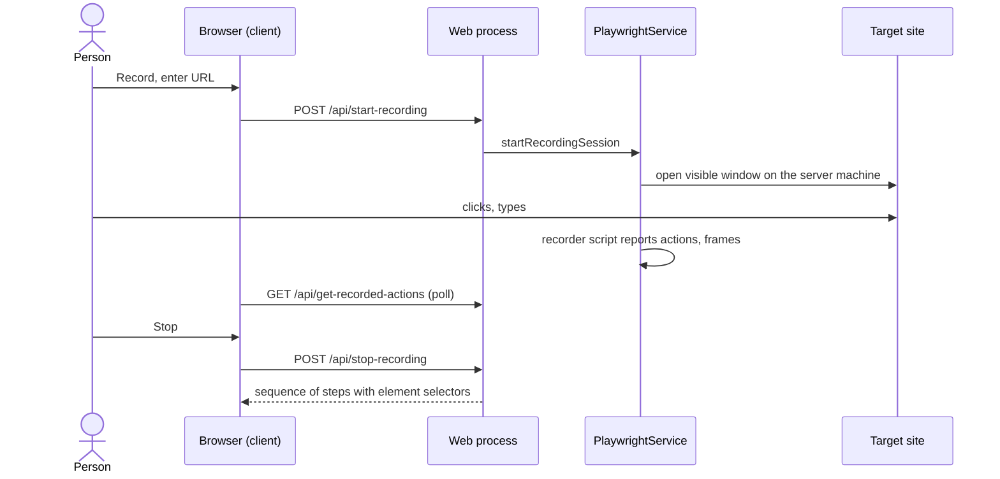

# Diagrammi di sequenza

I flussi principali del sistema come interazioni fra i processi e gli archivi descritti in
[Architettura di sistema](./system-architecture). Ogni diagramma è seguito dai punti in cui è facile
sbagliare. La versione in prosa del flusso di un run, con tutti i casi limite, è
[Ciclo di vita di un run](./execution). I diagrammi sono in inglese, come i nomi nel codice.

## 1. Accesso con password e secondo fattore

- L'accesso ha un limite per indirizzo (`AUTH_RATE_LIMIT`, 20 ogni 15 minuti di default).
- Un passo TOTP si accetta una volta sola (`last_used_step`), quindi un codice copiato non si può riusare.

## 2. Single sign-on

## 3. Una richiesta dal browser, sotto row-level security

Il `WHERE organization_id = 42` *non* è nella query: lo aggiunge la policy, quindi un filtro dimenticato non
può far uscire le righe di un'altra organizzazione.

## 4. Un piano viene eseguito

- **Esattamente uno stato terminale:** ogni cambio di stato è un `UPDATE … WHERE status = …` condizionale; un
  scrittore in ritardo o duplicato non cambia nulla.
- **Gli effetti collaterali non decidono l'esito:** l'ultima freccia può fallire e il run resta `completed` o
  `failed`.
- Un worker che muore viene trovato dal controllo di recupero (heartbeat più vecchio di `RUN_STALE_AFTER_MS`).

## 5. Una pipeline esegue un piano (CLI)

## 6. Un browser preso in prestito da un agente locale

Il protocollo in dettaglio è in [Agenti locali (interni)](./agents).

## 7. Un test mobile su un dispositivo

## 8. Un fallimento diventa un'issue e un'analisi

## 9. Registrare un test

La registrazione apre una finestra sulla macchina del processo web, ed è per questo che l'ambiente di collaudo
ha uno schermo virtuale (vedi [Ambiente di collaudo](../admin/test-lab)); il resto del lavoro sui browser è
delegato ai worker.
