# Manuale della suite

Questo manuale collega i percorsi del prodotto ai moduli che un collega dovrà modificare. Leggerlo
prima di progettare un miglioramento che coinvolga più tipi di test. La
[guida sviluppatore](./developer-guide) copre l'avvio; il
[percorso di contribuzione](./contributing-guide) traduce i principi in una modifica concreta.
Descrive il repository: non certifica il collaudo di ogni installazione o provider.

## Persone e responsabilità

Un editor trasforma un requisito in una verifica ripetibile, sceglie l'ambiente e mantiene il test.
Un revisore controlla versione ed evidenze prima della pubblicazione. Un viewer segue report e
tendenze. Un owner gestisce membri, accesso ai progetti, credenziali, integrazioni e profili di
esecuzione. L'operatore della piattaforma prepara database, code, agenti, grid, storage e monitoraggio.
L'ingegnere della pipeline collega un piano alla build e consuma API pubblica o risultato della CLI.
Sono responsabilità operative: i permessi restano quelli della gerarchia viewer/editor/owner e delle
policy di progetto, non nuove autorizzazioni assegnate automaticamente a ciascuna persona.

Iniziare ogni miglioramento indicando persona, azione ed esito osservabile. “Un editor riusa un
flusso di login mobile su più dispositivi” richiede authoring, validazione, espansione, versioni ed
evidenze; aggiungere un pulsante non basta a stabilire quel comportamento.

## Gli oggetti con cui lavora il team

| Oggetto        | Scopo                                                        | Conseguenza per l'implementazione                                              |
| -------------- | ------------------------------------------------------------ | ------------------------------------------------------------------------------ |
| Organizzazione | Confine di sicurezza e quote                                 | Un ID di organizzazione fornito dal client non è un'autorizzazione.            |
| Progetto       | Raggruppamento applicativo e possibile restrizione ai membri | Un record dell'organizzazione corretta può essere comunque inaccessibile.      |
| Test           | Definizione riusabile: UI/BDD, API o mobile                  | Portare il tipo insieme all'ID; gli ID numerici si sovrappongono tra tabelle.  |
| Versione       | Contenuto salvato, revisione e pubblicazione                 | Il contenuto pubblicato non deve diventare implicitamente la bozza modificata. |
| Tag e suite    | Classificazione, membri espliciti o regole di selezione      | La selezione futura di una suite dinamica è distinta dal run già accodato.     |
| Piano          | Selezione e policy di esecuzione e consegna                  | Ogni impostazione letta dal runner richiede una decisione sullo snapshot.      |
| Ambiente       | Variabili, segreti cifrati e autenticazione salvata          | Risolvere i valori nel contesto autorizzato e oscurarli nelle evidenze.        |
| Run            | Richiesta durevole con configurazione congelata              | Retry della coda e riavvii devono conservare identità e transizioni legali.    |
| Risultato      | Verdetto, durata e riferimenti alle evidenze di un'unità     | Matrici di dispositivi o browser/lingue possono produrre più unità per test.   |
| Requisito      | Collegamento di copertura ai test salvati                    | Un collegamento prova la tracciabilità, non il superamento del requisito.      |

L'autorità dello schema è `shared/schema.ts` insieme al journal SQL. Vedere
[modello dati](./data-model), [schema database](./database-schema) e
[organizzazione dei test](../guide/organizing). A questa revisione il journal contiene 83 voci,
da `0000` a `0082`; per la prossima migrazione consultare il journal, senza usare il conteggio
come valore di configurazione.

## Scrittura ed esecuzione sono percorsi distinti

I test browser combinano elementi e azioni nel builder, registrazione, scrittura in linguaggio
naturale, gruppi riusabili, variabili, dataset, condizioni e cicli. Rilevamento e anteprima richiedono
un browser vivo; salvare una definizione non richiede un run del piano. Il repository degli elementi
appartiene al progetto: modificare un locator riusato coinvolge i consumatori e richiede una revisione
adeguata. Baseline visive e controlli di accessibilità completano le asserzioni funzionali, rispondendo
a domande diverse. Vedere [test web](../guide/web-tests).

I test API salvano richiesta, autenticazione, asserzioni ed estrazioni. Il tester può inviare una
richiesta interattiva; il piano esegue la definizione salvata con il runner comune. Le estrazioni
permettono flussi ordinati: creare un oggetto, catturare l'ID, leggerlo ed eliminarlo. Una richiesta
non effettuabile è distinta da una risposta che fallisce un'asserzione. Anche gRPC e WebSocket
richiedono configurazione ed evidenze specifiche del trasporto: non sono riducibili a una risposta
HTTP JSON. Vedere [test API](../guide/api-tests).

I test mobile salvano piattaforma, impostazioni applicazione/dispositivo e passi nativi. Inspector e
recorder lavorano su una sessione Appium viva; selettori e operazioni appartengono alla gerarchia
delle viste native. Gruppi mobile riusabili e target vengono espansi nella definizione del run.
La matrice dispositivi produce unità specifiche, indipendenti dalla matrice browser del piano.
Grid, dispositivo e app disponibili sono prerequisiti. Vedere
[app mobile](../guide/mobile-apps) e [internals mobile](./mobile).

I test BDD conservano sorgente Gherkin, dialetto, nome logico del file e scenario/riga di esempio
selezionati. La modalità manuale registra passi umani. La modalità Cucumber collega la definizione
a un profilo agente annunciato dall'operatore e autorizzato dall'owner, con revisione esatta.
Il testo Gherkin non viene tradotto automaticamente in azioni Playwright. Step definition e
dipendenze del cliente appartengono al progetto di supporto dell'agente. Binding e sorgente sono
versionati; cambiare revisione richiede di aggiornare il binding e pubblicare i test interessati.
Vedere [test BDD](../guide/bdd-tests).

## Percorsi di esecuzione e collocazione del codice

| Percorso              | Controllo ed esecuzione                                                                        | Infrastruttura necessaria                                                             | Evidenze da leggere                                                           |
| --------------------- | ---------------------------------------------------------------------------------------------- | ------------------------------------------------------------------------------------- | ----------------------------------------------------------------------------- |
| UI browser            | Il worker esegue Playwright localmente, su grid o con browser prestato dall'agente             | Binari browser o browser remoto compatibile; accesso di rete dalla sede di esecuzione | Passi, screenshot/video/trace/HAR secondo policy; browser e lingua            |
| HTTP API              | `api-test-runner.ts` invia richieste; il trasporto agente può raggiungere la rete cliente      | Target e autenticazione raggiungibili dal trasporto scelto                            | Risposta, asserzioni ed estrazioni con segreti oscurati                       |
| Protocolli API nativi | `api-protocols.ts` e configurazione eseguono gRPC/WebSocket, anche via agente dove configurato | Endpoint, schema/configurazione e policy di rete                                      | Operazioni ed errori specifici del protocollo                                 |
| Mobile                | `mobile-runner.ts` usa Appium sulla grid configurata                                           | Credenziali provider, app caricata e dispositivo compatibile                          | Log nativo, dispositivo, screenshot e link sessione provider dove disponibili |
| BDD Cucumber          | `bdd-execution.ts` chiama il relay firmato; l'agente avvia `bdd-child.ts`                      | Profilo/revisione esatti annunciati e progetto di supporto installato                 | Step, hook e stati Cucumber, allegati testuali limitati                       |
| Manuale               | Run/report registrano il percorso umano invece di aprire un browser per ogni frase             | Persona autorizzata a registrare gli esiti                                            | Esiti dei passi ed evidenze fornite                                           |

Non applicare una sola matrice browser a tutte le righe. `test-execution-service.ts` costruisce
separatamente corsie browser e unità indipendenti BDD/mobile. Le righe dataset Cucumber possono
diventare unità indipendenti. Anche le catene di estrazioni API vincolano l'ordine: aumentare la
concorrenza deve conservare il contratto delle variabili catturate. Leggere questa costruzione
prima di modificare sharding o retry.

L'agente avvia connessioni in uscita. È un confine di esecuzione con credenziali organizzazione/pool
e ticket firmati a breve durata, non una shell remota generale. Slot browser, sessioni API native e
profili BDD hanno regole proprie di capacità e ciclo di vita. Agente assente, revisione obsoleta o
browser incompatibile devono produrre un errore comprensibile. Vedere
[agenti locali](../LOCAL_AGENT) e [internals agenti](./agents).

## Dalla richiesta al report durevole

```mermaid
flowchart LR
  Request["UI / CI / schedule / webhook"] --> Orchestrator["Autorizzazione + snapshot + run queued"]
  Orchestrator --> Queue["BullMQ / Redis"]
  Queue --> Worker["Claim + contesto tenant + policy"]
  Worker --> Units["Unità UI / API / mobile / BDD"]
  Units --> Evidence["Risultati + riferimenti artifact"]
  Evidence --> Terminal["Stato terminale del run"]
  Terminal --> Delivery["Report / notifiche / issue / commit status"]
```

`execution-orchestrator.ts` crea la richiesta, applica limiti di coda/idempotenza e invia il job.
`execution-snapshot.ts` cattura impostazioni e selezione del run. `worker.ts` consuma i job;
`execution-state.ts` controlla le transizioni condizionali. `test-execution-service.ts` risolve
definizioni tipizzate, crea unità, applica policy e salva risultati. Heartbeat, cancellazione e
recovery spiegano in modo durevole cosa accade quando un worker scompare. Non impostare direttamente
lo stato da una nuova route e non duplicare il ciclo di vita per un nuovo protocollo.

Il risultato relazionale e il file artifact sono risorse distinte. Un riferimento serve solo se
storage, autorizzazione, retention e download funzionano. I file locali richiedono un volume
condiviso tra processi su macchine diverse; lo storage S3 compatibile permette distribuzione.
Analisi degli errori, flaky detection, quarantena e trend consumano lo storico: cambiare il significato
dei verdetti coinvolge più della scheda del report.

La consegna segue l'esecuzione: notifiche, issue, commit status e pubblicazione ai sistemi di test
management espongono esiti propri. Un errore di integrazione deve essere visibile senza riscrivere il
verdetto del test. JUnit serve alla CI, HTML/PDF ai lettori, Allure al reporting dedicato. Vedere
[ciclo di vita](./execution), [risultati](../guide/results) e [CI](../CI_INTEGRATION).

## Confini di sicurezza da conservare

La richiesta stabilisce principal autenticato e contesto tenant. Le transazioni tenant impostano
ruolo PostgreSQL e organizzazione; la RLS filtra le righe, e le restrizioni di progetto agiscono
all'interno dell'organizzazione. Il middleware dei ruoli controlla l'azione. Gli endpoint pubblici
`/api/v1` aggiungono scope delle API key e contratto documentato di risposte/errori. Route di sessione
e API pubblica sono interfacce distinte: aggiungere una route di sessione non crea un endpoint CLI.

I segreti sono hash quando basta confrontarli, cifrati quando l'esecuzione deve recuperarli,
e oscurati in storico, log ed export. Un segreto d'ambiente può essere passato al codice cliente:
la redazione della piattaforma non è una sandbox che impedisce a quel codice di inviarlo altrove.
L'audit descrive la modifica confermata senza salvare credenziali. SSO, MFA, provisioning, inviti,
consegna email e revoca token coinvolgono anche il ciclo di vita del principal. Vedere
[tenancy](./tenancy), [amministrazione](../admin/administration) e [sicurezza](../security/).

I test PGlite ordinari verificano rapidamente il comportamento database. Il gate di isolamento
produttivo è `npm run test:rls` su PostgreSQL reale, con lavoro tenant eseguito come `app_user`
non superuser. Un mock positivo o una query privilegiata non provano l'applicazione della RLS.

## Installazione, collaudo e operazioni

Lo sviluppo locale avvia web e worker con Redis e PGlite oppure PostgreSQL. Il worker richiede
lo stesso database, impostazioni di cifratura e accesso adeguato agli artifact. La registrazione
browser apre una finestra sull'host web; i browser task normalmente usano i worker, con opzione
inline deliberata per sviluppo. Il processo web gestisce anche autenticazione, relay e coordinamento
delle pianificazioni. Quindi “il web non esegue mai nulla” è troppo ampio: distinguere i run dei
piani accodati da authoring/registrazione e browser task configurabili.

Docker Compose impacchetta web, worker e store. Un'installazione scalata richiede store condivisi,
configurazione proxy/cookie, versioni agente/browser compatibili, policy di rete in uscita e artifact
visibili ai processi interessati. Fare backup di dati relazionali e artifact e verificarne il
restore. Vedere [installazione](../admin/installation), [configurazione](../admin/configuration),
[operazioni](../admin/operations) e [rete SaaS](../admin/saas-network).

Installazione E2E dedicata e laboratorio Collaudo hanno finalità diverse. `test:e2e` verifica pochi
percorsi reali dell'interfaccia con bundle produttivi e store isolati. Collaudo fornisce HTTPS,
identity provider, simulatori di protocollo e fixture di dispositivi/integrazioni per un'accettazione
più ampia. I test unitari dell'applicazione Collaudo non eseguono tutti i casi di accettazione.
Registrare esecuzione effettiva, ambiente e link alle evidenze; distinguere un prerequisito mancante
da un difetto di prodotto. Vedere [laboratorio](../admin/test-lab).

La telemetria collega richieste HTTP, invio in coda, tentativi worker e sessioni agente attraverso
correlation ID e tracing. I log spiegano errori locali; le metriche mostrano carico/disponibilità;
i trace individuano il tempo speso tra processi. Il codice step Cucumber del cliente non viene
strumentato automaticamente dallo span della sessione agente. Vedere [telemetria](../admin/telemetry).

## Progettare il prossimo miglioramento

Scrivere comportamento attuale e desiderato, tipi coinvolti, permessi e casi di errore. Seguire
la definizione dall'editor a storage/versione, snapshot, unità, risultato, export ed evidenza di
accettazione. Riutilizzare il modulo di dominio che possiede la decisione evitando una seconda
implementazione nella pagina o nella route.

Decidere esplicitamente se servono migrazione, contratto API, capacità/revisione agente, campo
snapshot, schema evidenze o retention. Verificare quote, cancellazione e redazione oltre al percorso
positivo. Il [percorso di contribuzione](./contributing-guide) fornisce una ricetta concreta;
i [decision record](./decisions) documentano i tradeoff che cambiano l'architettura.

Per l’elenco di tabelle e colonne generato dal sorgente, vedere il [Catalogo schema](./schema-catalog).
