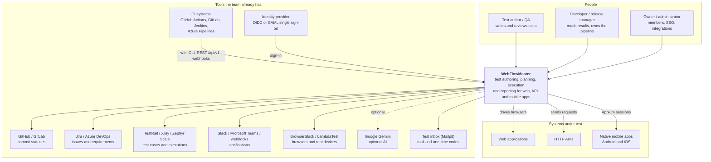
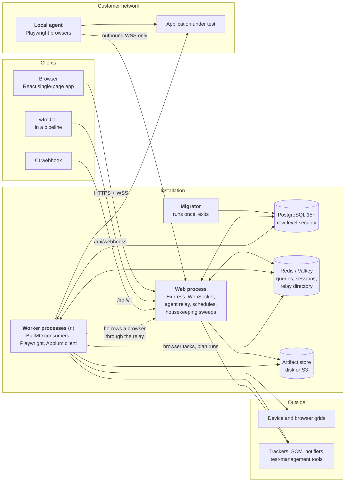
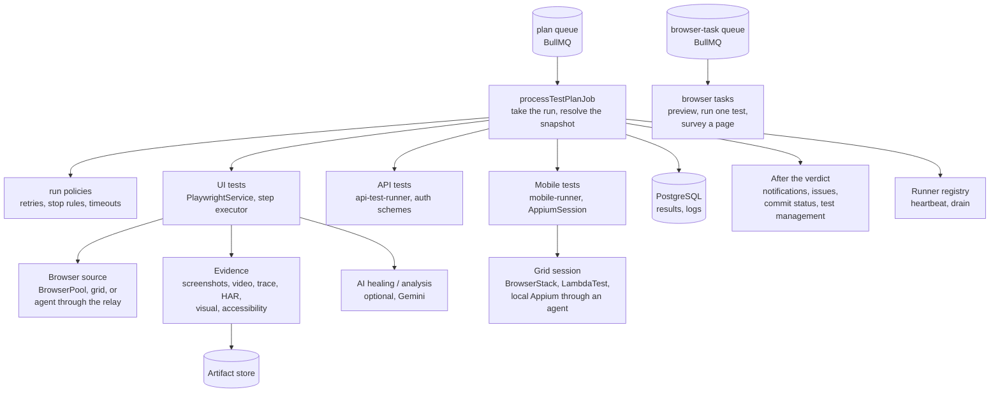
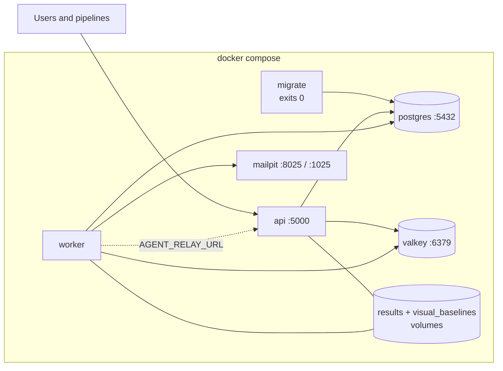
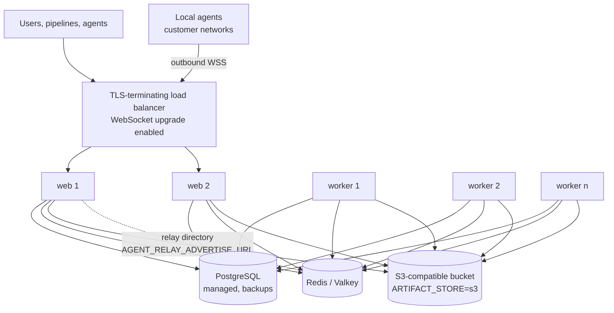

# Architettura di sistema

Questa pagina descrive WebFlowMaster dall'esterno verso l'interno, a quattro livelli di dettaglio: il
_contesto_ (con chi e con cosa dialoga), i _container_ (i processi e gli archivi di cui è fatto), i
_componenti_ (i moduli dentro i due processi che contano) e il _deployment_ (come si esegue). Segue il
modello C4; i diagrammi sono in Mermaid, quindi stanno nel repository e cambiano con il codice. Nei
diagrammi le etichette sono in inglese, come i nomi nel codice.

Leggila dopo la [Panoramica dell'architettura](./), che spiega cosa fa il prodotto. Le pagine seguenti
vanno più a fondo: [Diagrammi delle classi](./class-diagrams), [Schema del database](./database-schema),
[Diagrammi di sequenza](./sequences).

## 1. Contesto

WebFlowMaster sta fra chi scrive i test, le pipeline che li eseguono e i sistemi sotto test; riferisce
agli strumenti che un team ha già.

## 2. Container

Il prodotto è fatto di due processi di lunga durata e tre archivi, più due programmi che girano altrove.

| Container                    | Tecnologia                            | Responsabilità                                                                                                                                                                                                                                                                                                                                           | Stato                                                                                                                 |
| ---------------------------- | ------------------------------------- | -------------------------------------------------------------------------------------------------------------------------------------------------------------------------------------------------------------------------------------------------------------------------------------------------------------------------------------------------------- | --------------------------------------------------------------------------------------------------------------------- |
| **Processo web**             | Node.js 24, Express 4, `ws`, Passport | Serve la SPA e l'API REST; autentica le persone (password, secondo fattore, SSO) e le macchine (chiave API, token dell'agente, token dei webhook); crea i run ma non li esegue; ospita il **relay degli agenti**; fa partire le **pianificazioni**; esegue i controlli di **recupero** e di **conservazione**; trasmette i log in diretta via WebSocket. | Senza stato, a parte le sessioni del relay in memoria. Se ne possono avviare quanti si vuole dietro un load balancer. |
| **Processo worker**          | Node.js 24 sull'immagine Playwright   | Consuma la coda dei piani e quella dei browser task; esegue test UI, API e mobili; registra le evidenze; scrive i risultati; invia notifiche, issue e stati dei commit; si registra come _runner_ e invia heartbeat.                                                                                                                                     | Senza stato. Si scala con `docker compose up --scale worker=N`.                                                       |
| **Migratore**                | Node.js, `dist/apply-migrations.js`   | Applica le migrazioni SQL numerate, crea il ruolo `app_user` e verifica le precondizioni della tenancy.                                                                                                                                                                                                                                                  | Nessuno.                                                                                                              |
| **PostgreSQL**               | 15+ (PGlite in sviluppo e nei test)   | L'unico archivio durevole dei dati di business. L'isolamento fra organizzazioni è imposto qui dalla RLS.                                                                                                                                                                                                                                                 | Durevole.                                                                                                             |
| **Redis / Valkey**           | Valkey o Redis                        | Code BullMQ, store delle sessioni, registro delle pianificazioni (backend BullMQ), directory del relay condivisa fra più server web, canale del debugger.                                                                                                                                                                                                | Recuperabile: i run in coda sono anche righe in PostgreSQL.                                                           |
| **Archivio degli artefatti** | Volume locale o bucket compatibile S3 | Screenshot, video, trace, file HAR, baseline visuali, esportazioni dei report.                                                                                                                                                                                                                                                                           | Durevole finché la conservazione non li rimuove (`ARTIFACT_RETENTION_DAYS`, 90 di default).                           |
| **Agente locale**            | Node.js + Playwright, `wfm-agent.mjs` | Presta browser dentro la rete di un cliente (o fa da fronte a un server Appium locale) ai run sui worker. Apre solo connessioni in uscita.                                                                                                                                                                                                               | Nessuno.                                                                                                              |
| **CLI wfm**                  | Node.js, `wfm.mjs`                    | Avvia un piano da una pipeline, attende, scrive JUnit / HTML / PDF / Allure, termina con `0`, `1` o `2`.                                                                                                                                                                                                                                                 | Nessuno.                                                                                                              |

## 3. Componenti

### 3.1 Il processo web

Ogni richiesta attraversa la stessa pipeline, in quest'ordine (`server/index.ts`, poi `server/routes.ts`).
L'ordine è il modello di sicurezza: nulla legge dati prima che la richiesta sappia di chi sono.

```mermaid
flowchart LR
  REQ["HTTP request"] --> COR["Correlation id<br/>request logging"]
  COR --> CSRF["CSRF origin check<br/>state-changing requests"]
  CSRF --> SES["Session and Passport<br/>cookie, Redis store"]
  SES --> KEY["apiKeyAuth<br/>Bearer key to a user + scopes"]
  KEY --> RL["Rate limits<br/>API and webhooks"]
  RL --> TEN["tenancyMiddleware<br/>bind to organization,<br/>SET ROLE app_user"]
  TEN --> SSO["requireSso<br/>organization requires SSO"]
  SSO --> MFA["requireMfaEnrollment<br/>organization requires MFA"]
  MFA --> ROUTE["Route module<br/>requireRole / requireScope"]
  ROUTE --> DOM["Domain modules<br/>queries inside the tenant<br/>transaction, RLS filters rows"]
```

Accanto alla pipeline, il processo possiede:

| Componente          | File                                                                                                   | Ruolo                                                                                                                                                                                    |
| ------------------- | ------------------------------------------------------------------------------------------------------ | ---------------------------------------------------------------------------------------------------------------------------------------------------------------------------------------- |
| Moduli delle rotte  | `server/routes/*.routes.ts` (40 moduli), montati da `server/routes.ts`                                 | Un modulo per area: test, piani, run e report, suite, requisiti, test mobili, griglie, agenti, issue tracker, test management, SSO, MFA, chiavi API, ambienti, analytics, osservabilità. |
| API pubblica        | `server/routes/api-v1.routes.ts`, `server/api-v1/`                                                     | L'API REST versionata e il suo documento OpenAPI, per le pipeline.                                                                                                                       |
| Orchestratore       | `server/execution-orchestrator.ts`, `server/execution-snapshot.ts`, `server/execution-state.ts`        | Crea un run (snapshot, idempotenza, limiti di coda), invia il job BullMQ, possiede ogni transizione di stato.                                                                            |
| Pianificazione      | `server/scheduler-service.ts`                                                                          | Fa partire le pianificazioni, con il backend cron predefinito o con quello dei job scheduler BullMQ.                                                                                     |
| Relay degli agenti  | `server/agents/`                                                                                       | Accetta agenti, runner e sessioni via WebSocket e inoltra il protocollo Playwright fra loro.                                                                                             |
| Canali in diretta   | `server/websocket.ts`, `server/debug-session.ts`, `server/run-watch.ts`                                | Log dei run in diretta, debugger passo-passo, avanzamento della pagina del report.                                                                                                       |
| Controlli periodici | `server/run-recovery.ts`, `server/artifact-retention.ts`                                               | Chiudono i run il cui worker è morto; rimuovono le evidenze vecchie.                                                                                                                     |
| Autenticazione      | `server/auth.ts`, `sso.ts`, `mfa.ts`, `totp.ts`, `api-keys.ts`, `registration.ts`, `password-reset.ts` | Chi chiama e come l'ha dimostrato.                                                                                                                                                       |

### 3.2 Il processo worker

I moduli del worker, raggruppati per ciò che decidono:

| Area              | File                                                                                                                                                                                                                        |
| ----------------- | --------------------------------------------------------------------------------------------------------------------------------------------------------------------------------------------------------------------------- |
| Controllo del run | `worker.ts`, `test-execution-service.ts`, `run-policies.ts`, `execution-state.ts`, `runner-registry.ts`, `concurrency.ts`, `tenant-quotas.ts`                                                                               |
| Esecuzione UI     | `playwright-service.ts`, `step-executor.ts`, `flow-cursor.ts`, `browser-pool.ts`, `browsers.ts`, `variables.ts`, `custom-actions.ts`, `step-elements.ts`, `login-state.ts`, `database-step.ts`, `email-inbox.ts`, `totp.ts` |
| Esecuzione API    | `api-test-runner.ts`, `api-auth.ts`, `oauth2.ts`, `outbound-http.ts`                                                                                                                                                        |
| Esecuzione mobile | `mobile-runner.ts`, `appium-client.ts`, `mobile-inspector.ts`, `browser-grids.ts`                                                                                                                                           |
| Evidenze          | `run-evidence.ts`, `visual-testing.ts`, `accessibility.ts`, `shared/network.ts`, `artifact-store.ts`                                                                                                                        |
| Report            | `report-model.ts`, `report-html.ts`, `report-export.ts`, `junit.ts`, `allure-export.ts`                                                                                                                                     |
| Dopo il run       | `notifications.ts`, `issue-tracking.ts`, `issue-store.ts`, `issue-providers.ts`, `commit-status.ts`, `test-management.ts`, `test-management-providers.ts`                                                                   |
| AI (facoltativa)  | `ai-automation-service.ts`, `failure-analysis.ts`, `nl-authoring.ts`, `story-tests.ts`                                                                                                                                      |

### 3.3 Il client

L'applicazione React (`client/`) è una single-page app: wouter per il routing, TanStack Query per lo
stato del server, una WebSocket per i log dei run in diretta, React Flow per il builder visuale,
componenti Radix/shadcn, quattro bundle di traduzioni (en, it, fr, de). È descritta in [Client web](./frontend).

## 4. Deployment

### 4.1 Una sola macchina

`docker-compose.yml` è l'installazione completa più piccola: PostgreSQL, Valkey, Mailpit (una casella di
test), un migratore che esegue una volta, il processo web sulla porta 5000 e un worker. Due volumi con nome
contengono le evidenze dei run e le baseline visuali, condivisi da web e worker.

### 4.2 Produzione, scalata

Cosa serve per scalare (dettagli in [Installazione](../admin/installation) e [Operatività](../admin/operations)):

- Più server web non condividono altro che PostgreSQL e Redis. Impostare `AGENT_RELAY_ADVERTISE_URL` perché
  i loro relay vedano gli agenti l'uno dell'altro.
- I worker su altri host richiedono `ARTIFACT_STORE=s3`: con dischi locali, gli screenshot esisterebbero solo
  sul worker che li ha fatti.
- `ORG_MAX_CONCURRENT_RUNS` e `WORKER_CONCURRENCY` limitano quanto può eseguire insieme un'organizzazione e un
  worker; `SCHEDULER_BACKEND=bullmq` sposta l'avvio delle pianificazioni sui worker.

### 4.3 Accanto all'installazione

| Programma                              | Dove gira                     | Perché lì                                                                                                                                                                                                                       |
| -------------------------------------- | ----------------------------- | ------------------------------------------------------------------------------------------------------------------------------------------------------------------------------------------------------------------------------- |
| **Agente locale** (`Dockerfile.agent`) | Dentro la rete di un cliente  | Per raggiungere applicazioni che il server non raggiunge. Solo connessioni in uscita: nessuna porta in ingresso, nessuna VPN. Lo stesso agente può fare da fronte a un server Appium per emulatori e telefoni su una scrivania. |
| **CLI wfm**                            | In un job di CI               | Per avviare un piano, attenderlo e trasformare il risultato nel codice di uscita della pipeline.                                                                                                                                |
| **Ambiente di collaudo** (`collaudo/`) | L'host Docker di chi collauda | Il prodotto completo dietro HTTPS con identity provider, casella e-mail, strumenti simulati, Jenkins ed emulatore Android — vedi [Ambiente di collaudo](../admin/test-lab).                                                     |

## 5. Aspetti trasversali

| Aspetto                        | Come è affrontato                                                                                                                                                                                                                                                                                                         | Dove                                               |
| ------------------------------ | ------------------------------------------------------------------------------------------------------------------------------------------------------------------------------------------------------------------------------------------------------------------------------------------------------------------------- | -------------------------------------------------- |
| **Isolamento fra tenant**      | Row-level security di PostgreSQL su 44 tabelle; ogni richiesta gira in una transazione che imposta ruolo e organizzazione; l'handle privilegiato è a budget, controllato da un test di architettura.                                                                                                                      | [Tenancy e accessi](./tenancy)                     |
| **Coerenza dei run**           | Lo stato si muove solo con aggiornamenti condizionali; un job per run con l'id del run come id del job; chiavi di idempotenza; heartbeat più controllo di recupero.                                                                                                                                                       | [Ciclo di vita di un run](./execution)             |
| **Segreti**                    | AES-256-GCM per le credenziali salvate; hash SHA-256 per chiavi API, token di agenti e webhook; mostrati una volta.                                                                                                                                                                                                       | [Protezione dei dati](../security/data-protection) |
| **Osservabilità**              | Log strutturati (JSON in produzione) con id di correlazione, invio facoltativo a Loki e dashboard Grafana; cattura degli incidenti per i guasti non gestiti in sviluppo; salute di runner e code nelle pagine Impostazioni.                                                                                               | [Operatività](../admin/operations)                 |
| **Estensibilità**              | Azioni personalizzate (step propri), gruppi di step, repository degli elementi di progetto, provider di issue tracker / SCM / test management dietro interfacce, provider di griglie.                                                                                                                                     | [Guida sviluppatore](./developer-guide)            |
| **Internazionalizzazione**     | Quattro lingue del client; lingue dei run e dell'analisi; una matrice di lingue per i piani.                                                                                                                                                                                                                              | [Client web](./frontend)                           |
| **Testare il prodotto stesso** | Vitest su PGlite per il comportamento server e PostgreSQL reale con ruolo tenant non superuser per la RLS, Testing Library per il client, Chromium reale per runner e relay, test di architettura che leggono il codice, e un protocollo di accettazione manuale eseguito nell'[ambiente di collaudo](../admin/test-lab). | [Guida sviluppatore](./developer-guide)            |

## 6. Rete e porte

| Porta         | Servizio                                                                    | Direzione                                                                                     |
| ------------- | --------------------------------------------------------------------------- | --------------------------------------------------------------------------------------------- |
| 5000          | Processo web (HTTP, WebSocket)                                              | In ingresso, da utenti, pipeline e agenti                                                     |
| 5432          | PostgreSQL                                                                  | Interna                                                                                       |
| 6379          | Redis / Valkey                                                              | Interna                                                                                       |
| 8025 / 1025   | Mailpit web / SMTP (ambienti di prova)                                      | Interna                                                                                       |
| 443 → 5000    | Reverse proxy                                                               | In ingresso; il proxy deve lasciar passare gli upgrade WebSocket su `/ws` e `/api/agent/v1/*` |
| 443 in uscita | Tracker, SCM, notificatori, griglie, Gemini, S3, le applicazioni sotto test | In uscita, da web e worker; dagli agenti verso il processo web                                |

Le chiamate HTTP in uscita dal server passano da `server/outbound-http.ts`, che mantiene un elenco
volutamente stretto per i certificati self-signed (`INSECURE_TLS_HOSTS`) e sostituisce le `{{variabili}}`.
