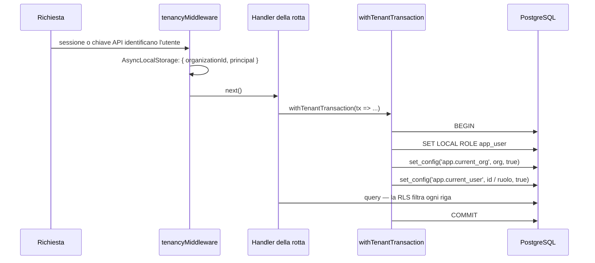

# Tenancy e accessi

Molte organizzazioni condividono un'installazione. Questa pagina spiega come vengono tenuti separati
i loro dati, chi può fare cosa dentro un'organizzazione, e come si autenticano persone e macchine.

## Organizzazioni e membri

Un'**organizzazione** possiede tutto ciò che un team crea: progetti, test, piani, run, ambienti,
credenziali. Ogni tabella per organizzazione ha un `organization_id`, e ogni utente appartiene a una
sola organizzazione con un solo **ruolo**:

| Ruolo | Può |
|---|---|
| `viewer` | Leggere tutto ciò che l'organizzazione vede; non esegue nulla e non modifica nulla. |
| `editor` | Creare e modificare test, piani, schedulazioni, suite, ambienti; avviare e annullare run. |
| `owner` | Tutto ciò che può un editor, più membri e inviti, chiavi API altrui, service account, agenti locali, collegamenti GitHub/GitLab, policy di sicurezza, runner, audit log. |

I ruoli sono controllati da `requireRole(minimo)` (`server/middleware/require-role.ts`) su ogni rotta.
Decidono quali **operazioni** un utente può fare. Quali **righe** esistono per lui lo decide il
database.

I nuovi membri entrano per **invito** (tabella `invitations`): un owner invita con un ruolo, e la
registrazione che usa il token crea l'account dentro l'organizzazione che ha invitato. La
registrazione è un'operazione privilegiata perché l'utente non esiste ancora (`server/storage.ts`).

## Row-level security: è il database a separare le organizzazioni

L'isolamento è imposto dalla **row-level security (RLS)** di PostgreSQL, non da clausole `WHERE`
nell'applicazione. Ogni tabella per organizzazione ha:

```sql
ALTER TABLE "x" ENABLE ROW LEVEL SECURITY;
ALTER TABLE "x" FORCE ROW LEVEL SECURITY;
CREATE POLICY org_isolation ON "x"
  USING (NULLIF(current_setting('app.current_org', true), '')::int = organization_id)
  WITH CHECK (NULLIF(current_setting('app.current_org', true), '')::int = organization_id);
GRANT SELECT, INSERT, UPDATE[, DELETE] ON TABLE "x" TO app_user;
```

L'elenco di queste tabelle è `ORG_SCOPED_TABLES` in `shared/schema.ts`, e un test di isolamento
(`server/tests/isolation.test.ts`, eseguito con `npm run test:rls`) dimostra per ognuna che le righe di
un'altra organizzazione sono invisibili e non scrivibili.

### Come una richiesta viene legata alla sua organizzazione



Tre dettagli reggono l'intero progetto (`server/middleware/tenancy.ts`):

- **`SET LOCAL ROLE app_user`**: la RLS non ha effetto su un superuser o su un ruolo con `BYPASSRLS`.
  Il ruolo della connessione possiede le tabelle e può aggirare la RLS; `app_user` no. Ogni query di un
  tenant gira come `app_user`.
- **`LOCAL`**: la connessione viene da un pool. Un'impostazione non locale sopravvivrebbe alla
  transazione e porterebbe l'organizzazione nella richiesta successiva su quella connessione.
- **Parametri legati** per `set_config`: un valore ostile viene rifiutato dal cast a intero nella
  policy invece di essere eseguito.

Le chiamate annidate si uniscono alla transazione aperta invece di aprirne una seconda, e legare
un'organizzazione diversa dentro una transazione aperta genera `TenantConflictError`.

All'avvio, `assertTenancyPreconditions` (`server/db.ts`) verifica che `app_user` esista, che il ruolo
della connessione possa passare a esso e che `app_user` non possa aggirare la RLS; altrimenti il server
non parte.

### Lavoro in background

Il lavoro che non è una richiesta — il worker che esegue un piano, un run schedulato, uno sweep — lega
l'organizzazione esplicitamente con `runWithTenant(orgId, fn)` o `runAsOrganization(orgId, fn)`. Senza
un principal legato, la transazione è "il sistema" e vede tutto ciò che la RLS della sua
organizzazione permette. `runDetachedForOrganization` apre un contesto nuovo per il lavoro che non deve
unirsi alla transazione del chiamante (per esempio l'avviso di stato del commit).

### L'handle privilegiato

`privilegedDb` si connette senza il cambio di ruolo e quindi aggira la RLS. Esiste per le tabelle
dell'installazione (`runners`, `system_settings`, `sessions`), per il bootstrap (registrazione, login,
verifica di chiavi API e token degli agenti, quando l'organizzazione non è ancora nota) e per
l'esportazione e la cancellazione di un'organizzazione (`server/organization-lifecycle.ts`). Ogni file
autorizzato a usarlo, e quante volte, è elencato in `PRIVILEGED_BOOTSTRAP_BUDGET` in
`server/tests/architecture.test.ts`; un nuovo uso fa fallire la build finché qualcuno non ne scrive il
motivo.

### Collegamenti fra righe della stessa organizzazione

Una foreign key da una riga dell'organizzazione A a una dell'organizzazione B sarebbe una fuga di dati
attraverso un join. Un test di deriva in `server/test-suites.test.ts` elenca ogni foreign key fra
tabelle per organizzazione e richiede che ognuna sia protetta da un vincolo di stessa organizzazione o
dichiarata come collegamento di paternità (`created_by` e simili, che puntano agli utenti).

## Progetti riservati

Un **progetto** è aperto per default: sui suoi test vale il ruolo nell'organizzazione. Un progetto può
essere **riservato** (migrazione 0031): allora è visibile solo agli owner dell'organizzazione e ai suoi
`project_members`, e il ruolo di progetto di ciascun membro (`viewer` o `editor`) può restringere il
ruolo nell'organizzazione ma mai ampliarlo.

Anche questo è imposto dalla RLS: policy restrittive leggono `app.current_user` e
`app.current_user_role`, che `withTenantTransaction` imposta per una richiesta. Test, test API, gruppi
di step, elementi e suite di un progetto riservato sono invisibili ai non membri. Piani, run e report
restano a livello di organizzazione: un piano può eseguire i test di un progetto riservato.

`effectiveProjectRole` (`server/routes/projects.routes.ts`) calcola la stessa risposta per
l'interfaccia, così non propone una modifica che il database rifiuterebbe.

## Autenticazione

### Persone

- **Password**: strategia locale di Passport; le password sono cifrate con scrypt e un salt per utente.
- **Sessione**: `express-session`, salvata in Redis in produzione (senza, il server rifiuta di partire
  in produzione) e in memoria in sviluppo. Il cookie è `Secure` in produzione e non altrove;
  `SESSION_COOKIE_SECURE=true|false` lo forza (lo stack docker-compose fornito serve HTTP semplice su
  localhost e lo imposta a `false`).
- **Secondo fattore**: TOTP (RFC 6238) da un'app di autenticazione, più codici di recupero monouso
  (`server/mfa.ts`). Una password accettata con un secondo fattore ancora dovuto non è un login. Un owner
  può rendere obbligatoria la MFA per l'organizzazione; `requireMfaEnrollment` lascia allora a un membro
  che non l'ha configurata solo la possibilità di configurarla, a ogni richiesta, così la policy vale
  anche per le sessioni già aperte.
- **CSRF**: una richiesta che modifica dati e porta un `Origin` o un `Referer` deve indicare l'host
  dell'applicazione (`server/middleware/csrf.ts`); le richieste senza nessuno dei due sono da server a
  server (CLI, webhook) e si autenticano con una chiave o un token. Un front end su un'altra origine si
  autorizza esplicitamente con `CSRF_TRUSTED_ORIGINS`.

### Macchine

| Credenziale | Per | Salvata come | Dettagli |
|---|---|---|---|
| **Chiave API** (`wfm_…`) | Pipeline e script | Hash SHA-256 + prefisso | Agisce come il suo utente o service account. Gli **scope** opzionali la limitano a `/api/v1` e a permessi precisi (`plans:read`, `runs:read`, `runs:write`); il ruolo del titolare vale comunque. Scadenza opzionale; ultimo uso registrato. |
| **Service account** | Chiavi che devono sopravvivere a una persona | Un utente che non può accedere | Ha un ruolo (mai `owner`) e possiede chiavi; disattivarlo le revoca tutte. |
| **Token di webhook** | Sistemi di CI che avviano un piano con un URL | Hash SHA-256 + prefisso | Inviato in `X-Webhook-Token` o `Authorization: Bearer`; mascherato nei log. |
| **Token di agente** (`wfa_…`) | Agenti locali | Hash SHA-256 + prefisso | Identifica un agente di un'organizzazione; revocarlo lo disconnette. |
| **Ticket del relay** | Un runner che prende in prestito un browser di un agente | Non salvato | Firmato HMAC, indica organizzazione, pool e browser, valido 60 secondi. |

Un token ad alta entropia non ha bisogno di essere "stirato": un solo SHA-256 rende la verifica una
query su indice e non lascia nulla da indovinare. Ognuno viene mostrato una sola volta, alla creazione.

## Segreti che il prodotto custodisce per i clienti

I segreti degli ambienti (variabili `{{secret_…}}`), i token degli issue tracker, i token GitHub/GitLab e
gli stati di login salvati (i cookie dell'applicazione sotto test) sono cifrati con **AES-256-GCM**
usando la `ENCRYPTION_KEY` dell'installazione (`server/crypto.ts`), ognuno con il proprio IV e tag di
autenticazione. L'API non ne restituisce mai nessuno; un modulo di modifica che non può mostrare il
valore attuale tratta un campo vuoto come "lascia invariato". I log passano da un redactor
(`server/utils/log-redactor.ts`) che maschera password, token e chiavi, e le catture HAR vengono ripulite
prima di essere salvate.

## Audit trail

`audit_log` registra chi ha fatto cosa: l'autore (utente, chiave API o sistema), l'azione
(`AUDIT_ACTIONS` in `shared/schema.ts`), il bersaglio, i campi modificati e la provenienza della
richiesta: la chiave API con cui si è autenticata (null per una sessione) e l'indirizzo IP del client
(dietro un proxy, quello indicato dal proxy). `app_user` ha solo `SELECT` e `INSERT`: l'applicazione non
può riscrivere la propria storia. Le voci si scrivono nella stessa transazione della modifica che
descrivono (`recordAudit(tx, …)`), quindi modifica e registrazione vengono confermate o annullate
insieme. Gli owner le leggono in Settings.

## Limiti per organizzazione

`server/tenant-quotas.ts` impedisce a un'organizzazione di affamare le altre: un massimo di run in
esecuzione contemporanea (un worker rimette in coda il run oltre il limite — aspetta, non fallisce), un
massimo di run in attesa (una richiesta oltre il limite riceve `429`) e un posto equo in coda per
l'organizzazione con meno run in corso. I limiti li imposta l'operatore sulla riga di `organizations`;
l'applicazione non ha i permessi per cambiarli.

## Esportazione e cancellazione

`server/organization-lifecycle.ts` esporta i dati di un'organizzazione e la cancella completamente,
comprese le righe che l'applicazione stessa non può eliminare (l'audit log). È l'unico modulo di dominio
privilegiato per progetto, perché cancellare un'organizzazione è un atto sul confine della tenancy, non
al suo interno.
