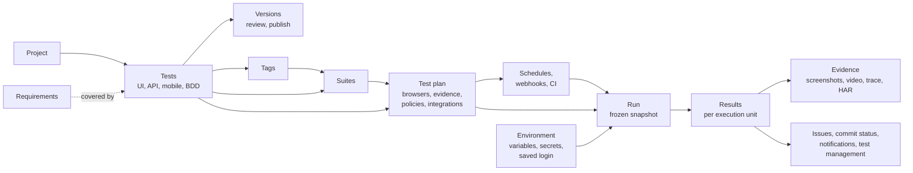
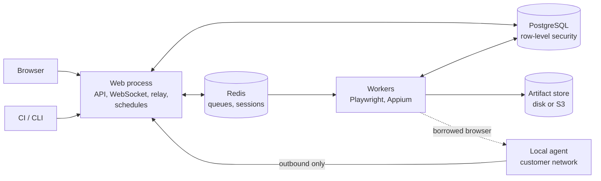

# WebFlowMaster in breve

È la pagina da leggere per prima, o da mandare a chi deve capire WebFlowMaster senza ancora usarlo. Dice cos'è
il prodotto, chi lo usa e per cosa, com'è costruito e dove sta la documentazione di dettaglio. Si legge in circa
un quarto d'ora.

## Cos'è

WebFlowMaster è una **piattaforma di automazione dei test** per team che devono controllare applicazioni web,
API HTTP/nativi, app mobili native e scenari Gherkin/Cucumber, in modo ripetuto e affidabile, e conoscere l'esito senza stare davanti a uno
schermo.

Un team la usa per:

1. **Scrivere** i test — registrando una sessione del browser, assemblando step in un builder visuale con
   condizioni e cicli, descrivendo un test a parole, generando test da user story, scrivendo richieste API con
   asserzioni e concatenazioni, o definendo step mobili con un inspector in diretta.
2. **Organizzarli** — progetti, tag, suite (statiche o guidate dai tag), versioni con revisione e
   pubblicazione, quarantena per i test inaffidabili, requisiti con copertura calcolata.
3. **Eseguirli** — dal pulsante, a orario, da una pipeline CI, da un webhook — su una matrice di browser e di
   lingue, in parallelo, sui worker della piattaforma, su griglie cloud (BrowserStack, LambdaTest) o su **agenti
   locali** dentro la rete di un cliente.
4. **Capire** i risultati — step, screenshot, video, trace, cattura di rete, confronto visivo, problemi di
   accessibilità, una spiegazione AI di un fallimento, rilevamento dei test instabili, andamenti; esportazioni in
   HTML, PDF, JUnit e Allure.
5. **Collegarla** al resto degli strumenti — stati dei commit in GitHub e GitLab, issue in Jira e Azure DevOps,
   pubblicazione su TestRail, Xray e Zephyr Scale, notifiche a Slack, Teams o a un webhook, single sign-on,
   template per GitHub Actions, GitLab, Jenkins, Azure Pipelines, Bitbucket Pipelines e CircleCI, un client a riga di comando.

È **multi-tenant**: molte organizzazioni condividono un'installazione, e il database stesso ne tiene separati i
dati. È **self-hosted**: uno stack Docker Compose per una macchina, oppure processi web e worker separati dietro
un load balancer per di più.

## Chi la usa

| Ruolo                           | Cosa fa                                                              | Da dove cominciare                                                                                                                                                                              |
| ------------------------------- | -------------------------------------------------------------------- | ----------------------------------------------------------------------------------------------------------------------------------------------------------------------------------------------- |
| **Autore dei test** (editor)    | Registra e costruisce test, esegue piani, legge i report             | [Guida utente](./guide/)                                                                                                                                                                        |
| **Revisore / viewer**           | Legge i risultati; gli editor autorizzati approvano la pubblicazione | [Risultati](./guide/results)                                                                                                                                                                    |
| **Owner / amministratore**      | Membri, ruoli, SSO e MFA, integrazioni, ambienti, chiavi             | [Amministrazione](./admin/administration)                                                                                                                                                       |
| **Operatore della piattaforma** | Installa, scala, fa i backup, monitora                               | [Installazione](./admin/installation), [Operatività](./admin/operations)                                                                                                                        |
| **Ingegnere di pipeline**       | Avvia piani dalla CI e legge il codice di uscita                     | [Integrazione CI](./CI_INTEGRATION), [CLI](./reference/cli), [API REST](./reference/api)                                                                                                        |
| **Revisore della sicurezza**    | Verifica isolamento, segreti, hardening                              | [Sicurezza](./security/)                                                                                                                                                                        |
| **Sviluppatore del prodotto**   | Lo modifica                                                          | [Architettura](./internals/), [Guida sviluppatore](./internals/developer-guide), [Manuale della suite](./internals/suite-handbook), [Percorso di contribuzione](./internals/contributing-guide) |

## I concetti, in un'immagine

## Com'è costruita

Due processi e tre archivi.

- Il **processo web** serve il client React e l'API REST, autentica persone e macchine, crea i run e accoda i piani per i worker; registrazione browser e task inline hanno percorsi distinti.
- I **worker** prendono i run da una coda, pilotano browser o dispositivi, registrano evidenze e risultati, poi
  inviano notifiche, issue e stati dei commit. Si aggiungono worker per eseguire più cose in parallelo.
- **PostgreSQL** contiene tutto ciò che è durevole e impone l'isolamento fra tenant con la row-level security.
  **Redis** contiene code e sessioni. **L'archivio degli artefatti** contiene screenshot, video e trace.
- Un **agente locale** fornisce browser, trasporti API e profili Cucumber autorizzati nella rete cliente; si connette sempre _verso l'esterno_.

Le cinque regole che spiegano la maggior parte del codice:

1. **Il database impone la tenancy**, non le clausole `WHERE` dell'applicazione.
2. **Un run è un record, non un processo**: il suo stato si muove solo con aggiornamenti condizionali.
3. **Un run è deciso quando è richiesto**: configurazione ed elenco dei test sono congelati in uno snapshot.
4. **Gli effetti collaterali non fanno fallire un run**: notifiche, issue e stati sono riportati, non decisivi.
5. **I segreti non tornano indietro**: con hash o cifrati, mostrati una volta.

## Tecnologie

TypeScript ovunque. Node.js 24, Express, `ws`, Passport; Drizzle ORM su PostgreSQL 15+ con migrazioni SQL scritte
a mano (83 voci nel journal fino a `0082` a questa revisione); BullMQ su Redis/Valkey; Playwright per i browser e axe-core per l'accessibilità; Appium per le
app mobili; React 18, Vite, TanStack Query, Radix/shadcn, Tailwind, React Flow; Google Gemini facoltativo per le
funzioni AI; Vitest, Testing Library e supertest per i test; Docker per il confezionamento.

## Il repository in una tabella

| Cartella         | Contenuto                                                                                                                |
| ---------------- | ------------------------------------------------------------------------------------------------------------------------ |
| `client/`        | L'applicazione React                                                                                                     |
| `server/`        | Il processo web e il worker: rotte, middleware, moduli di dominio                                                        |
| `shared/`        | Schema e tipi usati sia dal client sia dal server                                                                        |
| `migrations/`    | Le migrazioni SQL (da `0000` a `0082`; vedere il journal)                                                                |
| `scripts/`       | CLI (`wfm`), agente locale, migratore, schema doctor, importatori                                                        |
| `integrations/`  | GitHub Action, template GitLab, shared library Jenkins, template Azure Pipelines, step Bitbucket Pipelines, orb CircleCI |
| `collaudo/`      | L'ambiente di collaudo: HTTPS, Keycloak, simulatori, Jenkins, emulatore Android                                          |
| `docs/`          | Questa documentazione (VitePress, inglese e italiano)                                                                    |
| `observability/` | Configurazione di Loki e Grafana                                                                                         |

## La documentazione, per domanda

| Se vuoi sapere…                      | Leggi                                                                                                                                                                                                                                                                                                                                                                                                                               |
| ------------------------------------ | ----------------------------------------------------------------------------------------------------------------------------------------------------------------------------------------------------------------------------------------------------------------------------------------------------------------------------------------------------------------------------------------------------------------------------------- |
| Come si usa                          | [Guida utente](./guide/): [test web](./guide/web-tests), [test API](./guide/api-tests), [app mobili](./guide/mobile-apps), [organizzare](./guide/organizing), [eseguire](./guide/running), [risultati](./guide/results)                                                                                                                                                                                                             |
| Come si installa e si gestisce       | [Installazione](./admin/installation), [Operatività](./admin/operations), [Riferimento della configurazione](./admin/configuration)                                                                                                                                                                                                                                                                                                 |
| Come si amministra un'organizzazione | [Amministrazione](./admin/administration)                                                                                                                                                                                                                                                                                                                                                                                           |
| Quanto è sicura                      | [Panoramica sulla sicurezza](./security/), [Protezione dei dati](./security/data-protection), [Hardening](./security/hardening)                                                                                                                                                                                                                                                                                                     |
| Come chiamarla da una pipeline       | [Integrazione CI](./CI_INTEGRATION), [CLI](./reference/cli), [API REST](./reference/api)                                                                                                                                                                                                                                                                                                                                            |
| Come funzionano gli agenti           | [Agenti locali](./LOCAL_AGENT), [interni](./internals/agents)                                                                                                                                                                                                                                                                                                                                                                       |
| Com'è costruita                      | [Panoramica dell'architettura](./internals/), [Architettura di sistema](./internals/system-architecture), [Diagrammi delle classi](./internals/class-diagrams), [Schema del database](./internals/database-schema), [Diagrammi di sequenza](./internals/sequences), [Sottosistema mobile](./internals/mobile), [Ciclo di vita di un run](./internals/execution), [Tenancy](./internals/tenancy), [Client web](./internals/frontend) |
| Perché è costruita così              | [Registro delle decisioni](./internals/decisions)                                                                                                                                                                                                                                                                                                                                                                                   |
| Come è stata accettata               | [Ambiente di collaudo](./admin/test-lab)                                                                                                                                                                                                                                                                                                                                                                                            |
| Cosa significa una parola            | [Glossario](./internals/glossary)                                                                                                                                                                                                                                                                                                                                                                                                   |
